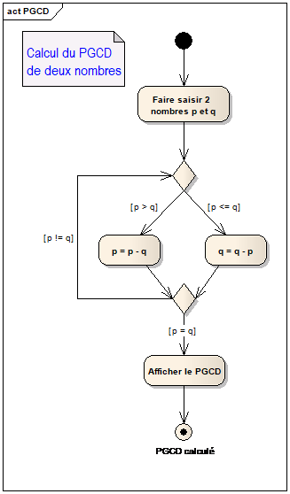

# Calcul du PGCD de 2 entiers

**Objectifs** : écrire un programme simple à partir d’un algorithme décrit en UML

Voici un diagramme d’activité qui décrit l’algorithme de calcul du plus
grand commun diviseur de deux entiers non nuls selon la méthode dite
« égyptienne » :



Ecrivez un programme C# qui implémente cet algorithme.  
Exemple de résultat attendu :

```
Entrez le premier nombre : 21

Entrez le deuxième nombre : 45

Le PGCD de 21 et 45 est : 3
```