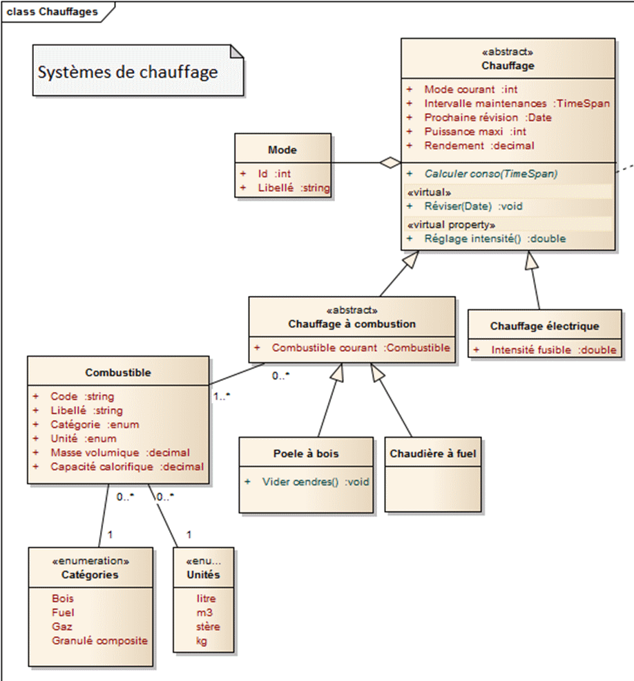
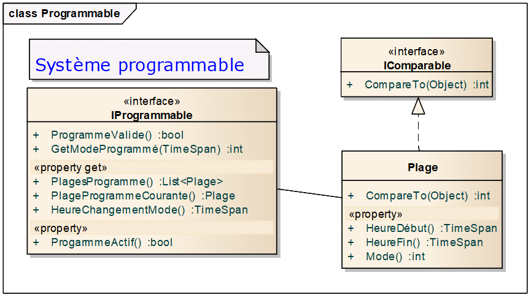

# Chauffage programmable

**Objectifs** : mettre en pratique les notions suivantes :

-  Héritage, hiérarchie de classes
-  Classes abstraites et membres abstraits
-  Interfaces
-  Intervalles de temps TimeSpan

## Description du programme

Le programme mettra en œuvre l’arborescence de systèmes de chauffage
suivante :



Il doit également permettre de rendre n’importe quel chauffage
programmable. Pour cela, il devra mettre en œuvre l’interface
IProgrammable décrite ci-dessous :



Description des méthodes et propriétés de `IProgrammable` :

-  `PlagesProgramme` : obtient la liste des plages de fonctionnement qui
   constituent le programme. Chaque plage est caractérisée par une heure
   de début, une heure de fin et un mode de fonctionnement durant cette
   période

-  `ProgrammeValide` : Vérifie que les plages du programme couvrent bien
   24h et ne se chevauchent pas

-  `GetModeProgrammé` : renvoie le mode programmé pour une heure donnée

-  `PlageProgrammeCourante` : obtient la plage de fonctionnement courante
   du système, c’est-à-dire celle dont la tranche horaire couvre l’heure
   courante

-  `HeureChangementMode` : obtient l’heure du prochain changement de mode

-  `ProgrammeActif` : obtient ou définit si le programme est actif ou non

NB/ `IComparable` est déjà fournie par le .Net framework. Elle permettra
de comparer les heures de début des plages de fonctionnement

## A faire

Créer l’arborescence de classes et d’interfaces décrite par les
diagrammes précédents, en utilisant des propriétés à la place des champs
publics (principe d’encapsulation).

-  On pourra utiliser des propriétés génériques de type List\<T> pour
   stocker les plages et les modes.

-  Inutile d’implémenter la méthode CalculerConso ; renvoyer une
   NotImplementedException.

Faire en sorte que la classe Chauffage hérite de l’interface
IProgrammable, et propose une implémentation par défaut de cette
interface, avec les règles de gestion suivantes :

-  Lorsque ProgrammeActif passe à vrai, exécuter ProgrammeValide et
   renvoyer une exception si elle renvoie faux

-  Lorsqu’on modifie ModeCourant, renvoyer des messages d’erreurs
   explicites dans les cas suivants :

   -  ProgrammeActif est à vrai. En effet, lorsqu’un programme est
      actif, on ne doit pas pouvoir modifier manuellement le mode de
      fonctionnement du chauffage.

   -  La valeur de mode qu’on essaie d’affecter n’est pas dans la liste
      des modes du chauffage

-  La programmation se fait à la minute près. Dans ProgrammeValide,
   mettre à 0 la partie des secondes sur les heures de chaque plage.

Remarque : garder l’implémentation de ProgrammeValide et
HeureChangementMode pour la fin (ce n’est pas le plus important dans cet
exercice).

Utiliser le code ci-dessous dans votre classe Program pour tester le programme :

```csharp
static void Main(string[] args)
{
   //--------------------------------------------------------
   // Tests de l'implémentation des classes

   var chaudiere = new ChaudiereAFuel();
   chaudiere.IntervalleMaintenances = new TimeSpan(365, 0, 0, 0);
   chaudiere.Reviser(DateTime.Today.AddDays(-365));
   Console.WriteLine("Prochaine révision le {0}", chaudiere.ProchaineRevision); // Doit afficher la date du jour

   Combustible fuel = new Combustible
   {
      Code = "F0",
      Libelle = "Fuel domestique",
      Categorie = CategoriesCombustible.Fuel,
      Unite = Unites.Litre,
      MasseVolumique = 0.845m,
      CapaciteCalorifique = 11.86m
   };
   chaudiere.CombustibleCourant = fuel;

   //--------------------------------------------------------
   // Test de l'implémentation de l'interface IProgrammable

   chaudiere.Modes.Add(new Mode { Id = 1, Libellé = "Eco" });
   chaudiere.Modes.Add(new Mode { Id = 2, Libellé = "Confort" });
   // Le mode 0 Eteint est défini dans le constructeur de Chauffage

   Plage p1 = new Plage
   {
      HeureDébut = new TimeSpan(0, 0, 0),
      HeureFin = new TimeSpan(4, 59, 0),
      Mode = 0
   };

   Plage p2 = new Plage
   {
      HeureDébut = new TimeSpan(5, 0, 0),
      HeureFin = new TimeSpan(7, 59, 0),
      Mode = 1
   };

   Plage p3 = new Plage
   {
      HeureDébut = new TimeSpan(8, 0, 0),
      HeureFin = new TimeSpan(23, 59, 0),
      Mode = 2
   };

   chaudiere.PlagesProgramme.Add(p1);
   chaudiere.PlagesProgramme.Add(p2);
   chaudiere.PlagesProgramme.Add(p3);

   TimeSpan[] horaires = new TimeSpan[3];
   horaires[0] = new TimeSpan(0, 15, 58);
   horaires[1] = new TimeSpan(5, 28, 20);
   horaires[2] = new TimeSpan(13, 23, 45);
   
   foreach (var h in horaires)
         Console.WriteLine("Mode programmé pour {0} : {1}", h, chaudiere.GetModeProgrammé(h));

   Console.WriteLine("Plage de programme courante : {0} - {1}",
         chaudiere.PlageProgrammeCourante.HeureDébut,
         chaudiere.PlageProgrammeCourante.HeureFin);

   try
   {
      chaudiere.ProgrammeActif = true;
      // Changer les plages p1 à p3 ci-dessus pour que le programme soit incomplet
      // et vérifier que cela lève une exception

      chaudiere.ModeCourant = 2; // lève une exception si le programme est actif
   }
   catch (Exception e)
   {
         Console.WriteLine(e.Message);
   }

   Console.ReadKey();
}
```