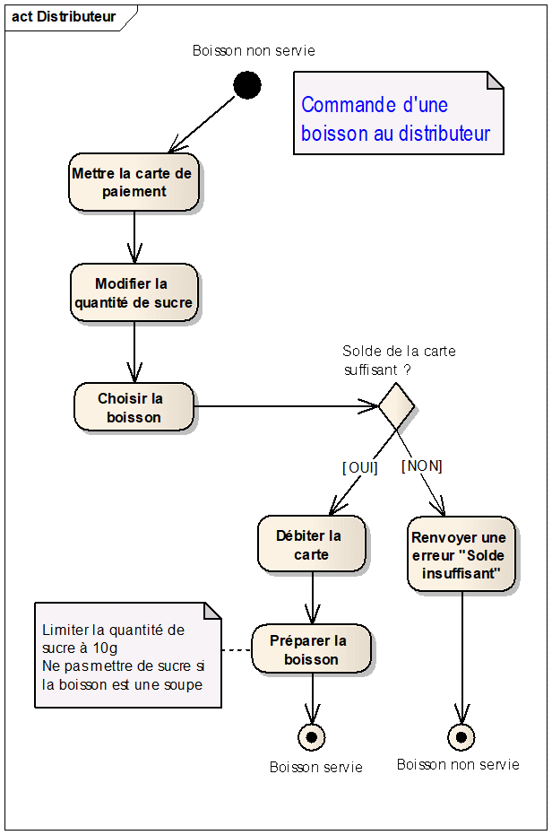

# Distributeur de boissons

**Objectifs** : mettre en œuvre les notions suivantes :

-  Propriétés et méthodes
-  Séparation du visuel et de la logique applicative
-  Accessoirement : énumérations et exceptions

On souhait modéliser un distributeur de boissons, dont le fonctionnement
est décrit par le diagramme d’activité et les règles de gestion suivants :

**Règles de gestion** :

Les boissons possibles sont :
- Café à 0.80 €
- Chocolat à 0.75 €
- Soupe à 1.00 €

Par défaut, la quantité de sucre est réglée sur 3g. Elle ne peut pas dépasser 10g.

Pour cela, créer une classe `Distributeur` comportant :

-  Les propriétés nécessaires

-  Une méthode `ServirBoisson` qui débite la carte si le solde est
   suffisant et renvoie une chaîne indiquant la boisson et la quantité
   de sucre choisies.  
   Exemples : « Café avec 5g de sucre », « Soupe », « Chocolat avec 0g de sucre »

!> Pour que cette classe soit utilisable dans différents
contextes, elle ne doit pas faire référence à la console.

Pour tester cette classe, dans la méthode Main de Program, simuler **en dur** le scénario suivant :

-  Mettre une carte avec un solde de 2€

-  Commander une soupe avec 5g de sucre vérifier que la soupe est
   préparée, mais sans sucre

-  Commander un café avec 12g de sucre vérifier que le café est préparé,
   mais avec 10g de sucre

-  Commander un chocolat vérifier qu’une exception est levée à cause du
   solde insuffisant