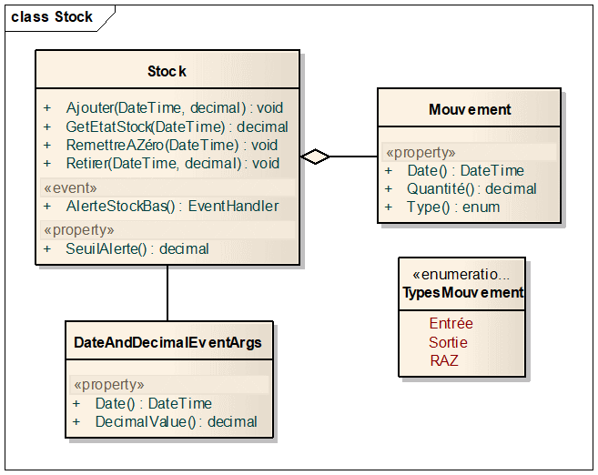

# Gestion d’un stock

**Objectifs** : utiliser les collections génériques, créer un évènement,
créer et utiliser des méthodes anonymes.

## Description du programme

Le diagramme de classes suivant modélise une gestion de stock :

Un mouvement de stock est caractérisé par :

-  Son type : soit une entrée (on alimente le stock), soit une sortie
   (on puise dans le stock), soit une remise à zéro du stock

-  Sa date

-  Sa quantité

Méthodes et propriétés de la classe `Stock `:

-  `Ajouter` : ajoute la quantité spécifiée au stock, à la date
   spécifiée. Cette méthode lève une System.ArgumentException s'il y a
   déjà un mouvement de stock à la même date

-  `Retirer` : retire la quantité spécifiée du stock à la date
   spécifiée.  
   Lève une System.ArgumentException s'il y a déjà un mouvement de stock
   à la même date  
   Lève une InvalidOperationException si la quantité en stock est
   insuffisante

-  `GetEtatStock` : Obtient l'état du stock, c’est-à-dire la quantité
   restante à une date donnée (pas forcément la date du jour

-  `SeuilAlerte` : valeur de stock au-dessous de laquelle la méthode
   Retirer émet un évènement pour prévenir l’utilisateur.

-  `AlerteStockBas` : décrit l’événement qui est déclenché par la
   méthode Retirer, lorsque le stock restant est inférieur au seuil
   d’alerte.

`DateAndDecimalEventArgs` est la classe qui modélise le paramètre
passé au gestionnaire de l’événement AlerteStockBas.

Les mouvements de stock sont agrégés par la classe Stock dans une
collection privée, et doivent toujours rester **ordonnés** selon la date
de mouvement, même si ces derniers ne sont pas insérés dans l’ordre.

## A faire

Créer le code correspondant au diagramme de classes, ou bien le
récupérer dans [ce fichier cs](csharp-exos/fichiers/stock.cs ':ignore').

Dans la méthode Main, et dans cet ordre :

-  Créer un stock vide et définir son seuil d’alerte à 50kg

-  S’abonner à l’évènement AlerteStockBas pour afficher le message
   suivant :  
   `Attention, au …, il ne reste que … kg en stock !`

-  Créer les mouvements de stock à partir des enregistrements fournis
   dans [ce fichier](csharp-exos/fichiers/MouvementsStock.txt ':ignore')  
   (utiliser `File.ReadAllLines` pour charger le    fichier)

-  S’il y a deux mouvements à la même date, afficher un message « Erreur
   : il y a déjà un mouvement de stock au … », et poursuivre la création
   des mouvements suivants. Inutile de gérer d’éventuelles erreurs de
   format de données.

-  Afficher le nombre de mouvements de stock créés

-  Afficher l’état du stock au 1er jour de chaque mois de
   l’année 2016 : « Etat du stock au … : … kg ».