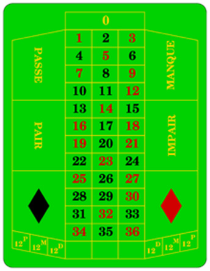
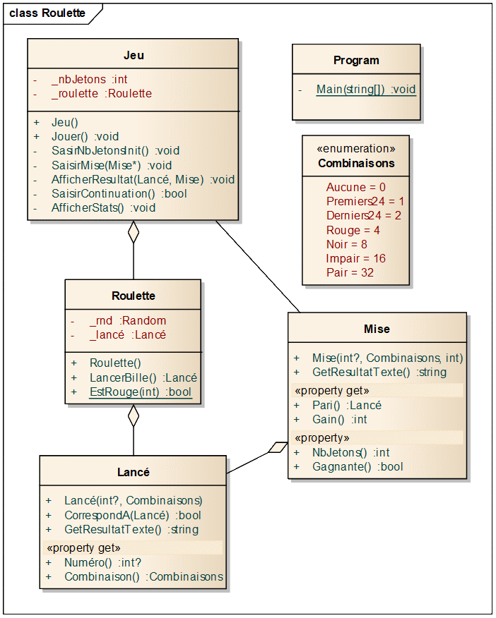

# Jeu de roulette

**Objectifs** : mettre en pratique les notions suivantes :

-  Classes, champs, propriétés, méthodes

-  Constructeurs

-  Modificateurs d’accès

-  Types énumérés

-  Composition/agrégation

-  Membres statiques

## Description du jeu

Une table de roulette ressemble à l’image suivante :



Pour simplifier, on suppose que le joueur ne peut faire que les types de
mises suivants :

|Type de mise                        |Gain                                |
|------------------------------------|------------------------------------|
|Un des 24 premiers numéros (1 à 24) |0.5 x la mise (arrondi au nombre <) |
|Un des 24 derniers numéros (13 à 36)|0.5 x la mise (arrondi au nombre <) |
|Couleur rouge                       |1 x la mise                         |
|Couleur noire                       |1 x la mise                         |
|Numéro impair                       |1 x la mise                         |
|Numéro pair                         |1 x la mise                         |
|Un numéro précis                    |35 x la mise                        |

Exemple : le joueur mise 4 jetons sur le fait que la bille tombe sur un des
24 derniers numéros.  
Si la bille tombe sur un de ces numéros, le joueur récupère sa mise + 2 jetons, sinon, il perd sa mise.

On ne peut pas miser sur le 0. Le jeu s’arrête si le joueur n’a plus de jetons.

**Déroulement du jeu :**

Demander d’abord à l’utilisateur de saisir le nombre de jetons achetés
au début de la partie.

Puis, pour chaque tour :

-  Demander à l’utilisateur de saisir une mise (combinaison et nombre de
   jetons)

-  Simuler le lancement de la bille sur la roulette en générant un
   nombre aléatoire compris entre 0 et 36 et afficher le résultat du
   lancé

-  Calculer et afficher le gain ou la perte, ainsi que le nombre total
   de jetons restants

-  Demander si on veut continuer à jouer

-  Vider l’écran

A la fin, afficher un message « Merci d’avoir joué ».

Si l’utilisateur saisit une information non valide, elle est ignorée, et
le programme attend une nouvelle saisie (sans poser de nouveau la
question).

**Exemple de déroulement du programme :**

NB/ La réponse de l’utilisateur suit chaque question

```
Combien de jetons avez-vous achetés ?
50
```
```
Quelle combinaison choisissez-vous ?
24p/24d : 24 premiers ou derniers numéros
r/n : Couleur rouge ou noire
i/p : Numéro impair ou pair
x : Un numéro précis
i
```
```
Combien de jetons misez-vous (max : 50) ?
8
```
```
La bille est tombée sur le N° 30, qui est rouge et pair.
Vous perdez 8 jetons. Vous possédez désormais 42 jetons.
Voulez-vous continuer (O/N) ?
O
```

[Vider l’écran]

```
Quelle combinaison choisissez-vous ?
24p/24d : 24 premiers ou derniers numéros
r/n : Couleur rouge ou noire
i/p : Numéro impair ou pair
x : Un numéro précis
24p
```
```
Combien de jetons misez-vous (max : 42) ?
20
```
```
La bille est tombée sur le N° 7, qui est rouge et impair.
Vous gagnez 10 jetons. Vous possédez désormais 52 jetons.
Voulez-vous continuer (O/N) ?
O
```

[Vider l’écran]

```
Quelle combinaison choisissez-vous ?
24p/24d : 24 premiers ou derniers numéros
r/n : Couleur rouge ou noire
i/p : Numéro impair ou pair
x : Un numéro précis
X
```
```
Choisissez un numéro compris entre 1 et 36 :
24
```
```
Combien de jetons misez-vous (max : 54) ?
52
```
```
La bille est tombée sur le N° 21, qui est rouge et impair.
Vous perdez 52 jetons. Il ne vous reste plus aucun jeton.

La partie est terminée.
Merci d’avoir joué
```

## A faire

En partant du diagramme de classes ci-dessous et du projet C# qui vous
sera fourni, vous devez compléter le code pour implémenter le jeu décrit
précédemment. Tout l’affichage doit être fait dans la classe Jeu.



## Indications

Pour le contrôle des saisies, s’inspirer du code de la méthode
`SaisirNbJetonsInit`.

Pour générer un nombre aléatoire, il suffit de créer un objet de type
`Random` et d’utiliser sa méthode `Next()`.

## Bonus

A la fin du jeu, afficher des statistiques, comme ceci :

```
2 mises réalisées, dont 1 gagnante(s) et 1 perdante(s)

Nombre de jetons initial : 50

Nombre de jetons final : 51 (+1)

Merci d’avoir joué.

```

Afficher la valeur du compteur de mises au début de chaque nouvelle mise :

```
Mise 3 – Quelle combinaison choisissez-vous ?
```