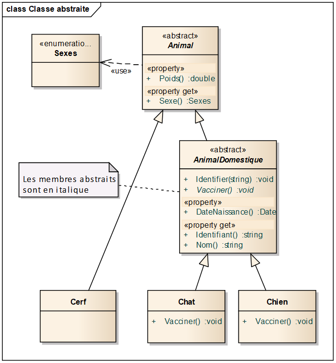

# 9. Classes abstraites et interfaces

## 9.1 Les classes et méthodes abstraites

### 9.1.1 Définition et intérêt

Prenons l’exemple d’une classe ancêtre `Animal` dérivée en plusieurs
classes telles que Chat, Chien, Vache, Cerf, Castor… Nous souhaitons
pouvoir distinguer les animaux domestiques des autres animaux, car nous
voulons leur attribuer des informations supplémentaires telles que le
nom, le numéro identifiant, la date de naissance…etc.

Pour répondre à ce besoin, nous pouvons créer une nouvelle classe
`AnimalDomestique` contenant ces nouvelles informations, avec les
relations d’héritage suivantes (la flèche signifiant « hérite de ») :

`Chat, Chien, Vache ➔ AnimalDomestique ➔ Animal`

Les autres classes d’animaux peuvent continuer à hériter directement
d’Animal :

`Cerf, Castor ➔ Animal`

Au fur et à mesure des nouveaux besoins, on peut être amené à créer
encore d’autres classes spécialisées, jusqu’à obtenir une arborescence
de classes assez complexe.

Cela amène la remarque suivante : rien n’empêche de créer des instances
des classes `Animal` ou `AnimalDomestique`, alors que cela n’a pas vraiment
de sens. En effet, seules les classes en bout de chaîne (Chat, Chien,
Cerf…) représentent vraiment des animaux concrets. L’idéal serait
d’interdire l’instanciation de toutes les classes ancêtres.  
C’est précisément à ce besoin que répond la notion de classe abstraite.

**Une classe abstraite** est une classe qui ne peut pas être instanciée,
et qui est destinée uniquement à être dérivée.  
Pour créer une classe abstraite, il suffit de mettre le mot clé `abstract` devant son nom.

**Les méthodes et propriétés abstraites** sont des membres de classes
abstraites qui ne contiennent pas de corps, et qui sont destinés à être
redéfinis dans les classes concrètes dérivées.

### 9.1.2 Caractéristiques

-  **Une classe abstraite peut contenir à la fois des méthodes concrètes
   et des méthodes abstraites**

-  **Une classe concrète ne peut pas contenir de membres abstraits**

-  **Une méthode ou propriété abstraite doit obligatoirement être
   implémentée dans les classes concrètes dérivées.**

Dans le framework .net, beaucoup de classes de haut niveau sont
abstraites. Comme n’importe quelle classe, les classes abstraites
peuvent implémenter des interfaces. C’est d’ailleurs un bon moyen de
fournir à des classes concrètes, une implémentation par défaut d’une
interface.

### 9.1.3 Exemple de mise en œuvre

On peut ainsi modéliser la hiérarchie de classes précédente de la façon
suivante :



`Animal` et `AnimalDomestique` sont abstraites, car créer directement des
instances de ces classes n’aurait pas beaucoup de sens.  
`AnimalDomestique.Vacciner()` est une méthode abstraite. Elle est donc
redéfinie dans les classes concrètes `Chat` et `Chien`.  
Les autres membres de Animal et AnimalDomestique sont concrets, ce qui permet de fournir
une implémentation par défaut. Mais rien n’empêche de les redéfinir dans
les classes dérivées concrètes si besoin.

Voici le code correspondant à cette architecture :
```csharp
using System;

namespace Exemples
{
   public enum Sexes { Male = 1, Femelle = 2 }

   // Classe ancêtre
   public abstract class Animal
   {
      public double Poids { get; set; }
      public Sexes Sexe { get; }

      public Animal() { }
      public Animal(Sexes sexe, double poids)
      {
         this.Sexe = sexe;
         this.Poids = poids;
      }
   }

   // Classe abstraite pour les animaux domestiques
   public abstract class AnimalDomestique : Animal
   {
      private string _identifiant;

      #region constructeurs
      public AnimalDomestique() { }
      public AnimalDomestique(Sexes sexe, double poids, string nom, DateTime dateNais) : base(sexe, poids)
      {
         this.Nom = nom;
         this.DateNaissance = dateNais;
      }
      #endregion

      #region Propriétés
      public string Nom { get; }
      public DateTime DateNaissance { get; set; }
      public string Identifiant
      {
         get { return _identifiant; }
      }
      #endregion

      #region methodes
      public void Identifier(string numero)
      {
         // On vérifie le format du numéro identifiant
         // Il doit contenir l'année de naissance à partir du 8ème caractère
         string anneeNais = String.Empty;
         if (numero.Length >= 12) anneeNais = numero.Substring(7, 4);
         int annee;
         if (int.TryParse(anneeNais, out annee) && annee >= 1900 && 
               annee <= DateTime.Today.Year)
         {
               _identifiant = numero;
         }
         else
         {
               // Si le format est incorrect, on lève une exception
               throw new FormatException("numéro de tatouage incorrect");
         }
      }

      // Méthode abstraite. Ne possède pas de corps
      abstract public void Vacciner();
      #endregion
   }


   // Classes dérivées concrètes
   public class Chat : AnimalDomestique
   {
      public Chat() { }
      public Chat(Sexes sexe, double poids, string nom, DateTime dateNais) :
         base (sexe, poids, nom, dateNais) { }

      public override void Vacciner()
      {
         // ...
      }
   }

   public class Chien : AnimalDomestique
   {
      public Chien() { }
      public Chien(Sexes sexe, double poids, string nom, DateTime dateNais) :
         base(sexe, poids, nom, dateNais) { }

      public override void Vacciner()
      {
         // ...
      }
   }

   public class Cerf : Animal
   {
      public Cerf() { }
      public Cerf(Sexes sexe, double poids) : base(sexe, poids) { }
   }
} 
```

Voici un exemple d’utilisation de ces classes :
```csharp
class Program
{
   static void Main(string[] args)
   {
      Chien wolfy = new Chien(Sexes.Male, 10.8, "Wolfy", new DateTime(2011, 04, 14));
      wolfy.Identifier("FR48HNG201075314");

      Chat ponpon = new Chat();
      ponpon.Identifier("FR52LKS201479847");

      AnimalDomestique x = new AnimalDomestique(); // Incorrect, car AnimalDomestique est abstraite

      Cerf c = new Cerf();
      c.Poids = 240;  // Correct car Poids est une propriété de Animal
      c.Identifier(); // Incorrect, car Cerf n’hérite pas de AnimalDomestique

      Console.ReadKey(true);
   }
```
## 9.2 Les interfaces

### 9.2.1 Définition

**Une interface** est un ensemble de membres non implémentés qui forment
un *contrat*. Pour qu’une classe remplisse ce contrat (i.e. implémente
l’interface), elle doit fournir une implémentation de tous les membres
prévus par le contrat.

En ce sens, les interfaces ressemblent aux classes abstraites.

**Caractéristiques**

-  Une interface peut contenir uniquement des méthodes, propriétés,
   événements et indexeurs. Elle ne peut pas contenir de constantes,
   champs, opérateurs, constructeurs d'instance, destructeurs ou types.

-  Une interface ne peut pas être instanciée directement

-  Une interface ne contient aucune implémentation. Ses méthodes n’ont
   pas de corps.

-  Les membres d’une interface sont automatiquement publics et ne
   peuvent pas avoir de modificateur d’accès

-  Une classe peut implémenter plusieurs interfaces (tout en dérivant
   d’une autre classe éventuellement)

L’exemple ci-dessous montre une interface nommée IClassable permettant
de classer les êtres vivants.

```csharp
public interface IClassable
{
   string Espece { get; }
   string Famille { get; }
   string Ordre { get;  }
   string Classe { get; }
   string Embranchement { get; }

   string GetClassification();
}
```

Le framework .NET fournit beaucoup d’interfaces. Parmi les plus
classiques, on peut citer par exemple l’interface
`System.Collections.IEnumerable` qui standardise le parcours des
classes conteneurs (collection, liste, dictionnaire…).  
Une classe qui implémente cette interface permet entre autres de parcourir ses éléments
au moyen de l'instruction `foreach` (cf. Section sur les conteneurs).

Il y a aussi l’interface `IComparable`, qui permet de comparer des objets
afin de pouvoir les trier.

### 9.2.2 Implémentation

Une classe peut implémenter une interface de façon implicite, explicite
ou abstraite. Visual Studio permet de choisir parmi les 3 modes, et de
générer automatiquement la structure de code correspondante.

-  **Implémentation implicite** : les membres issus de l’interface sont
   déclarés de façon classique. Si une classe implémente plusieurs
   interfaces avec des membres de même nom, l’implémentation ne peut pas
   être implicite, car ceci provoquerait des conflits de nommage.

-  **Implémentation explicite** : le nom de chaque membre issu de
   l’interface est préfixé par le nom de l’interface, et on ne précise
   pas de modificateur d’accès. Ceci permet de résoudre les conflits de
   noms éventuels

-  **Implémentation abstraite** : les membres issus de l’interface sont
   déclarés comme abstraits. Ceci n’est possible que si la classe est
   elle-même abstraite.

On peut choisir le mode d’implémentation pour chaque membre

Voici un exemple d’implémentation de l’interface précédente :

```csharp
public enum Sexes { Male = 1, Femelle = 2 }

// Classe ancêtre
public abstract class Animal : IClassable
{
   public double Poids { get; set; }
   public Sexes Sexe { get; }

   // Interface IClassable
   // Implémentation abstraite des propriétés
   public abstract string Espece { get; }
   public abstract string Famille { get; }
   public abstract string Ordre { get; }
   public abstract string Classe { get; }
   public abstract string Embranchement { get; }
   // Implémentation explicite de la méthode
   string IClassable.GetClassification()
   {
      return Embranchement + "." + Classe + "." + Ordre + "." + Famille + "." + Espece;
   }

   // Constructeurs
   public Animal() { }
   public Animal(Sexes sexe, double poids)
   {
      this.Sexe = sexe;
      this.Poids = poids;
   }
}

// Classe abstraite pour les animaux domestiques
public abstract class AnimalDomestique : Animal
{
   //...
}


// Classes dérivées
public class Chat : AnimalDomestique
{
   public Chat() { }
   public Chat(Sexes sexe, double poids, string nom, DateTime dateNais) :
         base(sexe, poids, nom, dateNais) { }

   // Propriétés issues de l'nterface IClassable
   public override string Espece { get { return "Chat"; } }
   public override string Famille { get { return "Félidé"; } }
   public override string Ordre { get { return "Carnivore"; } }
   public override string Classe { get { return "Mammifère"; } }
   public override string Embranchement { get { return "Vertébré"; } }
}

public class Chien : AnimalDomestique
{
   public Chien() { }
   public Chien(Sexes sexe, double poids, string nom, DateTime dateNais) :
         base(sexe, poids, nom, dateNais) { }

   // Propriétés issues de l'nterface IClassable
   public override string Espece { get { return "Chien"; } }
   public override string Famille { get { return "Canidé"; } }
   public override string Ordre { get { return "Carnivore"; } }
   public override string Classe { get { return "Mammifère"; } }
   public override string Embranchement { get { return "Vertébré"; } }
}

public class Cerf : Animal
{
   public Cerf() { }
   public Cerf(Sexes sexe, double poids) : base(sexe, poids) { }

   // Propriétés issues de l'nterface IClassable
   public override string Espece { get { return "Cerf"; } }
   public override string Famille { get { return "Cervidé"; } }
   public override string Ordre { get { return "Artiodactyle"; } }
   public override string Classe { get { return "Mammifère"; } }
   public override string Embranchement { get { return "Vertébré"; } }
}
```

La classe ancêtre Animal est abstraite et implémente l’interface
IClassable. Comme les propriétés sont implémentées de façon abstraite,
elles doivent être implémentées réellement dans les classes concrètes
dérivées. En revanche, la méthode GetClassification est implémentée
explicitement dans Animal.

### 9.2.3 Utilisation de variables de type interface

Considérons l’exemple de code ci-dessous :

```csharp
IClassable mimine = new Chat();
Console.WriteLine("La famille du chat est : {0}", mimine.Famille);
mimine.Poids = 4.2; // Incorrect car la variable mimine n'est pas de type Animal mais Iclassable
string c1 = mimine.GetClassification();

Chien capi = new Chien();
Console.WriteLine("La famille du chien est : {0}", capi.Famille);
capi.Poids = 12.8; // correct
string c2 = capi.GetClassification(); // incorrect car GetClassification est implémentée explicitement
```

Il montre plusieurs choses intéressantes :

La première ligne montre qu’un objet qui implémente une interface peut
être référencé au moyen d'une variable du type de l’interface.

Les 2<sup>ème</sup> et 3<sup>ème</sup> lignes montrent que cette
variable ne permet par contre d’accéder qu’aux membres de l’interface,
et pas aux membres de la classe qui l’implémente.

Une variable du type de la classe permet bien entendu d’accéder aux
membres de l’interface (`capi.Famille`), sauf s’ils sont implémentés de
façon explicite (`capi.GetClassification()`).

Pour accéder aux membres implémentés explicitement, il faut
obligatoirement passer par une variable du type de l’interface
(`mimine.GetClassification()`). C’est là une limitation de
l’implémentation explicite d’interface. Cette limitation n’existe pas
avec l’implémentation implicite.

### 9.2.4 Polymorphisme d’interface

Tous les objets qui implémentent IClassable peuvent être manipulés de la
même façon via des variables de type IClassable, quel que soit le type
d’objet référencé. Il s’agit d’un comportement polymorphique.
