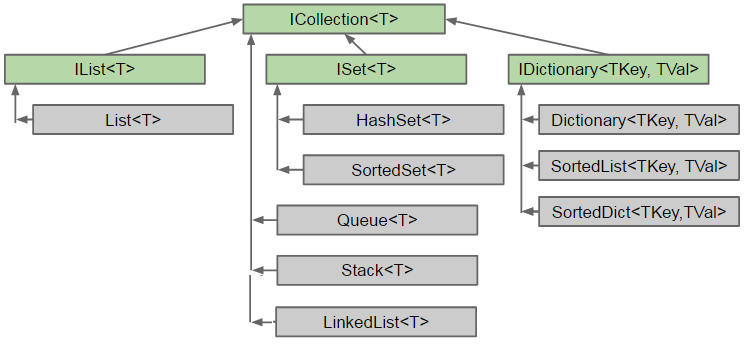

# 12. Les classes conteneurs

Le framework .NET fournit des classes pour stocker des données. Nous
décrivons sommairement quelques classes d'usage fréquent.

## 12.1 Les tableaux

En C#, les tableaux sont des objets dérivés de la classe abstraite
System.Array.

Un tableau contient des éléments de même type, accessibles par un index
entier, de base 0.

On peut créer des tableaux d’éléments de tous types, valeurs ou
références.

```csharp
int[] t1, t2; // déclaration de références (aucune allocation mémoire pour les éléments à ce stade)
t1 = new int[3]; // instanciation. Les éléments sont initialisés par défaut à 0
t2 = new int[] {1, 2, 3}; // instanciation + initialisation

Animal[] anx = new Animal[5]; // déclaration + instanciation. Les éléments sont initialisés à null
```

Lorsqu’on initialise directement les éléments du tableau, on peut
omettre le mot clé new et la dimension du tableau :
```csharp
int[] t3 = {2, 6}; // déclaration + instanciation + initialisation explicite
TimeSpan[] programmation = { new TimeSpan(12, 30, 59), new TimeSpan(5, 10, 0) };
```

La taille du tableau peut être définie dynamiquement :
```csharp
Int size = int.Parse(Console.ReadLine());
Animal[] anx = new Animal[size];
```

…mais cette taille ne peut pas être modifiée après coup (le tableau
n’est pas redimensionnable).

**Parcours d'un tableau avec une boucle for**
```csharp
int[] tab = new int[3];
for (int i = 0; i < tab.Length; i++)
{
   tab[i] = i + 1;
   Console.WriteLine(tab[i]);
}
```
Length est une propriété de la classe System.Array qui donne le nombre
d’éléments du tableau

**Parcours d’un tableau avec une instruction foreach :**
```csharp
int[] tab = new int[3];
foreach(int val in tab)
{
   Console.WriteLine(val);
}
```

L’instruction `foreach` est le moyen le plus simple de parcourir un
tableau, mais elle à plusieurs limitations :

-  On ne peut pas parcourir seulement une partie du tableau

-  On ne peut pas parcourir le tableau dans l’ordre inverse (du dernier élément au premier)

-  On ne connaît pas l’index de l’élément courant

-  On ne peut pas modifier ou supprimer l’élément courant ; il est en lecture seule

**Copie d’un tableau**

Un tableau étant un type référence, si on veut le copier avec son
contenu, on ne peut pas se contenter de faire :
```csharp
int[] t = {1, 2, 3};
int[] c = t;
```

Il faut plutôt utiliser la méthode CopyTo, fournie par la classe Array :
```csharp
int[] t = {1, 2, 3};
int[] c = new int[t.Length];
t.CopyTo(c,  0); // copie en commençant à l’index 0
```

On est obligé d’instancier le tableau dans lequel on veut copier avant
d’appeler CopyTo. On peut choisir de ne copier qu’une partie des
éléments.

**Tableau à plusieurs dimensions**

Juste à titre indicatif, voici un exemple de tableau à plusieurs
dimensions :
```csharp
int[, ,] cube = new int[3, 4, 3];
cube[0,0,0] = 1;
Console.WriteLine(cube.Length); // 36
Console.WriteLine(cube.GetLength(0)); // taille de la première dimension
Console.WriteLine(cube.Rank); // nombre de dimensions = 3
```

**Tableau params**

Une méthode peut avoir un paramètre de type tableau. Dans ce cas, il
faut lui passer un tableau en paramètre lorsqu’on l’appelle. Mais en
ajoutant le mot clé **params** devant le nom du paramètre, il devient
inutile de créer soi-même le tableau. Exemple :
```csharp
class Util
{
   // Méthode qui retourne la valeurminimale d’une liste d’entiers
   public static int Min(params int[] valeurs)
   {
      if (valeurs == null || valeurs.Length == 0)
         throw new ArgumentException("Util.Min : il n’y a pas assez d’arguments");

      int valeurMin = valeurs[0];
      foreach(int i in valeurs)
      {
         if (i < valeurMin)
            valeurMin = i;
      }
      return valeurMin;
   }
}
```

La méthode Min s’utilise de la façon suivante :
```csharp
int m = Util.Min(45, 12, 68, 954, 21, 7, 47);
Console.WriteLine(m);
```

On voit qu’on peut passer directement la liste des valeurs à comparer en
paramètre de la méthode. Il n’est pas nécessaire de créer un tableau.  
Ceci est rendu possible grâce au mot clé `params`. Il permet à la méthode
d’accepter un nombre quelconque de paramètres.

Quand de plus le tableau params est de type `Object`, la méthode est
capable d’accepter n’importe quel nombre et n’importe type de paramètres. 
C’est cette possibilité qui est utilisée dans les méthodes
`String.Format` et `Console.Writeline`, que nous avons déjà utilisées
plusieurs fois.

## 12.2 Les collections non génériques

Les collections sont un autre moyen de stocker des données et de les
parcourir. A la différence des tableaux, les éléments d’une collection
sont toujours stockés sous forme d’**objets**, même s’il s’agit à la
base de types valeur. Le mécanisme de boxing intervient donc lorsqu’on
ajoute des éléments à la collection, et le mécanisme d’unboxing
intervient lorsqu’on veut récupérer la valeur d’un élément de type
simple.

Il existe plusieurs sortes de collections définies dans l’espace de noms
System.Collections, qui diffèrent par la façon d’ajouter des éléments,
d’y accéder, et de les ranger en mémoire. Nous les présentons ici de
façon succincte :

`ArrayList` : se comporte comme un tableau, avec des possibilités
supplémentaires : on peut ajouter ou supprimer un élément au milieu de
la collection, avec les méthodes Insert et RemoveAt.

`Queue` : implémente une file d’attente, selon le mécanisme de premier
entré, premier sorti (FIFO). Les éléments sont ajoutés avec la méthode
Enqueue et enlevés avec la méthode Dequeue

`Stack` : implémente une pile, selon le mécanisme du dernier entré,
premier sorti (LIFO). Les éléments sont ajoutés avec la méthode Push et
enlevés avec la méthode Pop.

`Hashtable` : semblable à un tableau dans lequel les éléments ne sont
pas indexés par un entier, mais par un objet de n’importe quel type
(string, double DateTime…), qu’on appelle clé. Chaque clé doit être
unique. Cette collection gère en interne un tableau pour les clés, et un
autre pour les valeurs.

`SortedList` : similaire à une Hastable dans laquelle les clés sont
triées. Lors de l’ajout d’un élément, celui-ci est placé au bon endroit
pour maintenir la liste triée.

On pourra consulter plus en détails les méthodes de chaque collection
sur [cette page de doc](https://docs.microsoft.com/fr-fr/dotnet/api/system.collections?view=netframework-4.5.2&f1url=%3FappId%3DDev14IDEF1%26l%3DFR-FR%26k%3Dk(System.Collections);k(TargetFrameworkMoniker-.NETFramework,Version%253Dv4.5.2);k(DevLang-csharp)%26rd%3Dtrue).

Voici juste un exemple de mise en œuvre d’une ArrayList :
```csharp
using System;
using System.Collections;

namespace Exemples
{
      class Collections
      {
         public void TestArrayList()
         {
            ArrayList ar = new ArrayList();
            for (int i=0; i<10; i++)
            {
                  // utilisation comme un tableau ordinaire
                  ar[i] = "Elément " + i.ToString(); 
            }

            ar.Add("Elément x"); // ajout d'un élément à la fin du tableau
            ar.Insert(8, "Elément y"); // Ajout d'un élément au milieu du tableau
            ar.RemoveAt(5); // Suppression d'un élément au milieu du tableau
         }
      }
}
```

**Différences entre tableau et collection**

Les différences fondamentales entre un tableau et une collection sont :

-  Un tableau déclare le type des éléments qu’il contient, alors qu’une
   collection ne le fait pas (les éléments sont stockés en tant qu’Object).

-  Un tableau a une taille fixe, alors que la taille d’une collection
   s’adapte dynamiquement à son contenu.

-  Un tableau peut avoir plusieurs dimensions, alors qu’une collection est linéaire

## 12.3 Introduction aux génériques

**Le problème des collections d’objets**

Nous avons vu que les variables de type `Object` pouvaient stocker
n’importe quel type de donnée, valeur ou référence, grâce au fait que :

-  Toutes les classes dérivent de `Object`

-  Les types valeurs peuvent être stockés automatiquement dans des
   objets grâce au mécanisme de boxing

Les collections de l’espace de noms System.Collections permettent ainsi
de stocker n’importe quoi, et rien n’empêche d’y mettre des éléments de
natures différentes.

Ce système et très souple pour le stockage des données, mais il pose
ensuite problème pour leur utilisation.  
En effet, nous avons vu que pour manipuler les types sous-jacents, il fallait transtyper (convertir) les objets dans le type souhaité.  
D’une part, c’est une opération coûteuse en performance.  
D’autre part, elle n’est pas sécurisée, car même si l’on s’attend à ce que l’objet soi
du type sous-jacent souhaité, rien ne permet de le garantir. Il faut
alors gérer cette éventualité par le code au moyen d’exceptions et/ou
des opérateurs `is` et `as` si on veut empêcher l’application de planter.  
Mais cette solution n’est pas satisfaisante. Il serait préférable de
traiter le problème à la racine, en disposant de collections qui
n’autorisent le stockage que d’éléments du même type. C’est là
qu’intervient la généricité.

**Les classes génériques** acceptent des paramètres de type, qui
spécifient le type des objets sur lequel elles opèrent.  
En particulier, le .NET Framework fournit de nombreuses classes de collections et
interfaces génériques dans l’espace de noms `System.Collections.Generic`

Voici un exemple simple de classe générique, qui modélise un point du
plan dont le type des coordonnées est paramétrable :

```csharp
namespace Generique
{
   class Point<T>  // classe générique : T est un type paramétrable
   {
      private T _x, _y;  // les deux champs sont du même type
      public Point(T x, T y)  // constructeur
      {
         _x = x;
         _y = y;
      }

      public override string ToString()
      {
         return "(" + _x.ToString() + "," + _y.ToString() + ")";
      }
   }
}
```

Le type est passé en paramètre à la classe au moyen de la syntaxe `<T>`.  
T est un paramètre qui sera remplacé par un type réel au moment de la compilation.  
Le paramètre T peut être utilisé à l’intérieur de la classe comme type de champ, de propriété ou d’argument de méthode.  
Dans l’exemple ci-dessus, il est utilisé pour les deux champs privés et
pour les paramètres du constructeur.

Cette classe s’utilise de façon simple comme le montre l’exemple ci-dessous :

```csharp
namespace Generique
{
   class Program
   {
      static void Main(string[] args)
      {
         // Point avec des coordonnées entières
         Point<int> p1 = new Point<int>(7, 2);
         Console.WriteLine(p1.ToString());
         
         // Point avec des coordonnées décimales
         Point<decimal> p2 = new Point<decimal>(1.35m, 3.54m);
         Console.WriteLine(p2.ToString());
      }
   }
}
```

Sortie console :
```csharp
(7,2)
(1.35,3.54)
```

On voit dans cet exemple qu’il n’y a besoin d’aucun transtypage pour
gérer les différents types de points. Il suffit de préciser le type réel
à utiliser entre `<>` juste après le nom de la classe. En interne, le
compilateur génèrera une version de la classe `Point` pour chaque type
réel demandé.

## 12.4 Interfaces génériques de collections

Un développeur doit toujours se demander quelle collection est la plus adaptée à un besoin particulier.

Pour aider à faire ce choix, il est souvent pertinent de regarder en premier quelle(s) interface(s) doit implémenter la collection, avant de choisir une collection particulière.

Voici un diagramme qui résume la hiérarchie des principales
interfaces implémentées par les collections génériques.


?> Pour voir les membres d'une interface, il suffit de
saisir son nom dans Visual Studio et de presser F12 (atteindre la définition).  

Le détail des interfaces les plus usuelles est donné ci-dessous à titre indicatif :

`IEnumerable<T>` est l'interface de base pour les collections
génériques. Elle contient une seule méthode non statique nommée
`GetEnumerator`, qui retourne un `IEnumerator<T>`. Elle contient en
revanche beaucoup de méthodes d’extensions.

Les collections qui implémentent `IEnumerable<T>` peuvent être parcourues
à l'aide de l’instruction `foreach`.

`ICollection<T>` fournit entre autres des méthodes pour ajouter et supprimer un élément, et déterminer si la collection contient un élément donné :

```csharp
namespace System.Collections.Generic
{
   public interface ICollection<T> : IEnumerable<T>, IEnumerable
   {
      int Count { get; }
      bool IsReadOnly { get; }
      void Add(T item);
      void Clear();
      bool Contains(T item);
      void CopyTo(T[] array, int arrayIndex);
      bool Remove(T item);
   }
}
```

`IList<T>` permet d'atteindre des éléments par un index (comme dans un
tableau), et d’ajouter ou supprimer des éléments à une position donnée de la liste

```csharp
namespace System.Collections.Generic
{
   public interface IList<T> : ICollection<T>, IEnumerable<T>, IEnumerable
   {
      T this[int index] { get; set; } // Indexeur
      int IndexOf(T item); // donne l'index de item ou -1 sinon
      void Insert(int index, T item); // insertion de item à l'index
      void RemoveAt(int index); // supprime l'élment à index
   }
}
```

`IDictionary<TKey,TValue>` est l'interface pour les paires (clé,
valeur) avec clés uniques. On appelle parfois cela des tableaux
associatifs. On peut accéder aux éléments à partir de leurs clés et vérifier si une clé donnée existe dans la collection :

```csharp
namespace System.Collections.Generic
{
   public interface IDictionary<TKey, TValue> : ICollection<KeyValuePair<TKey, TValue>>, 
   IEnumerable<KeyValuePair<TKey, TValue>>, IEnumerable
   {
      TValue this[TKey key] { get; set; }
      ICollection<TValue> Values { get; }
      void Add(TKey key, TValue value);
      bool ContainsKey(TKey key);
      bool Remove(TKey key);
      bool TryGetValue(TKey key, out TValue value);
   }
}
```

`ISet<T>` est l’interface de base pour les ensembles
```csharp
namespace System.Collections.Generic
{
   public interface ISet<T> : ICollection<T>, IEnumerable<T>, IEnumerable
   {
      bool Add(T item);
      // Supprime de l'ensemble actuel tous les éléments de la collection spécifiée.
      void ExceptWith(IEnumerable<T> other);
      // Modifie l'ensemble actuel afin qu'il contienne uniquement les éléments qui figurent également dans une collection spécifiée.
      void IntersectWith(IEnumerable<T> other);
      // Détermine si le jeu en cours est un sous-ensemble approprié (strict) d'une collection spécifiée.
      bool IsProperSubsetOf(IEnumerable<T> other);
      // Détermine si le jeu en cours est un sur-ensemble (strict) correct de la collection spécifiée.
      bool IsProperSupersetOf(IEnumerable<T> other);
      // Détermine si un ensemble est un sous-ensemble d'une collection spécifiée.
      bool IsSubsetOf(IEnumerable<T> other);
      // Détermine si l'ensemble actuel est un super-ensemble d'une collection spécifiée.
      bool IsSupersetOf(IEnumerable<T> other);
      // Détermine si l'ensemble actuel recoupe la collection spécifiée.
      bool Overlaps(IEnumerable<T> other);
      // Détermine si l'ensemble actuel et la collection spécifiée contiennent les mêmes éléments.
      bool SetEquals(IEnumerable<T> other);
      // Modifie l'ensemble actuel afin qu'il contienne uniquement les éléments présents dans l'ensemble actuel ou dans la collection spécifiée, mais pas dans les deux à la fois.
      void SymmetricExceptWith(IEnumerable<T> other);
      // Modifie le jeu en cours pour qu'il contienne tous les éléments qui sont présents dans le jeu actuel ou la collection spécifiée.
      void UnionWith(IEnumerable<T> other);
   }
}
```

Il existe aussi les interfaces `IReadOnlyCollection<T>`,
`IReadOnlyList<T>` et `IReadOnlyDictionary<TKey, TValue>`, qui sont les
pendants des interfaces vues précédemment, mais avec beaucoup moins de
méthodes puisqu’elles gèrent des collections en lecture seule, qui interdisent l'ajout ou la suppression d'éléments après leur chargement initial.

## 12.5 Collections génériques

Le diagramme ci-dessous présente la hiérarchie des collections
génériques avec les interfaces qu’elles implémentent :



Voici quelques précisions à propos de certaines de ces collections :

`List\<T>` représente une liste d'objets accessibles par index. Elle
fournit des méthodes de recherche, de tri et de manipulation de listes.
C’est certainement la collection la plus utilisée.

`LinkedList\<T>` est une liste doublement chaînée ; c’est-à-dire que
chaque élément connaît le précédent et le suivant. Cette classe
n'implémente pas `IList<T>` puisque l'on ne peut pas accéder directement
à un élément par index.

Les éléments sont stockés dans des nœuds décrits par la classe
ci-dessous :

```csharp
   namespace System.Collections.Generic
   {
      public sealed class LinkedListNode<T>
      {
         public LinkedListNode(T value);
         public LinkedList<T> List { get; 
         public LinkedListNode<T> Next { get; }
         public LinkedListNode<T> Previous { get; }
         public T Value { get; set; }
      }
   }
```

`Dictionary\<TKey,TValue>`

Classe générique de tableaux associatifs implémentant l'interface `IDictionary<key,value>`.
```csharp
namespace System.Collections.Generic
{
   public class Dictionary<TKey, TValue> : IDictionary<TKey, TValue>,
            ICollection<KeyValuePair<TKey, TValue>>,
            IEnumerable<KeyValuePair<TKey, TValue>>,
            IDictionary, ICollection, IEnumerable, Iserializable,
            IDeserializationCallback
   {
      public Dictionary();
      public Dictionary(IDictionary<TKey, TValue> dictionary);

      public int Count { get; }
      public Dictionary<TKey, TValue>.KeyCollection Keys { get; }        
      public Dictionary<TKey, TValue>.ValueCollection Values { get; }
      public TValue this[TKey key] { get; set; }
      public void Add(TKey key, TValue value);
      public void Clear();
      public bool ContainsKey(TKey key);
      public Dictionary<TKey, TValue>.Enumerator GetEnumerator();
      public bool Remove(TKey key);
      public bool TryGetValue(TKey key, out TValue value);
   }
}
```

`SortedList<TKey, TValue>` et `SortedDictionary<TKey, TValue>` sont
similaires. Leurs différences concernent la charge mémoire et les
performances :

-  SortedList utilise moins de mémoire

-  SortedDictionary a des opérations d’insertion et de suppression plus
   rapides pour les données non triées

-  Si la liste est remplie en une seule fois à partir de données triées,
   SortedList est plus rapide.

## 12.6 Enumération des collections

Nous avons vu plus haut que, pour être énumérable, une classe conteneur
doit implémenter l’interface `System.Collections.IEnumerable`. On peut
alors parcourir ses éléments au moyen de l'instruction `foreach`. Pour
être plus précis, ce parcours est rendu possible grâce à un objet de
type IEnumerator, renvoyé par la méthode GetNumerator.

La création d’un objet implémentant l’interface `IEnumerator` est un peu
fastidieuse. C’est pourquoi .net propose la notion d’itérateur, qui
permet de faire générer automatiquement un IEnumerator par le
compilateur.

Un itérateur est un bloc de code qui effectue une itération au sein du
conteneur, c’est-à-dire qui renvoie successivement les éléments du
conteneur à chaque appel. Il contient pour cela une instruction `yield return`, 
qui mémorise la position à laquelle il s’est arrêté, et
reprend l’exécution du code à partir de cette position au prochain appel.

Examinons l’exemple suivant (issu de [cette page
MSDN](https://msdn.microsoft.com/fr-fr/library/dscyy5s0(v=vs.110).aspx)) :
```csharp
static void Main()
{
      DaysOfTheWeek days = new DaysOfTheWeek();

      foreach (string day in days)
      {
         Console.Write(day + " ");
      }
      // Output: Sun Mon Tue Wed Thu Fri Sat
      Console.ReadKey();
}

public class DaysOfTheWeek : IEnumerable
{
      private string[] days = { "Sun", "Mon", "Tue", "Wed", "Thu", "Fri", "Sat" };

      public IEnumerator GetEnumerator()
      {
         for (int index = 0; index < days.Length; index++)
         {
            // Yield each day of the week.
            yield return days[index];
         }
      }
}
```

`DaysOfTheWeek` est une classe conteneur pour les jours de la semaine.
Elle contient un itérateur, qui est le bloc de code de la boucle for.
Cette boucle contient l’instruction yield return, qui renvoie
successivement chaque jour de la semaine, à chaque fois que l’élément
suivant de la collection est demandé par la boucle foreach de la méthode
main.

A partir de ce code, le compilateur est capable de générer lui-même un
objet de type IEnumerator qui sera renvoyé par la méthode GetEnumerator.

L’appel à GetEnumerator lors de l’utilisation de l’instruction foreach
est également réalisé implicitement par le compilateur.

**Remarque** : la compréhension du fonctionnement d’un itérateur est un
peu délicate, justement à cause du fait qu’une bonne partie du code
n’est pas visible, car générée par le compilateur.

