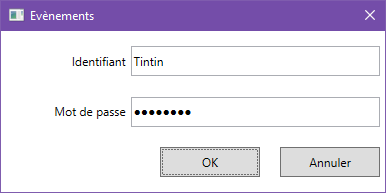

# 13. Délégués et évènements

## 13.1 Délégués

**Un délégué** est un représentant d’une ou plusieurs méthodes.
Lorsqu’on exécute un délégué, on exécute en fait les méthodes
représentées par ce délégué.

Les délégués permettent de passer des méthodes en paramètre d’autres
méthodes, et sont utilisés pour découpler certains traitements de leur
code appelant. Ils sont notamment utilisés pour exécuter des
gestionnaires d’évènements.  

Le .net framework fournit également beaucoup de méthodes utilisant des délégués pour réaliser des opérations sur les collections. L’exemple suivant illustre la méthode `FindAll`, qui permet
de rechercher les éléments d’une liste qui correspondent à une condition :

```csharp
class Program
{
    static void Main(string[] args)
    {
        List<Animal> animaux = new List<Animal>();
        animaux.Add(new Animal { Nom = "Souris", DureeVie = 1.5 });
        animaux.Add(new Animal { Nom = "Tortue", DureeVie = 110 });
        animaux.Add(new Animal { Nom = "Chien", DureeVie = 12 });
        animaux.Add(new Animal { Nom = "Vache", DureeVie = 17 });
        animaux.Add(new Animal { Nom = "Corbeau", DureeVie = 50 });
   
        List<Animal> lst = animaux.FindAll(ADureeVieElevee);
      }

      private static bool ADureeVieElevee(Animal a)
      {
         return a.DureeVie >= 50;
      }
}
```

La méthode `FindAll` a l’en-tête suivante :

```csharp
public List<T> FindAll(Predicate<T> match)
```

`Predicate<T>` est un prédicat, c’est à dire un délégué prenant en
paramètre un élément de type T, et renvoyant un booléen :

```csharp
public delegate bool Predicate<in T>(T obj);
```

La méthode `ADureeVieElevee` satisfait ce délégué et peut donc être
utilisée pour définir le critère de la recherche.

La méthode `FindAll` implémente l’algorithme de recherche, qui consiste à
vérifier pour chaque élément de la collection s’il satisfait ou non une
condition, tandis que cette condition est fournie par une fonction
externe. On a ainsi un découplage complet entre l’algorithme de
recherche et la condition à vérifier, ce qui permet d’utiliser
l’algorithme avec toutes sortes de conditions différentes.

### 13.1.1 Création et exécution d’un délégué

Dans l’exemple qui suit, la méthode `VisiteVeterinaire` modélise une
visite vétérinaire sur un animal, qui peut comprendre plusieurs actes
médicaux :
```csharp
public class Animal
{
    public string Nom { get; set; }
    public double DureeVie { get; set; }
    public List<string> CarnetSanté { get; }
   
    public Animal()
    {
        CarnetSanté = new List<string>();
    }
   
    public void VisiteVeterinaire(DelegueActesMedicaux actes)
    {
        // Appelle chaque méthode représentée par le délégué sur l'animal courant
       actes(this);
    }
}

// Type délégué pour les actes médicaux
public delegate void DelegueActesMedicaux(Animal a);
```

La méthode `VisiteVeterinaire` prend en paramètre un délégué qui
représente tous les actes médicaux effectués durant la visite. Dans le
corps de la méthode, l’exécution du délégué appelle ainsi
automatiquement les méthodes correspondant aux différents actes.

Le type de délégué doit être déclaré. C’est ce qui est fait dans la
dernière ligne, en dehors de la classe `Animal`. La déclaration définit le
type de retour et les paramètres que devront avoir les méthodes
correspondant aux actes médicaux (ici, retour de type `void`, et un
paramètre de type `Animal`).

### 13.1.2 Branchement de méthodes à un délégué

Regardons maintenant comment appeler la méthode VisiteVeterinaire créée précédemment :

```csharp
class Program
{
    static void Main(string[] args)
    {
        Animal capi = new Animal();
   
        // Création d'un délégué qui représente les différents actes médicaux
        DelegueActesMedicaux deleg = null;
        deleg += Deparasiter;
        deleg += Vacciner;

         // Déclenchement de la viste, puis affichage du carnet de santé
         capi.VisiteVeterinaire(deleg);
         foreach (var visite in capi.CarnetSanté)
             Console.WriteLine(visite);
      }

      private static void Deparasiter(Animal a)
      {
        a.CarnetSanté.Add("Déparasitage");
      }
   
      private static void Vacciner(Animal a)
      {
          a.CarnetSanté.Add("Vaccination");
      }
```

Dans la méthode `Main`, on déclare une variable de type délégué
`DelegueActesMedicaux`, et on branche dessus les méthodes souhaitées au
moyen de l’opérateur `+=`.  
Le délégué représente ici les méthodes `Deparasiter` et `Vacciner` qui modélisent les actes médicaux. Les types de leurs paramètres et de leurs retours correspondent à ceux du type délégué.

On appelle ensuite la méthode VisiteVeterinaire sur une instance
d’animal en lui passant le délégué en paramètre. L’appel de ce délégué
dans le corps de la méthode appellera automatiquement les méthodes
Deparasiter et Vacciner, dans cet ordre.

La méthode VisiteVeterinaire permet donc d’effectuer une visite sur un
animal, sans savoir quels seront les actes médicaux pratiqués. Et
surtout, l’implémentation de ces actes est fournie par les méthodes
d’une classe complètement étrangère à la classe Animal (ici la classe
Program).

**Remarques :**

-  Il est possible de débrancher une méthode du délégué au moyen de l’opérateur `-=`.

-  Lorsque le délégué ne représente qu’une seule méthode, il n’est pas
   nécessaire d’utiliser une variable de type délégué. On peut passer
   directement cette méthode en paramètre de l’autre, comme ceci :

```csharp
capi.VisiteVeterinaire(Deparasiter);
```

**Autre syntaxe**

La syntaxe précédente est valable depuis C# 2.0. En C# 1.0 on utilisait
une autre syntaxe, dans laquelle il fallait explicitement instancier le
délégué :
```csharp
DelegueComparer comparateur = null;
comparateur += new DelegueComparer(ComparerNoms);
```

En effet, dans la syntaxe du C# 2.0, l’instanciation du délégué est
implicite lorsqu’on branche une méthode avec l’opérateur +=.

?> La syntaxe du C# 1.00 est utilisée dans le code généré automatiquement
par Visual Studio lors de la création d’interfaces graphiques, pour
associer une méthode à un évènement émis par un contrôle graphique.
C’est pourquoi il est bon de la comprendre, même si on ne l’utilise pas soi-même.

## 13.2 Evénements

### 13.2.1 Notion d'évènement
Une application classique possède une interface visuelle contenant des
composants d’interaction avec l’utilisateur tels que des boutons, zones
de saisies, barre de défilement…etc. Généralement, l’utilisateur est
libre d’interagir avec ces éléments dans l’ordre qu’il veut, et il
existe de nombreux scénarios d’utilisation possibles.  
Prenons l’exemple de la fenêtre ci-dessous :



Dans cette fenêtre, l’utilisateur peut saisir du texte dans des zones de
texte et cliquer sur des boutons. Les clics sur ces boutons ne
déclenchent évidemment pas le même traitement. Lors du clic sur le
bouton OK, l’application doit vérifier si les informations
d’authentification sont correctes et par exemple donner accès à
l’interface principale de l’application. Un clic sur le bouton Annuler
peut par exemple fermer l’application.

Ce type de comportement asynchrone met en œuvre des **évènements**, qui
sont chargés de déclencher des traitements.  
Les clics sur les boutons sont des évènements.  
Chaque pression d’une touche à l’intérieur d’une zone de saisie est également un évènement.  
La prise de focus par une zone de saisie, la fermeture de la fenêtre modale…etc. sont aussi des
évènements.

D’un point de vue du code, les évènements sont des points d’entrée pour
l’interaction avec l’application.

L'utilisation des événements n'est cependant pas limitée aux interfaces
graphiques. D'une manière générale, ils fournissent un moyen pour des
objets au sens large (visuels ou non) de signaler (on dit aussi
**notifier**) quelque-chose à leur environnement extérieur. D’autres
objets de l’environnement extérieur peuvent **s’abonner** à l’évènement
pour y réagir aux moyen de divers traitements.

Dans l’exemple ci-dessus, lorsqu’on clique sur le bouton OK, celui-ci
émet un évènement `click` pour notifier ce clic à la fenêtre qui le
contient. Dans le code lié à cette fenêtre, on peut s’abonner à cet
évènement pour pouvoir exécuter une action (par exemple vérifier
l’identité de l’utilisateur) à chaque fois que l’évènement est
déclenché.

L’objet qui émet l’évènement n’a aucune connaissance des traitements qui
seront exécutés en réaction à cet évènement. On peut ainsi créer des
objets émetteurs d’évènements qui sont indépendants de leur
environnement et réutilisables partout. Le code devient ainsi modulaire.

### 13.2.2 Abonnement à un évènement

Un évènement est en fait un type délégué particulier (déclaré avec le
mot clé `event`)

L’abonnement à un évènement consiste donc à brancher une ou plusieurs
méthodes dessus, comme nous l’avons fait plus haut pour les délégués
ordinaires.

Les méthodes branchées sur des évènements sont appelées **gestionnaires d’évènements**.

Le code suivant montre l’abonnement aux évènements `Click` des boutons de la fenêtre précédente :

```csharp
public partial class MainWindow : Window
{
    public MainWindow()
    {
        InitializeComponent(); // Code généré automatiquement par VS
   
        // Branchement de gestionnaires aux évènements Click
        // des boutons OK et Annuler
        btnOK.Click += BtnOK_Click;
        btnAnnuler.Click += BtnAnnuler_Click;
    }
   
    private void BtnOK_Click(object sender, RoutedEventArgs e)
    {
        // Vérification des informations saisies
        // ...
    }
   
    private void BtnAnnuler_Click(object sender, RoutedEventArgs e)
    {
        this.Close(); // Fermeture de la fenêtre
    }
}
```

Ce code est associé à la fenêtre représentée par la classe `MainWindow`.
Dans le constructeur, après l’appel au code d’initialisation du visuel
généré automatiquement par Visual Studio, on branche deux gestionnaires
pour répondre aux évènements Click émis par les boutons OK et Annuler.

`btnOK.Click` et `btnAnnuler.Click` sont des délégués de type
`RoutedEventHandler`, dont voici la déclaration :

```csharp
public delegate void RoutedEventHandler(object sender, RoutedEventArgs e);
```

NB/ Cette déclaration est présente dans l’assembly PresentationCore.dll qui
est référencée par le projet.

### 13.2.3 Création d’un évènement

Prenons l’exemple de l’application Microsoft Word.  
Lorsqu’on clique sur un des titres du volet de navigation
(affiché via une case à cocher du ruban Affichage), la vue du document
défile jusqu’au titre cliqué. Juste pour l’exemple, on peut imaginer
modéliser ce fonctionnement à l’aide de 3 classes :

-  Document (objet de haut niveau contenant une liste de titres)

-  Title (titre)

-  DocumentViewer (vue du document)

Le code C# correspondant ressemblerait à ceci :
```csharp
using System;
using System.Collections.Generic;

namespace Exemples
{
   public class Document
   {
      private var _titles = new Dictionary<string, Title>();

      // Evènement clic sur un titre
      public event EventHandler<StringEventArgs> TitleClickEvent;

      public void AddTitle(string id, string label)
      {
         _titles.Add(id, new Title(id, label));
      }

      // Méthode pour déclencher l'évènement
      public void SelectTitle(string titleId)
      {
         if (this.TitleClickEvent != null)
               this.TitleClickEvent(this, new StringEventArgs(titleId));
      }
   }

   // Classe décrivant l'argument pour l'événement TitleClickEvent
   public class StringEventArgs : EventArgs
   {
      public string StringValue { get; set; }

      public StringEventArgs(string s)
      {
         this.StringValue = s;
      }
   }

   // Modélise un titre de paragraphe
   public class Title
   {
      public string Id { get; }
      public string Label { get; }

      public Title(string id, string label)
      {
         this.Id = id;
         this.Label = label;
      }
   }

   // Modélise un visualiseur de document
   public class DocumentViewer
   {
      public Document CurrentDoc { get; }

      // Le document à visualiser est passé en paramètre du constructeur
      public DocumentViewer(Document doc)
      {
         CurrentDoc = doc;
         // Abonnement à l'évènement TitleClickEvent du document
         CurrentDoc.TitleClickEvent += OnDocTitleClick;
      }

      // Gestionnaire de l'évènement TitleClickEvent du document
      private void OnDocTitleClick(object sender, StringEventArgs e)
      {
         ScrollToTitle(e.StringValue);
      }

      // Méthode pour scroller jusqu'à un titre
      private void ScrollToTitle(string titleId)
      {
         Console.WriteLine("Défilement vers le titre {0}", titleId);
      }
   }
}
```

La classe Document possède un évènement `TitleClickEvent` associé à un
type délégué `System.EventHandler<T>`, qui est fourni par le .net
framework et fréquemment utilisé. Ce type délégué permet de définir la
signature des méthodes capables de répondre à l’évènement.

`DocumentViewer` s’abonne à l’évènement `Click` de la classe `Document` en
branchant sa méthode `OnDocTitleClick` à l’évènement (avec l’opérateur
`+=`). La signature de cette méthode doit être identique à celle du type
délégué associé à l’évènement.

Lorsqu’on clique sur un titre dans le volet de navigation, la classe
`Document` déclenche son évènement `TitleClickEvent`, ce qui exécute la
méthode `OnDocTitleClick` de l’objet `DocumentViewer`.

Le type délégué associé à l’évènement est de type `EventHandler`.
Lorsqu’on regarde l’aide Microsoft sur ce type, on voit qu’il comporte 2
paramètres : `object sender` et `TEventArgs e`.

-  Le premier paramètre représente l’objet qui a émis l’évènement (ici,
   le document)

-  Le second est de type générique, et représente les données transmises
   par cet objet. Dans notre exemple, nous avons créé un type
   `StringEventArgs` qui permet de stocker un identifiant de titre.

Exemple de code de mise en œuvre de ces classes :

```csharp
class Program
{
   static void Main(string[] args)
   {
      // Crée un document et un visualiseur
      var doc = new Document();
      var view = new DocumentViewer(doc);
      
      // Ajoute des titres au document
      doc.AddTitle("T1", "Le premier titre");
      doc.AddTitle("T2", "Le second titre");
      doc.AddTitle("T3", "Le troisième titre");
      
      // Simule le clic sur un titre dans le volet de navigation
      doc.SelectTitle("T2");

      Console.ReadKey(true);
   }
}
```

On créer un document et un visualiseur, puis on ajoute des titres à la
collection de titres du document.

On simule ensuite un clic sur le titre T2 en appelant la méthode
`SelectTitle` du document (dans une application graphique, le
déclenchement se ferait par un clic sur l’élément d’interface visuelle
qui représente un titre). La méthode SelectTitle déclenche en interne
l’évènement `TitleClickEvent`. Ceci produit l’affiche suivant à l’écran :

```   
Défilement vers le titre T2 
```

Dans une application graphique, cela ferait effectivement défiler le
document.

Il est important de noter que `Document` ne possède aucune référence de
`DocumentViewer`. C’est au contraire DocumentViewer qui connaît Document.
Et pourtant, par l’intermédiaire de l’évènement, on arrive à déclencher
automatiquement l’exécution d’une méthode de DocumentViewer à partir de
Document. C’est bien là tout l’intérêt des évènements et délégués.

## 13.3 Méthodes anonymes et expressions lambda

### 13.3.1 Méthodes anonymes

Dans l’exemple du paragraphe 13.2.2, pour nous abonner à l’évènement
Click du bouton Fermer, nous avons utilisé la syntaxe suivante :

```csharp
btnFermer.Click += BtnFermer_Click;

private void BtnFermer_Click(object sender, RoutedEventArgs e)
{
   this.Close(); // Fermeture de la fenêtre
}
```

Il existe une syntaxe plus condensée utilisant une méthode anonyme :

```csharp
btnFermer.Click += delegate(object sender, RoutedEventArgs e) { this.Close(); }; 
```

La méthode anonyme est constituée du code après le mot delegate.

**Une méthode anonyme** est simplement une méthode sans nom. Comme toute
méthode, elle possède des paramètres et un corps, et peut retourner une valeur.

Comme cette méthode est branchée sur un évènement (qui est un type
particulier de délégué), on la fait précéder du mot clé `delegate`, et sa
signature doit respecter celle du délégué. Les méthodes anonymes sont
quasiment toujours utilisées comme délégués.

**Intérêt des méthodes anonymes**

Les méthodes anonymes évitent la création de tas de petites méthodes
spécifiques, et rendent le code plus concis.  
Un autre avantage est qu’elles servent d’adaptateur ; c’est-à-dire qu’elles peuvent appeler
dans leur corps des méthodes qui ne seraient pas directement utilisables
en tant que délégués du fait que leurs signatures ne respectent pas celle du délégué.

### 13.3.2 Expressions lambda

C# 3.0 a introduit un nouveau concept qui remplace les méthodes
anonymes : les expressions lambda.

La syntaxe est la suivante :
```csharp
// Abonnement à l'évènement TitleClickEvent du document
CurrentDoc.TitleClickEvent += (object sender, StringEventArgs e) => {
   ScrollToTitle(e.StringValue); }; 
```

Une expression lambda est une fonction anonyme qui peut être utilisée
pour créer des types délégués ou des types d’arbres d’expressions (cf.
chapitre sur LINQ).

On n’a donc plus besoin du mot clé `delegate`, mais on utilise par contre
l’opérateur `=>` appelé **opérateur lambda**, entre les paramètres et
le corps de la fonction.

Pour l’abonnement à des évènements, on peut utiliser indifféremment les
méthodes anonymes et les expressions lambda. Il est bon de connaître les
2 syntaxes pour ne pas être perturbé à la lecture du code.  
Les expressions lambda ont cependant un domaine d’application plus large
(notamment utilisées dans les requêtes LINQ). Il est donc préférable de
les utiliser lorsqu’on écrit du nouveau code.

**Différentes formes d’expressions lambda**

Les expressions lambda peuvent prendre plusieurs formes légèrement
différentes :

Dans la forme la plus générale, les paramètres ont des types explicites :

```csharp
(ref int x, int y) => { x++; return x / y; }
```

Les types des paramètres peuvent être déduits automatiquement par le compilateur
(ont dit qu’ils sont inférés).
```csharp
(x, y) => { x++; return x / y; }
```

Dans la forme la plus simple, pas besoin de spécifier le type de paramètre, ni d'utiliser un bloc de code :
```csharp
x => x * x
```


Autre forme simplifiée pour appeler une méthode sans paramètre :
```csharp
() => MaMethode()
```

Certaines syntaxes peuvent paraître déroutantes au départ, mais
l’opérateur lambda (`=>`) permet de reconnaître qu’il s’agit d’expressions
lambda, et donc de comprendre le code.
