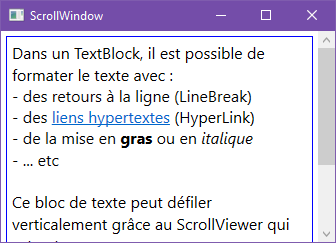
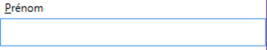

# 3 Construire une interface visuelle

## 3.1 Les contrôles WPF

### 3.1.1 Catégories

[Cette page de doc](https://docs.microsoft.com/fr-fr/dotnet/desktop/wpf/controls/controls-by-category?redirectedfrom=MSDN&view=netframeworkdesktop-4.8)
présente la liste complète des contrôles WPF classés par catégories.

En voici un résumé :

|Catégorie|Utilisation|Contrôles|
|-----|----|----|
|Disposition|Gérer la position, la disposition, la taille et les dimensions des éléments enfants|Border, BulletDecorator, Canvas, DockPanel, Expander, Grid, GridSplitter, GroupBox, Panel, ResizeGrip, Separator, ScrollBar, ScrollViewer, StackPanel, Thumb, Viewbox, VirtualizingStackPanel, Window, WrapPanel|
|Boutons|Contrôles d'interface utilisateur les plus élémentaires. En général, les applications exécutent une tâche dans l'événement Click|Button, RepeatButton|
|Affichage des données|Afficher les données à partir d'une source de données.|DataGrid, ListView, TreeView|
|Affichage et sélection de date|Afficher et sélectionner les informations du calendrier|Calendar, DatePicker|
|Menus|Regrouper des actions connexes ou fournir une assistance contextuelle.|ContextMenu, Menu, ToolBar|
|Sélection|Sélectionner un ou plusieurs items parmi une collection|CheckBox, ComboBox, ListBox, RadioButton, Slider|
|Navigation|Améliorent ou étendent la navigation dans l'application avec des liens, des onglets…|Frame, Hyperlink, Page, NavigationWindow, TabControl|
|Boîtes de dialogue|Scénarios communs d'interaction utilisateur, tels que l'impression, la sélection et l’enregistrement de fichiers|OpenFileDialog, PrintDialog, SaveFileDialog|
|Informations|Fournissent de l’aide contextuelle ou clarifient l'interface utilisateur d'une application. L'utilisateur ne peut généralement pas interagir avec ces contrôles.|AccessText, Label, Popup, ProgressBar, StatusBar, TextBlock, ToolTip|
|Saisie|Permettent de saisir des données|TextBox, RichTextBox, PasswordBox|
|Documents|WPF inclut des contrôles spécialisés pour consulter des documents. Ces contrôles optimisent l'environnement de lecture selon le scénario ciblé|DocumentViewer, FlowDocumentPageViewer, FlowDocumentReader, FlowDocumentScrollViewer, StickyNoteControl|
|Multimédia|WPF inclut la prise en charge de contenus audio et vidéo, ainsi que des codecs pour la plupart des formats d'image courants|Image, MediaElement, SoundPlayerAction|
|Encre numérique|Prennent en charge les fonctionnalités Tablet PC, telles que la saisie et l’affichage de données manuscrites|InkCanvas, InkPresenter|

### 3.1.2 Hiérarchie d’héritage

Tous les éléments WPF dérivent de la classe
[FrameworkElement](https://docs.microsoft.com/fr-fr/dotnet/api/system.windows.frameworkelement?view=netframework-4.8),
dont voici une représentation de la hiérarchie d’héritage dans .net 4.0 :


Nous nous intéresserons dans ce cours plus particulièrement aux branches des classes suivantes :

-  `Panel` (en haut à droite) : contrôles permettent de définir la
   disposition (le layout) des autres contrôles dans la page,
   c’est-à-dire leurs tailles et positions relatives ou absolues.

-  `ContentControl` : contrôle de contenu, pouvant contenir un seul enfant

-  `ItemsControl` : contrôles pouvant afficher des listes d’objets

### 3.1.3 Propriétés communes

**Les dimensions**

FrameworkElement fournit les propriétés suivantes pour le
dimensionnement d’un élément :

| Propriété              | Description |
|----------------------------|---------|
| ActualHeight / ActualWidth | Hauteur / largeur courante en exécution.<br>En lecture seule |
| Height / Width             | Hauteur / Largeur |
| MaxHeight / MaxWidth       | Hauteur / Largeur maximale |
| MinHeight / MinWidth       | Hauteur / Largeur minimale |

NB/ Les dimensions sont exprimées en DIP (Device Independant Pixel).
Cette unité permet de définir les dimensions apparentes, indépendamment
de la résolution de l’écran. Elle est reliée au nombre de pixels par la
formule suivante :  
`DIPs = pixels / (DPI/96)` où DPI (Dot Per Inch) est le nombre de points par pouces de l’écran.

**Les marges**

On distingue deux types de marges sur un élément WPF :

-  Les marges extérieures (`Margin`), entre les bords de l’élément et de son conteneur

-  Les marges intérieures (`Padding`), entre les bords et le contenu de l’élément


Les valeurs des propriétés Margin et Padding sont spécifiées par une
suite de 4 entiers, séparés par des virgules, et désignant
respectivement les marges gauche, supérieure, droite et inférieure.  
Exemple :

```xml
<Button Content="Annuler" Margin="10,0,20,10"/>
```

Si on veut que les marges gauche et droite d’une part, et supérieure et
inférieure d’autre part, soient identiques, on peut se contenter de
spécifier seulement 2 nombres :

```xml
<Button Content="Annuler" Margin="10,20"/>
```

Si on veut que les 4 marges soient identiques, on peut spécifier un seul nombre.

NB/ Padding n’est pas une propriété de FrameworkElement, mais de
ContentControl. Elle ne s’applique qu’aux contrôles qui peuvent avoir un contenu.

**L’alignement**

Les propriétés `HorizontalAlignment` et `VerticalAlignment` définissent les
alignements horizontal et vertical de l’élément lorsqu’il est à
l’intérieur d’un élément parent. Elles peuvent prendre les valeurs suivantes : 
Center, Left, Right, Stretch

Les contrôles qui peuvent posséder un contenu ont deux propriétés
supplémentaires, qui définissent l’alignement de leur contenu :
`HorizontalContentAlignment` et `VerticalContentAlignment`

!> Il y a des interactions entre les propriétés de dimensions et
d’alignement, et le type de conteneur qui contient l’élément.

## 3.2 La disposition (layout)

Les contrôles de disposition sont des conteneurs qui permettent
d’agencer les autres contrôles à l’intérieur d’une fenêtre. Ils peuvent
contenir plusieurs contrôles enfants.

La fenêtre contient toujours un unique conteneur principal, qui peut
lui-même contenir d’autres conteneurs.

Nous allons voir dans ce chapitre :

-  Les principaux conteneurs dérivés de la classe `Panel` (Canvas, Grid,
   StackPanel, DockPanel)

-  D’autres conteneurs dérivés de la classe `ContentControl`, tels que
   ScrollViewer, GroupBox, Expander et TabItem

-  Le contrôle `Border`

Il s’agit de présenter les contrôles les plus utilisés pour la
disposition des éléments d’une fenêtre, et non pas la liste exhaustive.

### 3.2.1 Canvas

Dans ce type de conteneur, les contrôles sont placés et dimensionnés de
façon absolue, c’est-à-dire qu’on attribue à chaque contrôle :

-  Des coordonnées par rapport aux bords gauche et supérieur du canevas
   (propriétés attachées `Canvas.Left` et `Canvas.Top`)

-  Une largeur et une hauteur (propriétés `Width` et `Height`) si nécessaire

En mode design, la barre d’outils Disposition (Layout) offre les
commandes nécessaires pour aligner et dimensionner facilement les
contrôles, sans avoir à saisir toutes les valeurs numériques à la main.

Exemple :


L’intérieur de cette fenêtre peut être réalisé avec le code suivant :

```xml
<Canvas>
   <Label Content="Nom" Canvas.Left="44" Canvas.Top="44"/>
   <TextBox TextWrapping="Wrap" Canvas.Left="154" Canvas.Top="46" Width="150"/>
   <Label Content="Prénom" Canvas.Left="44" Canvas.Top="84"/>
   <TextBox Canvas.Left="154" Canvas.Top="86" Width="150"/>
   <Label Content="Date de naissance" Canvas.Left="44" Canvas.Top="122"/>
   <DatePicker Canvas.Left="154" Canvas.Top="124" Width="150"/>
   <Button Content="Valider" Canvas.Left="154" Canvas.Top="161" Width="75"/>
</Canvas>
```

**Propriétés attachées**

Les propriétés `Canvas.Left` et `Canvas.Top` qui sont affectées à chaque
élément ne sont pas celles de l’élément, mais bien celles du canevas,
c’est pourquoi on parle de propriétés **attachées**. C’est une
particularité importante du xaml, qu’on ne retrouve pas dans le langage
xml classique.

Le canevas permet donc de positionner les éléments de façon très simple
à l’aide de propriétés attachées. Mais l’interface obtenue est rigide.
Il n’y a par exemple pas de repositionnement, ni de redimensionnement
des contrôles selon la taille de la fenêtre. Le canevas ne permet donc
pas d’exploiter l’aspect dynamique de WPF, c’est pourquoi on ne
l’utilise généralement pas.

### 3.2.2 Grid

La grille est un conteneur riche et très largement utilisé en WPF. Elle
permet de placer des contrôles dans des cases, repérées par des numéros
de lignes et de colonnes.

La hauteur et la largeur des lignes et des colonnes peuvent s’adapter
dynamiquement aux dimensions de la fenêtre. C’est pourquoi la grille est
très souvent utilisée comme conteneur principal, afin d’obtenir un
visuel dynamique.

Voici un exemple de visuel obtenu…


… avec le code suivant :

```xml
<Grid>
   <!-- Création de 4 lignes -->
   <Grid.RowDefinitions>
      <RowDefinition/>
      <RowDefinition/>
      <RowDefinition/>
      <RowDefinition/>
   </Grid.RowDefinitions>
   <!-- Création de 2 colonnes -->
   <Grid.ColumnDefinitions>
      <ColumnDefinition/>
      <ColumnDefinition/>
   </Grid.ColumnDefinitions>

   <!-- Ligne 0 -->
   <Label Content="Nom"/>
   <TextBox Grid.Column="1"/>
   <!-- Ligne 1 -->
   <Label Content="Prénom" Grid.Row="1"/>
   <TextBox Grid.Row="1" Grid.Column="1"/>
   <!-- Ligne 2 -->
   <Label Content="Date de naissance" Grid.Row="2"/>
   <DatePicker Grid.Row="2" Grid.Column="1"/>
   <!-- Ligne 3 -->
   <Button Content="Valider" Grid.Row="3" Grid.Column="1"/>
</Grid>
```

Dans ce code :

-  On commence par définir les lignes et colonnes de la grille

-  On place ensuite les contrôles dans la grille à l’aide des propriétés
   attachées `Grid.Row` et `Grid.Column`. On n’a pas besoin de spécifier
   leurs valeurs pour la première ligne et la première colonne, car la
   valeur par défaut vaut 0.

Ce code et son rendu visuel illustrent plusieurs caractéristiques
essentielles de la grille :

#### Caractéristiques principales
-  La hauteur des lignes et la largeur des colonnes s’adaptent
   dynamiquement aux dimensions de la fenêtre, sauf si on spécifie des
   valeurs fixes. Par défaut, toutes les lignes ont la même hauteur, et
   toutes les colonnes ont la même largeur.
   
-  Un contrôle à l’intérieur d’une cellule occupe par défaut toute la
   place qui lui est offerte, c’est-à-dire la cellule entière, sauf si
   on spécifie ses dimensions.  
   NB/ Pour les Labels, ce n’est pas visible car leurs bordures ne sont
   pas visibles.

-  Si on place plusieurs éléments dans une même cellule, ils se superposent

-  La numérotation des lignes et colonnes commence à 0 (valeur par défaut)

-  Un contrôle peut s’étendre sur plusieurs lignes et plusieurs colonnes
   si besoin (cf. plus bas)

Le visuel obtenu précédemment est dynamique, c’est-à-dire qu’en
exécution, les dimensions des contrôles s’adaptent à la taille de la
fenêtre pour occuper tout l’espace disponible.

#### Positionnement des contrôles dans la grille

Pour améliorer le visuel précédent, on peut jouer en particulier sur les
éléments suivants :

-  La hauteur des contrôles

-  La hauteur des lignes et la largeur des colonnes de la grille

-  L’alignement horizontal et vertical de chaque contrôle à l’intérieur
   de sa cellule

-  L’alignement horizontal et vertical du contenu de chaque contrôle

-  Les marges autour de chaque contrôle.

Voici le visuel obtenu…


...en complétant le code précédent de cette façon :

```xml
<Grid Margin="5">
   <!-- Création de 4 lignes -->
   <Grid.RowDefinitions>
      <RowDefinition/>
      <RowDefinition/>
      <RowDefinition/>
      <RowDefinition/>
   </Grid.RowDefinitions>
   <!-- Création de 2 colonnes -->
   <Grid.ColumnDefinitions>
      <ColumnDefinition Width="1*"/>
      <ColumnDefinition Width="2*"/>
   </Grid.ColumnDefinitions>
   
   <!-- Ligne 0 -->
   <Label Content="Nom" VerticalContentAlignment="Center"
                        HorizontalContentAlignment="Right"/>
   <TextBox Grid.Column="1" Height="30" VerticalContentAlignment="Center"/>
   <!-- Ligne 1 -->
   <Label Content="Prénom" Grid.Row="1" VerticalContentAlignment="Center"
                                          HorizontalContentAlignment="Right"/>
   <TextBox Grid.Row="1" Grid.Column="1" Height="30" VerticalContentAlignment="Center"/>
   <!-- Ligne 2 -->
   <Label Content="Date de naissance" Grid.Row="2" VerticalContentAlignment="Center"
                                                   HorizontalContentAlignment="Right"/>
   <DatePicker Grid.Row="2" Grid.Column="1" Height="30" VerticalContentAlignment="Center"/>
   <!-- Ligne 3 -->
   <Button Content="Valider" Grid.Row="3" Grid.Column="1" Height="30"/>
</Grid>
```
Dans ce code, on a :

-  Spécifié une hauteur fixe pour les zones de saisies

-  Centré verticalement le contenu des libellés et zones de texte

-  Centré à droite le texte de chaque libellé, pour qu’il reste proche
   de la zone de saisie associée, notamment lorsqu’on élargit la fenêtre

-  Spécifié des largeurs de colonnes relatives de 1 et 2, et extensibles
   (grâce à l’astérisque)

-  Spécifié une marge droite de 5 sur le bord droit de la grille
   elle-même, afin qu’elle ne soit pas complètement collée au bord de la
   fenêtre

Le visuel obtenu est cette fois à la fois dynamique et esthétique.

**Taille des lignes et colonnes**

Revenons plus en détail sur la façon de spécifier les largeurs de
colonnes et hauteur de lignes de la grille.

`<ColumnDefinition Width="2*"/>` permet à la colonne d’adapter
dynamiquement sa largeur (grâce à \*), tout en gardant une largeur
relative double par rapport aux autres colonnes. Ce sont les valeurs
relatives des largeurs des colonnes qui comptent, et non les valeurs
absolues. On aurait ainsi pu obtenir le même résultat en spécifiant des
largeurs de « 33\* » et « 66\* » par exemple.

Il y a en fait 4 façons de définir la largeur d'une colonne
(respectivement la hauteur d'une ligne) :

-  `Auto` : la largeur s'adapte automatiquement aux contrôles contenus
   dans la colonne

-  `[Valeur]` : valeur absolue en dip

-  `[Valeur]*` : la largeur s'adapte proportionnellement à la
   valeur spécifiée. Lorsque plusieurs colonnes ont une largeur définie
   de la sorte, c'est le ratio entre les valeurs qui compte et non les
   valeurs absolues.

-  `*` : la colonne prend tout le reste de la place disponible en
   largeur. Si plusieurs colonnes ont une largeur \*, elles se partagent
   équitablement la largeur disponible.

**Positionnement d’un contrôle sur plusieurs lignes ou plusieurs colonnes**

Un contrôle peut être positionné sur plusieurs lignes et plusieurs
colonnes à la fois. Pour cela, on utilise les propriétés attachées
`Grid.RowSpan` et `Grid.ColumSpan`.

En reprenant l’exemple précédent, et en modifiant le code du bouton comme ceci :

```xml
<Button Content="Valider" Grid.Row="3" Grid.ColumnSpan="2" Height="30"/>
```
… le bouton s’étendra sur les 2 colonnes de la grille.

#### GridSplitter

Le GridSplitter (séparateur de grille) peut être associé à une grille
pour permettre à l’utilisateur de modifier lui-même les largeurs
relatives de 2 colonnes, ou les hauteurs relatives de 2 lignes, sans
modifier les dimensions de la fenêtre.

Il se présente comme une barre que l’on fait glisser avec la souris.

Dans l’exemple ci-dessous, le GridSplitter est représenté par la barre
verticale en bleu clair :


Examinons le code correspondant :

```xml
<Grid Margin="5">
   <!-- Création de 4 lignes -->
   <Grid.RowDefinitions>
      <RowDefinition/>
      <RowDefinition/>
      <RowDefinition/>
      <RowDefinition/>
   </Grid.RowDefinitions>
   <!-- Création de 3 colonnes -->
   <Grid.ColumnDefinitions>
      <ColumnDefinition Width="3*"/>
      <ColumnDefinition Width="4*"/>
      <ColumnDefinition Width="3*"/>
   </Grid.ColumnDefinitions>

   <GridSplitter Grid.Column="2" Grid.RowSpan="3" HorizontalAlignment="Left"
                  Width="4" Margin="4" Background="LightBlue"/>

   <!-- Ligne 0 -->
   ...
   <Image Grid.Column="2" Grid.RowSpan="2"
            Source="https://cdn.pixabay.com/photo/2016/03/31/17/33/account-1293744_960_720.png" />
   <!-- Ligne 1 -->
   ...
   <!-- Ligne 2 -->
   ...
   <TextBlock Grid.Row="2" Grid.Column="2" HorizontalAlignment="Center">
      <Hyperlink>Modifier</Hyperlink>
   </TextBlock>
   <!-- Ligne 3 -->
   ...
</Grid>
```
Par rapport à la version précédente, nous avons ajouté une nouvelle
colonne qui contient :

-  Une image qui s’étend sur les 2 premières lignes

-  Un lien hypertexte

-  Un séparateur de grille vertical, aligné à gauche, et qui s’étend sur
   les 3 premières lignes. Nous lui avons spécifié une largeur, une
   marge et une couleur afin qu’il soit plus visible :

```xml
<GridSplitter Grid.Column="2" Grid.RowSpan="3"
               HorizontalAlignment="Left"
               Width="4" Background="LightBlue"/>
```
Le GridSplitter peut être ajouté indifféremment sur l’une des 2 colonnes
ou lignes séparées. Il est par défaut aligné verticalement à droite et
horizontalement au centre.

Pour créer un séparateur horizontal, on utilisera un code semblable à celui-ci :

```xml
<GridSplitter Grid.Row="3" Grid.ColumnSpan="2"
               HorizontalAlignment="Stretch" VerticalAlignment="Top"
               Height="4" Background="LightBlue" ResizeDirection="Rows"/> 
```

**Remarque** : si le GridSplitter est placé dans des cellules contenant
déjà d’autres contrôles, il faudra appliquer une marge sur ces derniers
pour qu’il n’y ait pas de chevauchement.

### 3.2.3 StackPanel

Le StackPanel (qu’on pourrait traduire par « panneau d’empilage ») est
un conteneur assez basique, qui permet d’empiler des contrôles les uns à
la suite des autres, soit horizontalement, soit verticalement, sans
chevauchement possible.

***Caractéristiques principales :***

-  La propriété `Orientation` permet de définir si le contenu du
   StackPanel est empilé verticalement ou horizontalement. La valeur par
   défaut est « vertical ».

La disposition de la fenêtre ci-dessous est réalisée au moyen d'une grille à 5 lignes dont certaines contiennent des StackPanel (sur fond coloré pour bien voir leur étendue) :

<div style="display: grid; grid-template-columns: 1fr 1fr;">
   
   <p style="align-self:center">⟵ StackPanel vertical</p>
   <p style="align-self:center">⟵ StackPanel horizontal (jaune) contenant 3 StackPanel verticaux (rose, vert et bleu)</p>
   <p style="align-self:end">⟵ StackPanel horizontal avec alignement à droite</p>
</div>

Cet exemple illustre les caractéristiques suivantes :

-  Dans un StackPanel vertical, chaque contrôle empilé occupe par défaut :
   -  Une hauteur minimale fixée par son contenu (ex : la hauteur du texte pour les TextBox)
   -  Toute la largeur du StackPanel

-  Dans un StackPanel horizontal, c’est l’inverse : chaque contrôle empilé occupe :
   - Une largeur minimale fixée par son contenu (ex : la largeur du texte des boutons)
   - Toute la hauteur du StackPanel

Le StackPanel horizontal jaune clair contient 3 StackPanels verticaux.  
Ces derniers ont une largeur minimale fixée par leur contenu (les cases à cocher), et occupent toute la hauteur du StackPanel horizontal.  
Les cases à cocher occupent une hauteur minimale. Si la largeur de la fenêtre diminuait, le texte de la dernière case à cocher serait tronqué.  
Pour améliorer le visuel, on pourrait spécifier la largeur des boutons OK et Annuler, et la hauteur du StackPanel qui les contient.

Voici le code correspondant au visuel précédent :
```xml
<Grid Margin="10" ShowGridLines="True">
   <Grid.RowDefinitions>
      <RowDefinition Height="20*"/>
      <RowDefinition Height="10*"/>
      <RowDefinition Height="50*"/>
      <RowDefinition Height="10*"/>
      <RowDefinition Height="10*"/>
   </Grid.RowDefinitions>
   <!-- Ligne 0 : StackPanel contenant les zones de texte prénom et nom -->
   <StackPanel Orientation="Vertical" Background="#FFC8C8FF">
      <TextBox x:Name="textBox1" Text="Prénom" Height="25" Margin="0,5,0,5"/>
      <TextBox x:Name="textBox2" Text="Email" Height="25"/>
   </StackPanel>
   
   <!-- Ligne 1 : libellé -->
   <TextBlock Grid.Row="1" VerticalAlignment="Bottom" Margin="0,0,0,5"
               Text="Quels sont vos centres d'intérêt ?"/>

   <!-- Ligne 2 : StackPanel horizontal contenant 3 StackPanel verticaux -->
   <StackPanel Grid.Row="2" Orientation="Horizontal" Background="LightYellow">
      <StackPanel Orientation="Vertical" Background="#FFFFC8C8">
         <CheckBox Content="Développement Web" Margin="0,0,5,5"/>
         <CheckBox Content="cbk21" Margin="0,0,5,5"/>
         <CheckBox Content="cbk31" Margin="0,0,5,5"/>
         <CheckBox Content="cbk41" Margin="0,0,5,5"/>
         <CheckBox Content="cbk51"/>
      </StackPanel>
      <StackPanel Orientation="Vertical" Background="#FFC8FFC8">
         <CheckBox Content="cbk12" Margin="0,0,5,5"/>
         <CheckBox Content="cbk22" Margin="0,0,5,5"/>
         <CheckBox Content="cbk32" Margin="0,0,5,5"/>
         <CheckBox Content="cbk42" Margin="0,0,5,5"/>
         <CheckBox Content="cbk52" Margin="0,0,5,5"/>
      </StackPanel>
      <StackPanel Orientation="Vertical" Background="#FF96C8FF">
         <CheckBox Content="cbk13" Margin="0,0,5,5"/>
         <CheckBox Content="cbk23" Margin="0,0,5,5"/>
         <CheckBox Content="cbk33" Margin="0,0,5,5"/>
         <CheckBox Content="cbk43" Margin="0,0,5,5"/>
         <CheckBox Content="Développement mobile" Margin="0,0,5,5"/>
      </StackPanel>
   </StackPanel>

   <!-- Ligne 3 : cases à cocher avec texte long -->
   <CheckBox Grid.Row="3"/>
   <TextBlock Grid.Row="3" Margin="20,0,0,0" TextWrapping="Wrap"
         Text="J'autorise ... à m'envoyer des offres commerciales de ses partenaires"/>

   <!-- Ligne 4 : StackPanel horizontal contenant les boutons OK et Annuler-->
   <StackPanel Grid.Row="4" Orientation="Horizontal" HorizontalAlignment="Right"
               Background="#FFF3F319">
      <Button Content="OK"/>
      <Button Content="Annuler" Margin="10,0,0,0"/>
   </StackPanel>
</Grid>
```
**Remarques :**  

- Le fait de placer les cases à cocher dans des StackPanel évite
  d’avoir à créer une multitude de lignes de grille. On pourrait ainsi
  rajouter facilement de nouvelles cases à cocher sans changer les N° de lignes.

- A l’intérieur des StackPanel, des marges permettent d'espacer légèrement les différents contrôles

- Dans la ligne 3 de la grille, le TextBlock associé à la case à cocher permet au texte de retourner à la ligne lorsque la largeur de la fenêtre diminue.

?> **Bonne pratique**  
Le StackPanel permet de regrouper des contrôles qui vont ensemble, afin de les manipuler plus facilement.  
Comme dans notre exemple, il permet notamment de mettre plusieurs éléments dans une seule cellule de grille, sans les superposer, ce qui évite d’avoir à créer une grille très fine.  
En effet, plus le nombre de lignes et de colonnes d’une grille est élevé, plus celle-ci est difficile à maintenir.

***WrapPanel***

Le WrapPanel est identique au StackPanel, hormis le fait que son contenu
n’est pas tronqué, mais passe sur une nouvelle ligne, s’il excède la
largeur du panneau. Cette caractéristique peut être utilisée par exemple
dans une barre d’outils, pour que les boutons restent visibles si on
réduit la largeur de la barre.

### 3.2.4 DockPanel

Le DockPanel (qu’on pourrait traduire par « panneau d’ancrage ») se
comporte par défaut comme un StackPanel horizontal, aux
différences près suivantes :

<div style="display:flex; flex-wrap:wrap; justify-content:space-evenly; align-items:center;">


- Il s’étend sur toute la largeur disponible
- Le dernier bloc ajouté à l’intérieur remplit par défaut<br>
le reste de l’espace disponible (alignement horizontal étiré)

</div> 

Remarque : si on aligne le dernier bloc à droite, un espace vide
apparaît entre les blocs 2 et 3.

Grâce à ces différences, le DockPanel permet un positionnement plus
dynamique qu’avec un simple StackPanel. C’est aussi une bonne
alternative à la grille pour placer quelques composants sur une même
ligne et occuper toute la largeur disponible, sans avoir la lourdeur de
syntaxe de la grille.

***Ancrage de composants***

Le DockPanel permet aussi d’ancrer des composants sur ses bords à l’aide
de la propriété attachée `DockPanel.Dock`. Les composants restent
ancrés même si la taille du DockPanel varie.

Si on ancre plusieurs composants sur le même bord, ils s’empilent.
L’ordre dans lequel ils sont ajoutés dans le code est important, comme
le montre l’exemple suivant :

<div style="display:flex; flex-wrap:wrap; justify-content:space-evenly; align-items:center;">


```xml
<DockPanel>
<TextBlock Text="Bloc 1" DockPanel.Dock="Top"
      Background="LightSteelBlue" Padding="5"/>
<TextBlock Text="Bloc 2" DockPanel.Dock="Left"
      Background="LightBlue" Padding="5"/>
<TextBlock Text="Bloc 3" DockPanel.Dock="Bottom"
     Background="LightGreen" Padding="5"/>
<TextBlock Text="Bloc 4" DockPanel.Dock="Right"
      Background="LightYellow" Padding="5"/>
<TextBlock Text="Bloc 5" DockPanel.Dock="Top"
      Background="LightSalmon" Padding="5"/>
<TextBlock Text="Bloc 6" DockPanel.Dock="Left"
      Background="LightCoral" Padding="5"/>
<TextBlock Text="Bloc 7" Padding="5"/>
</DockPanel>
```

</div> 

Dans cet exemple, on voit que :

-  Les blocs 1 et 5 sont ancrés au bord supérieur et s’empilent verticalement.
-  Les blocs 2 et 6 sont ancrés au bord gauche et s’empilent horizontalement.
-  L’étendue de chaque bloc est limitée par les blocs qui le précèdent

?> **Bonne pratique**  
Typiquement, on peut utiliser le DockPanel comme conteneur principal
d’une fenêtre pour ancrer des menus, barres d’outils, boutons...etc. sur
les bords de la fenêtre. On peut ajouter un autre composant à
l’intérieur pour disposer le contenu non ancré.

### 3.2.5 ScrollViewer

Le fait de placer un contrôle à l’intérieur d’un ScrollViewer, permet
d’afficher des **barres de défilement** sur ce contrôle, si celui-ci le
permet. Il n’est pas nécessaire d’ajouter soi-même un contrôle ScrollBar.

Les propriétés `HorizontalScrollBarVisibility` et
`VerticalScrollBarVisibility` permettent de définir les visibilités
des barres de défilement horizontale et verticale.  
Elles peuvent prendre les valeurs `Auto`, `Disabled`, `Hidden` ou `Visible`.  
La valeur par défaut est Hidden pour la barre horizontale et Visible pour la barre verticale.

Examinons les exemples ci-dessous :

<div style="display:flex; flex-wrap:wrap; justify-content:space-evenly; align-items:center;">


```xml
<ScrollViewer>
   <TextBlock TextWrapping="Wrap"
            FontSize="16">
   ...
   </TextBlock>
</ScrollViewer>
```

</div>

<div style="display:flex; flex-wrap:wrap; justify-content:space-evenly; align-items:center;">


```xml
<ScrollViewer
   HorizontalScrollBarVisibility="Auto">
   <TextBlock TextWrapping="Wrap"
            FontSize="16">
   ...
   </TextBlock>
</ScrollViewer>

```

</div>

Dans le premier cas, les valeurs par défaut des propriétés de visibilité
s’appliquent, et seule la barre de défilement verticale est visible.

Dans le second cas, on affiche également la barre de défilement
horizontale en spécifiant la valeur Auto pour sa propriété de
Visibilité. Remarquons que dans ce cas le texte ne passe plus à la
ligne, même si la propriété TextWrapping du TextBlock à la valeur Wrap.

Par défaut, la barre de défilement verticale n’est activée que si c’est
nécessaire, c’est-à-dire que si le contenu auquel elle s’applique n’est
pas entièrement visible. Si la barre n’est pas nécessaire, elle reste
visible, mais dans un état désactivé.

**Remarques :**

-  Si le ScrollViewer est le premier contrôle enfant de la fenêtre, la
   barre de défilement porte sur l’ensemble du contenu de la fenêtre.

-  Un ScrollViewer est nativement intégré aux contrôles de type liste
   (ListBox, ListView, DataGrid…), de sorte qu’une barre de défilement
   verticale s’affiche automatiquement lorsque c’est nécessaire.

?> **Bonne pratique**  
  Dans la mesure du possible, pour garder une bonne expérience utilisateur, il est préférable de concevoir les écrans de façon qu’aucune barre de défilement horizontale ne soit nécessaire.

### 3.2.6 GroupBox, Expander et TabControl/TabItem

Ces contrôles servent surtout à regrouper visuellement des éléments.

Ils sont illustrés par l’exemple suivant :


Code correspondant :
```xml
<Grid Margin="5">
   <Grid.RowDefinitions>
      <RowDefinition/>
      <RowDefinition Height="Auto"/>
   </Grid.RowDefinitions>
   <!-- 1ère ligne -->
   <ScrollViewer>
      <TextBlock TextWrapping="Wrap" FontSize="16">
         ... 
      </TextBlock>
   </ScrollViewer>
   <!-- 2de ligne -->
   <Expander Header="Expander" Grid.Row="1" IsExpanded="True"
               BorderThickness="1" BorderBrush="Red">
      <TabControl Margin="5">
            <!-- Onglet 1 -->
         <TabItem Header="TabItem 1">
            <GroupBox Header="GroupBox 1" Margin="5" Padding="10">
               <StackPanel>
                  <CheckBox Content="chk1" IsChecked="True"/>
                  <CheckBox Content="chk2"/>
                  <CheckBox Content="chk3"/>
               </StackPanel>
            </GroupBox>
         </TabItem>
         <!-- Onglet 2 -->
         <TabItem Header="TabItem 2">
            <GroupBox Header="GroupBox 2" Margin="5" Padding="10" BorderBrush="Blue">
               <StackPanel Orientation="Horizontal">
                  <RadioButton Content="opt1" Margin="0,0,20,0"/>
                  <RadioButton Content="opt2" Margin="0,0,20,0" IsChecked="True"/>
                  <RadioButton Content="opt3" Margin="0,0,20,0"/>
               </StackPanel>
            </GroupBox>
         </TabItem>
      </TabControl>
   </Expander>
</Grid>
```

**Le GroupBox** affiche un titre (ici "GroupBox 1")et un cadre dans lequel on place généralement
des boutons radio et des cases à cocher.

**L’Expander** est semblable au GroupBox, mais il permet en plus de se
replier ou de se déplier au moyen d'un bouton en forme de flèche, pour masquer ou afficher son contenu.  
Il a un en-tête et un contenu. Lorsqu’il est replié, seul l’en-tête est visible.

Caractéristiques :

-  La propriété `IsExpanded` définit si l’Expander est replié ou déplié
-  La propriété `ExpandDirection` définit dans quelle direction se déplie l’Expander (bas, haut, gauche ou droite)
-  Par défaut, sa bordure est invisible, mais on peut la rendre visible en spécifiant une épaisseur et une couleur.

Le **TabControl** est un conteneur d’onglets. Les onglets permettent de partager un
même espace à l’écran. On ne peut voir le contenu que d’un seul onglet à la fois.  
Le TabControl gère automatiquement le clic sur les onglets, pour afficher le contenu de l’onglet cliqué.  
Il peut contenir une collection d’objets de n’importe quel type (texte, image, panneau…),
mais le type le plus approprié est le `TabItem`, qui permet d’afficher un titre d’onglet et un contenu.

!> Ces contrôles dérivent de `ContentControl` et ne peuvent donc
contenir qu’**un seul élément enfant**.  
Cet élément sera donc généralement un autre contrôle de disposition capable de contenir plusieurs éléments.

### 3.2.7 Border

Le contrôle **Border** affiche simplement une bordure avec l’épaisseur
et la couleur souhaitée. Il est utile pour encadrer les contrôles qui
n’ont pas de bordure, comme par exemple le TextBlock ou le StackPanel.

On peut le comparer à un GroupBox sans titre.

Ci-dessous, on ajoute une bordure bleue autour d'un bloc de texte :

<div style="display:flex; flex-wrap:wrap; justify-content:space-evenly; align-items:center;">



```xml
<Border BorderBrush="Blue"
        BorderThickness="1" 
        Margin="5" Padding="5">
   <TextBlock TextWrapping="Wrap"
              FontSize="16">
            ... 
   </TextBlock>
</Border>

```

</div>

### 3.2.8 Recommandations

-  Pour garder un visuel dynamique et un code facilement modifiable, **spécifier le moins possible de largeurs fixes** sur les contrôles.

-  **Regrouper les contrôles dans des conteneurs intermédiaires** (Grid ou
   StackPanel), avant de les placer dans le conteneur principale, de façon
   à pouvoir les traiter par paquets. C’est plus productif et plus
   évolutif que d’utiliser uniquement la grille principale.

-  **Limiter toutefois les niveaux d’imbrications de conteneurs**, qui rendent le
   code plus difficile à lire et peuvent dégrader les performances.

-  **Pour obtenir un visuel harmonieux :**

   -  Aligner au maximum les contrôles les uns avec les autres
   -  Les répartir de façon homogène (éviter les espaces vides trop importants)
   -  Optimiser la place : dimensionner les fenêtres au plus juste,
      éviter les marges trop importantes (penser aux écrans
      d’ordinateurs portables qui ont parfois une résolution assez faible)…

-  **Mettre des commentaires dans le xaml** pour s’y retrouver plus
   facilement, notamment avant les conteneurs principaux, les lignes de
   grilles, les blocs d’informations...etc.

### 3.2.9 Le designer de Visual Studio

Le designer de Visual Studio permet d’afficher en temps réel un aperçu
du visuel décrit en XAML :


On peut construire le visuel en faisant glisser des contrôles de la
boîte à outils située sur le côté gauche, vers la surface de design
située au centre. Le code xaml correspondant s’affiche dans la partie
inférieure. Bien entendu, si on saisit directement le code xaml dans la
partie inférieure, l’aperçu se rafraîchira automatiquement dans la
partie supérieure.

Le panneau des propriétés situé à droite affiche les propriétés de
l’élément WPF courant (celui qui a le focus), classées par catégorie. Il
permet également de modifier leurs valeurs. Ce panneau peut s’avérer
très utile pour explorer les propriétés disponibles sur les différents
contrôles.

**Limitations**

La création d’un visuel par glisser/déplacer de contrôles sur la surface
de design a ses limites :
- Il est généralement compliqué de faire un visuel dynamique de cette façon, ou bien d’ajouter des éléments à un
  visuel existant sans impacter les autres éléments. L’écriture directe du code xaml permet d’aller plus directement et plus rapidement au résultat souhaité.  
- De plus, il est indispensable de bien maîtriser le code xaml pour comprendre ce que l’on fait.  
- Enfin, le designer ne pourra pas afficher correctement les composants externes (non fournis par Visual Studio), si cela n’a pas été prévu par l’éditeur.

?> **Bonne pratique**  
Utiliser la surface de design pour avoir un aperçu du visuel, sélectionner rapidement un contrôle, ou afficher ses
propriétés.  
En effet, un clic sur le contrôle visuel permet de sélectionner le code xaml correspondant dans l’éditeur de code, et d’afficher les propriétés du contrôle dans le panneau de propriétés.

## 3.3 Le contenu

Le terme « contenu » est ici à prendre au sens large. Les contrôles de
contenu sont ceux qui ne peuvent contenir qu’**un seul élément enfant**,
de n’importe quel type. Cela englobe des contrôles très variés : les
fenêtres, les libellés, les différents types de boutons, les contrôles
représentant des items de collection…etc.

Ces contrôles dérivent de la classe `ContentControl`.

!> Ne pas confondre contenu et conteneur. Les contrôles que
l’on nomme « conteneurs » sont généralement les contrôles de disposition
(Grid, StackPanel…etc).

### 3.3.1 La classe ContentControl

Cette classe est l’ancêtre des contrôles de contenu. Voici sa hiérarchie
d’héritage :


La particularité de la classe ContentControl est de posséder une
propriété `Content` de type Object, qui représente le contenu du
contrôle. Il y a 2 façons de spécifier la valeur de cette propriété en XAML :

```xml
<Button Content="Valider"/>
<!-- équivalent à : -->
<Button>Valider</Button>
```

Un ContentControl peut contenir et afficher n’importe quel type CLR
(comme string ou DateTime par exemple) ou n’importe quel type dérivé de
`UIElement`, ce qui laisse énormément de possibilités.  
Ceci est illustré par l’exemple de code suivant :

```xml   
<!-- Contenu de type String -->
<Label>Texte simple</Label>
   
<!-- Contenu de type DateTime-->
<Label xmlns:sys="clr-namespace:System;assembly=mscorlib" ContentStringFormat="D">
   <sys:DateTime>2016-12-25 13:06:55</sys:DateTime>
</Label>

<!--Contenu de type UIElement -->
<Label>
   <Border BorderBrush="Red" BorderThickness="1" Padding="5" CornerRadius="10">
      <StackPanel Orientation="Horizontal">
         <Ellipse Height="20" Width="20" Fill="Blue" Margin="0,0,5,0"/>
         <TextBlock VerticalAlignment="Center">StackPanel</TextBlock>
      </StackPanel>
   </Border>
</Label>
```

…qui donne le visuel suivant (certains styles supplémentaires ont été appliqués) :


La propriété `ContentTemplate` est également l’une des plus
intéressantes. Elle permet de spécifier le modèle (DataTemplate) à
utiliser pour afficher son contenu. Cette fonctionnalité est utilisée
conjointement avec la liaison de données, que nous verrons plus loin.

### 3.3.2 Quelques exemples de ContentControl

`ContentControl` n’est pas une classe abstraite ; on peut donc
utiliser cet élément directement. Il est quasiment identique au Label.

`ButtonBase` est la classe abstraite ancêtre des boutons, notamment
Button et ToggleButton. Elle définit l’évènement `click`, ainsi que la
propriété `Command`, qui permet d’invoquer une commande (cf. + loin)
lorsque le bouton est pressé.

`CheckBox` et `RadioButton` dérivent de `ToggleButton`, qui possède deux
propriétés propres : `IsChecked` (état coché ou non) et `IsThreeState`
(possibilité ou non d’avoir un état intermédiaire).

`Tooltip` (info-bulle) se présente sous forme d’un popup permettant de
fournir des informations à l’utilisateur.  
Le Tooltip ne peut pas avoir de parent, mais peut être assigné à la
propriété Tooltip d’un autre contrôle. Le popup apparaît généralement au
survol de ce contrôle par la souris.  
Un Tooltip peut être défini en tant que ressource (cf. plus bas) afin
d’être utilisable sur plusieurs contrôles.

Exemple :


```xml
<CheckBox Content="Imprimer les dessins" IsChecked="True"
      ToolTip="Désactiver cette option pour imprimer les documents sans graphiques ni zones de texte flottantes"/>

<TextBox Text="TextBox avec ToolTip contenant une image et du texte">
   <TextBox.ToolTip>
      <ToolTip>
      <DockPanel Width="150" Height="40">
         <Image Source="information.png"/>
         <TextBlock VerticalAlignment="Center">Information texte</TextBlock>
      </DockPanel>
      </ToolTip>
   </TextBox.ToolTip>
</TextBox>
```
`Label` (étiquette) est fait pour être associé à un autre contrôle. Il
a une propriété `Target` pour indiquer le nom de l’élément qui reçoit le
focus lorsqu’on utilise l’accès rapide du Label au moyen de ALT + \<touche>.

La touche d’accès rapide est définie en mettant un `_` devant la
lettre souhaitée du texte du Label, comme le montre l’exemple suivant :

<div style="display:flex; flex-wrap:wrap; justify-content:space-evenly; align-items:center;">



```xml
<Label Content="_Prénom"
      Target="{Binding ElementName=tbPrenom}"/>

```

</div>

Ici, lorsqu’on appuie sur ALT + P, la zone de texte tbPrenom reçoit
automatiquement le focus.

Il est également possible de définir le texte d’un libellé avec un
élément `AccessText` de façon à bénéficier de sa propriété `TextWrapping`
pour avoir un retour à la ligne automatique.

Exemple :

<div style="display:flex; flex-wrap:wrap; justify-content:space-evenly; align-items:center;">


```xml
<Label>
   <AccessText Text="Dimensions de la fenêtre"
               TextWrapping="Wrap"/>
</Label>

```

</div>

**Différences entre Label et TextBlock :**

Label hérite de ContentControl et donc de Control. Il a donc des
propriétés HorizontalContentAlignment et VerticalContentAlignment,
IsTabStop, TabIndex, Background, Foreground, BorderBrush, que ne possède
pas le TextBlock.

TextBlock hérite directement de FrameworkElement, et est spécialisé dans
l’affichage de texte. Il a des propriétés propres pour cela :

-  IsHyphenationEnabled (coupure de mots automatique)
-  LineHeight (hauteur des lignes de texte)
-  LineStackingStrategy
-  Text
-  TextAlignment
-  TextDecorations
-  TextEffects
-  TextTrimming
-  TextWrapping (retour à la ligne)
-  Typography

Il peut contenir plusieurs éléments enfants, ce qui permet notamment
d’imbriquer d’autres TextBlock, et de mettre en forme le texte avec les
éléments Bold, Italic, LineBreak…etc.

```xml
<TextBlock TextWrapping="Wrap" FontSize="14">
   Dans un TextBlock, il est possible de formater le texte avec :<LineBreak/>
   - des retours à la ligne (LineBreak)<LineBreak/>
   - des <Hyperlink>liens hypertextes</Hyperlink> (HyperLink)<LineBreak/>
   - de la mise en <Bold>gras</Bold> ou en <Italic>italique</Italic><LineBreak/>
   - ... etc
</TextBlock>
```

## 3.4 Les collections d’éléments

L’affichage de collections d’éléments concerne :

-  Les menus (y compris contextuels)
-  La barre de statut
-  Les barres d’outils
-  Les arbres
-  Les onglets
-  Les contrôles de sélection (listes, grille de données)

Ces contrôles dérivent de la classe
[ItemsControl](https://docs.microsoft.com/fr-fr/dotnet/api/system.windows.controls.itemscontrol?view=netframework-4.8)

### 3.4.1 La classe ItemsControl

Cette classe est l’ancêtre des contrôles qui gèrent une collection
d’éléments. Voici sa hiérarchie d’héritage :


**Contenu de la collection**

Pour chaque dérivé de ItemsControl, il existe une classe dédiée à la
représentation de ses items :

| ItemsControl | Classe qui représente ses items |
|:------------:|:-------------------------------:|
| ComboBox| ComboBoxItem|
| ListBox| ListBoxItem|
| ListView| ListViewItem|
| StatusBar| StatusBarItem|
| Menu| MenuItem|
| TabControl| TabItem|
| TreeView| TreeViewItem|

…mais leur utilisation n’est pas obligatoire, car un ItemsControl peut
contenir tout type d’objet (texte, image, case à cocher…), et les
éléments d’une même collection ne sont pas forcément de même nature.

Exemple avec le contrôle Menu :


```xml
<Menu>
   <MenuItem Header="_Edition">
      <MenuItem Command="ApplicationCommands.Copy"/>
      <MenuItem Command="ApplicationCommands.Cut"/>
      <MenuItem Command="ApplicationCommands.Paste"/>
   </MenuItem>
   <CheckBox Content="case à cocher"/>
   <Button Content="Bouton"/>
   <Image Source="Information.png" Height="20"/>
</Menu>

```

Dans cet exemple, on utilise des MenuItem pour créer un menu déroulant
avec des commandes associées. On a également ajouté d’autres items de
différents types.

Le contenu de la collection peut être défini par le code au moyen de la
propriété `ItemsSource` (= source des items de la collection).

Dans l’exemple suivant, on remplit une liste avec les mois de l’année :

Dans le xaml :
```xml
<ListBox Name="lbFrise" />
```

Dans le code-behind :

```csharp
List<DateTime> liste = new List<DateTime>();
for (int m = 1; m <= 12; m++)
{
   liste.Add(new DateTime(2018, m, 1));
}
   
lbFrise.ItemsSource = liste;
```

**Affichage des éléments**

Pour personnaliser l’affichage des éléments de la collection, on peut
utiliser entre autres les propriétés suivantes de ItemsControl :

| Propriété     | Type           | Description|
|---------------|----------------|------------|
| DisplayMemberPath | String | Chemin de la propriété de la source d’items qui définit ce qui est affiché dans la liste|
| ItemsPanel | ItemsPanelTemplate | Panneau qui contrôle la disposition des éléments |
| ItemStringFormat  | String | Format d’affichage des éléments s'ils sont affichés en tant que chaînes. Cela peut être un format prédéfini (G, F, D, X…), ou un format personnalisé (ex : MMMM/yyyy) |

Complétons l’exemple de code précédent de la façon suivante :
```xml
<ListBox Name="lbFrise" DisplayMemberPath="Month">
```
… la liste s’affiche de la façon suivante :


La structure `DateTime` possède des propriétés Year, Month, Day…etc.
Au moyen de la propriété `DisplayMemberPath`, nous avons ici spécifié que c’est la valeur de la propriété Month de chaque item qui doit être affichée.

Ce principe s’applique à n’importe quel type de donnée. Si la source des items est par exemple une liste de personnes décrites par une classe possédant des propriétés Id, Nom, Prénom et DateNais, on peut faire en sorte de n’afficher que les noms des personnes en précisant `DisplayMemberPath="Nom"`

?> Si `DisplayMemberPath` n’est pas définie, c’est la représentation textuelle définie par la méthode `ToString` de l’objet qui s’affiche.

Si on remplace le code précédent par le suivant :
```xml
<ListBox SelectionMode="Multiple" DisplayMemberPath="Month" ItemStringFormat="MMM">
   <ListBox.ItemsPanel>
      <ItemsPanelTemplate>
         <StackPanel Orientation="Horizontal"
                     VerticalAlignment="Center" HorizontalAlignment="Center"/>
      </ItemsPanelTemplate>
   </ListBox.ItemsPanel>
</ListBox>
```
… la liste s’affiche sous la forme suivante :


Au moyen de la propriété `ItemsPanel`, on a défini un StackPanel horizontal comme contrôle de disposition des items de la liste.

Les items sont de type DateTime, ils devraient donc s’afficher sous la
forme « 01/12/2018 ». Mais au moyen de la propriété `ItemsStringFormat`,
nous avons spécifié le format « MMM » pour n’afficher que le mois sous forme abrégée.

NB/ Nous verrons plus loin comment relier un ItemsControl à sa source au moyen d’une liaison de données.

### 3.4.2 Les contrôles de sélection

Un contrôle de sélection permet à l’utilisateur de sélectionner des éléments parmi ses éléments enfants.

Tous les contrôles de sélection dérivent de la classe abstraite
`Selector` elle-même dérivée de `ItemsControl`.

Nous allons voir ici les propriétés principales de Selector, puis les
propriétés spécifiques des contrôles ComboBox, ListBox et ListView. Ces
contrôles prennent tout leur intérêt avec la liaison de données et les
DataTemplate, que nous verrons dans les prochains chapitres.

NB/ Nous avons déjà vu le TabControl en tant que contrôle de
disposition. Nous verrons le DataGrid dans le module "Réaliser une saisie".

#### Propriétés communes

Voyons les propriétés principales de la classe ancêtre
[Selector](https://msdn.microsoft.com/en-us/library/system.windows.controls.primitives.selector(v=vs.110).aspx).

**Propriétés de sélection**

| Propriété         | Type     | Description                                           |
|-------------------|----------|-----------------------------------------------------------|
| SelectedIndex     | int      | Indice de l’item sélectionné                              |
| SelectedItem      | object   | Item sélectionné                                          |
| SelectedValuePath | string   | Chemin de la propriété qui définit la valeur sélectionnée |
| SelectedValue     | object   | Valeur sélectionnée                                       |

Exemple : On souhaite afficher une liste déroulante de personnes ressemblant à ceci :


Les personnes sont décrites par la classe suivante :

```csharp
public class Personne
{
   public string Id { get; set; }
   public string Nom { get; set; }
   public string Prenom { get; set; }
   public Personne(string id, string nom, string prenom)
   {
      Id = id;
      Nom = nom;
      Prenom = prenom;
   }
   public override string ToString()
   {
      return string.Format("{0} {1}", Nom, Prenom);
   }
}
```

La liste déroulante, nommée cbPersonnes, peut être remplie dans le
code-behind de la façon suivante :

```csharp
   var listePers = new List<Personne>();
   listePers.Add(new Personne("CB", "Castafiore", "Bianca"));
   listePers.Add(new Personne("SL", "Lampion", "Séraphin"));
   listePers.Add(new Personne("TT", "Tournesol", "Triphon"));
      
   cbPersonnes.ItemsSource = listePers;
   cbPersonnes.SelectedValuePath = "Id";
   cbPersonnes.SelectedValue = "SL";
```

Ce code remplit une liste d’objets Personne, puis la définit comme
source de données de la liste déroulante. Il spécifie ensuite que c’est
la propriété Id de la classe Personne qui définira la valeur
sélectionnée dans la liste. Enfin, il affecte une valeur d’Id à
SelectedValue pour sélectionner une des personnes.

L’item sélectionné dans la liste aurait aussi pu être spécifié par :
`SelectedIndex = 2`

Comme on ne spécifie par la propriété DisplayMemberPath, c’est la
méthode ToString de la classe Personne qui est utilisée pour fournir le
texte à afficher pour chaque item.

NB/ Toutes les propriétés affectées ici dans le code-behind peuvent être
affectées dans le code xaml. Nous verrons plus loin comment faire pour
ItemsSource avec une liaison de données.

#### ListBox

La ListBox est une liste qui permet d’afficher plusieurs items à la fois.

La propriété `SelectionMode` détermine si on peut sélectionner un ou
plusieurs items. Avec la valeur `Extended`, il est possible d’utiliser les
touches SHIFT et CTRL pour sélectionner des plages d’items consécutives ou non.

#### ListView

La [ListView](https://docs.microsoft.com/fr-fr/dotnet/desktop/wpf/controls/listview-overview?view=netframeworkdesktop-4.8)
permet de visualiser une collection de données sous différents formes
appelées « vues ». La vue est définie par la propriété `View`.  
WPF fournit une vue par défaut nommé `GridView`, qui correspond à un
tableau ayant des colonnes personnalisables de type `GridViewColumn`.

L’exemple ci-dessous montre comment créer une ListView avec ce type de vue.

```xml
<ListView >
   <ListView.View>
      <GridView AllowsColumnReorder="true">
         <GridViewColumn Header="Prénom" Width="100"/>
         <GridViewColumn Width="150">
            <GridViewColumnHeader>Nom
               <GridViewColumnHeader.ContextMenu>
                  <ContextMenu>
                     <MenuItem Header="Trier en montant" />
                     <MenuItem Header="Trier en descendant" />
                  </ContextMenu>
               </GridViewColumnHeader.ContextMenu>
            </GridViewColumnHeader>
         </GridViewColumn>
         <GridViewColumn Header="Date de naissance"/>
      </GridView>
   </ListView.View>
</ListView>
```
Visuel correspondant :


Sur la GridView, `AllowsColumnReorder="true"` autorise l’utilisateur à
réorganiser les colonnes dans l’ordre qu’il veut en les faisant glisser avec la souris.

Le `GridViewColumnHeader` représente l’en-tête de colonne. C’est un
ContentControl, qui peut donc contenir un objet de n’importe quel type
(Ici, nous n’avons mis que du texte). On peut lui associer un menu contextuel, comme le montre l’exemple.

On peut définir une vue personnalisée en dérivant la classe abstraite
`ViewBase`, comme illustré dans [cette page de doc Microsft](https://docs.microsoft.com/fr-fr/dotnet/framework/wpf/controls/how-to-create-a-custom-view-mode-for-a-listview).

ListView est typiquement un contrôle qui s’utilise avec une liaison de
données pour définir son contenu. Il n’a pas d’utilité sans cela.

#### ComboBox

La [ComboBox](https://docs.microsoft.com/fr-fr/dotnet/api/system.windows.controls.combobox?view=netframework-4.8)
permet à l'utilisateur de sélectionner un élément dans une liste
déroulante ou d'entrer éventuellement le nouveau texte dans la zone de
texte du contrôle.

Les propriétés `IsEditable` et `IsReadonly` déterminent ce qu’il est
possible de faire en termes de saisie dans ce composant. Ceci est résumé
par le tableau suivant :

|                                                       | IsEditable | IsReadonly |        |
|-------------------------------------------------------|-----------|--------- |-----------|
|                                                       |           | **True** | **False** |
| Sélectionner un élément en saisissant du texte        | **True**  | \-       | ✔         |
|                                                       | **False** | ✔        | ✔         |
| Saisir du texte qui ne correspond à aucun élément     | **True**  | \-       | ✔         |
|                                                       | **False** | \-       | \-        |
| Sélection d'une partie du texte dans la zone de texte | **True**  | ✔        | ✔         |
|                                                       | **False** | \-       | \-        |
| Copier/coller du texte                                | **True**  | Copie    | ✔         |
|                                                       | **False** | \-       | \-        |

## 3.5 Les styles

Les styles WPF peuvent être comparés aux styles CSS utilisés en HTML.
Ils permettent de modifier l’apparence standard des éléments visuels, et
de créer des applications visuellement cohérentes.

La notion de style est très vaste en WPF. Nous ne verrons ici que les bases.

### 3.5.1 Création d’un style

Un style est défini au moyen de l’élément `Style`, dans lequel on
place des éléments `Setter`

Un **Setter** permet d’affecter une valeur à une propriété d’un élément.  
Dans l’exemple ci-dessous, on affecte la couleur de fond des boutons :

```xml
<Style x:Key="Style1">
   <Setter Property="Button.Background" Value="AliceBlue"/>
</Style>
```
La propriété à affecter est toujours désignée par la syntaxe 
`Elément.Propriété`.

Si on veut pouvoir affecter un style à plusieurs types d’éléments, on
peut utiliser un type ancêtre.  
Par exemple, pour affecter la couleur de fond de n’importe que contrôle, on utilisera :

```xml
<Setter Property="Control.Background" Value="AliceBlue"/>
```

### 3.5.2 Application d’un style

Les styles sont généralement appliqués sur plusieurs instances
d’éléments, c’est pourquoi ils sont définis en tant que ressources, soit
locales, soit de l’application.

Il y a deux façons d’appliquer un style défini en tant que ressource :

-  En faisant référence à sa **clé de ressource** :

```xml
<StackPanel>
   <StackPanel.Resources>
      <Style x:Key="StyleBouton1">
         <Setter Property="Button.Background" Value="AliceBlue"/>
         <Setter Property="Button.Height" Value="30"/>
      </Style>
   </StackPanel.Resources>

   <Button Content="Un bouton" Style="{StaticResource StyleBouton1}"/>
</StackPanel>
```
-  En définissant un style qui s’applique à tous les **éléments d’un type spécifique** :

```xml
<StackPanel>
   <StackPanel.Resources>
      <Style TargetType="Button">
         <Setter Property="Background" Value="AliceBlue"/>
         <Setter Property="Height" Value="30"/>
      </Style>
   </StackPanel.Resources>
   <Button Content="Un bouton"/>
</StackPanel>
```
Dans la seconde méthode, on note 3 différences par rapport à la
première :

-  Au lieu de spécifier une clé de ressource pour le style, on affecte
   sa propriété `TargetType`
-  Il n’est plus nécessaire de spécifier le type de l’élément dans la
   propriété `Property` des Setter
-  Les contrôles sur lesquels le style s’applique n’ont pas besoin de
   faire référence à une ressource. Le style leur est automatiquement appliqué.

**Remarques**

-  On peut annuler le style automatique sur un contrôle particulier en
   lui affectant un style `Null` :

```xml
<Button Content="Un bouton" Style="{x:Null}"/>
```
-  Si on définit à la fois les propriétés TargetType et Key d’un style,
   celui-ci doit n’est pas appliqué automatiquement sur les éléments du
   type ciblé, mais cela évite d’avoir à spécifier le type d’’élément
   cible dans les setters, comme le montre cet exemple :

```xml
<Style TargetType="Button" x:Key="StyleBouton1">
   <Setter Property="Background" Value="AliceBlue"/>
   <Setter Property="Height" Value="30"/>
</Style>
```
-  On peut aussi affecter dynamiquement le style d’un élément par le    code :

```csharp
Btn1.Style = (Style)Resources["StyleBouton1"];
```

### 3.5.3 Héritage de style

Comme pour l’héritage de classes, l’héritage de style permet de définir
des styles dérivés d’un style de base, pour ajouter ou modifier des
propriétés.

Pour mettre en œuvre l’héritage, on utilise la propriété `BasedOn `:

```xml
<Style x:Key="StyleBouton3" BasedOn="{StaticResource StyleBouton1}">
   <Setter Property="Button.Foreground" Value="Red"/>
</Style>      
```

Ici, StyleBouton3 hérite de tous les Setter de StyleBouton1 et en
ajoute un qui lui est propre.

On peut hériter d’un style défini sur un type avec TargetType de la façon suivante :

```xml
<Style TargetType="Button">
   <Setter Property="Height" Value="30"/>
   <Setter Property="Foreground" Value="red"/>
</Style>
<Style x:Key="Style1" TargetType="Button"
         BasedOn="{StaticResource {x:Type Button}}">
   <Setter Property="Background" Value="AliceBlue"/>
   <Setter Property="Foreground" Value="Blue"/>
</Style>
```

Un bouton auquel on applique Style1 ressemblera alors à ceci :


Style1 modifie la couleur de police en bleu, et ajoute la couleur de fond bleu clair.  
La hauteur est toujours définie par le style de base.

### 3.5.4 Triggers

Les triggers permettent de décrire en xaml, comment les valeurs de
certaines propriétés doivent être affectées par les changements de
valeurs d’autres propriétés.

Exemple :
```xml
<Style TargetType="Button">
   <Setter Property="Background" Value="AliceBlue"/>
   <Setter Property="Height" Value="30"/>
   <Style.Triggers>
      <Trigger Property="IsMouseOver" Value="True">
         <Setter Property="Foreground" Value="Red"/>
      </Trigger>
   </Style.Triggers>
</Style>
```

Ce trigger indique que lorsque la propriété `IsMouseOver` d’un bouton à la
valeur True, alors sa propriété Foreground doit être affectée à Red.
Autrement dit, lorsque la souris survole le bouton, sa couleur de police doit être rouge :


**Caractéristiques**

-  Un trigger doit être placé dans la collection Triggers d’un style

-  Il existe en fait 5 types de triggers répondant à différents besoins :

   -  `Trigger`: se déclenche quand une propriété reçoit une valeur donnée

   -  `MultiTrigger` : se déclenche quand un ensemble de propriétés reçoivent
      des valeurs données

   -  `DataTrigger` : se déclenche quand la propriété liée par DataBinding
      reçoit une valeur donnée

   -  `MultiDataTrigger` : se déclenche quand un ensemble de propriétés liées
      par DataBinding reçoivent des valeurs données

   -  `EventTrigger` : initie une série d’actions quand un évènement est
      déclenché

Nous ne les détaillerons pas dans ce cours. A titre indicatif, voici un
exemple de MultiTrigger, qui change la couleur de fond des zones de
texte lorsqu’elles ont le focus et qu’elles sont survolées avec la
souris :

```xml
<Style TargetType="TextBox">
   <Style.Triggers>
      <MultiTrigger>
         <MultiTrigger.Conditions>
            <Condition Property="IsKeyboardFocused" Value="True" />
            <Condition Property="IsMouseOver" Value="True" />
         </MultiTrigger.Conditions>
         <MultiTrigger.Setters>
            <Setter Property="Background" Value="LightGreen" />
         </MultiTrigger.Setters>
      </MultiTrigger>
   </Style.Triggers>
</Style>
```
