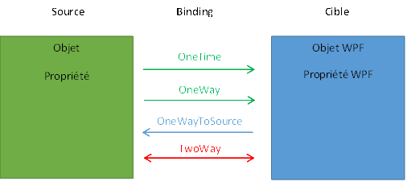
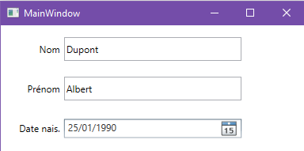
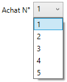
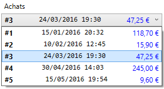
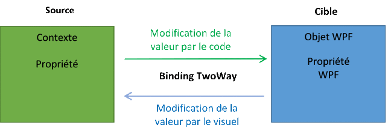

# 7 La liaison de données (DataBinding)

## 7.1 Principe du DataBinding

**Définition**

La databinding est un mécanisme permettant de lier de façon simple une propriété d’un élément WPF (qu’on appelle la propriété cible), à une source de données.

**Caractéristiques**

-  La propriété cible peut être quasiment n’importe quelle propriété WPF
-  La source peut être une propriété d’un autre élément WPF, ou un objet quelconque (éventuellement une collection) fourni par le code.
-  La liaison est simplement **décrite** en xaml, et WPF se débrouille pour qu’elle soit effective en temps réel (c’est là toute la force du databinding)
-  Le lien peut fonctionner dans les 2 sens, afin d’afficher et/ou de modifier les données sources

Le databinding fournit donc un mécanisme puissant pour créer des interfaces visuelles **rafraîchies en temps réel**, et transmettre à la source les modifications (au sens large) faites par l’utilisateur.

Exemple : on souhaite afficher en temps réel dans un bloc de texte, la valeur numérique sélectionnée au moyen d’un curseur :


Pour cela, il suffit de créer une liaison entre la propriété `Value` du Slider et la propriété `Text` du TextBlock.

La liaison de données entre la cible et sa source est réalisée à l'aide d'un objet [Binding](https://msdn.microsoft.com/fr-fr/library/system.windows.data.binding(v=vs.110).aspx), qui définit le comportement de la liaison. Voici les propriétés les plus importantes de cette classe :

| Propriété           | Type                                                      | Description|
| ------------------- | --------------------------------------------------------- | ---------- |
| ElementName         | string | Nom de l’élément WPF source.|
| RelativeSource      | RelativeSource | Elément WPF source spécifié par son emplacement relatif par rapport à la cible|
| Source              | Object | Objet source des données, dans le cas d’une liaison à un objet qui n’est pas un élément WPF|
| Path                | PropertyPath | Chemin de la propriété de l’objet source qui participe à la liaison|
| StringFormat        | string | Chaîne de format pour l’affichage de la donnée, si celle-ci est affichée en tant que chaîne de caractères. Cela peut être un format prédéfini (G, F, D, X…), ou un format personnalisé (ex : MMMM/yyyy)|
| Mode                | BindingMode<br>Enumération avec 4 valeurs possibles | Définit la direction du flux de données.<br>`OneTime` : la propriété cible est affectée uniquement à l’initialisation de l’application et n’est plus mise à jour ensuite<br>`OneWay` : la propriété cible est mise à jour à chaque changement de la propriété source<br>`OneWayToSource` : la propriété source est mise à jour à chaque changement de la propriété cible<br>`TwoWay` : les propriétés cible et source sont mises à jour à chaque changement de l’une ou de l’autre |
| UpdateSourceTrigger | UpdateSourceTrigger<br>Enumération avec 3 valeurs possibles | Définit quand les données sont transmises à la source :<br>`PropertyChange` : à chaque changement de valeur<br>`LostFocus` : à la perte de focus<br>`Explicit `: par déclenchement explicite en appelant UpdateSource())|

**Remarques** :

-  Seule l’une des 3 propriétés `ElementName`, `RelativeSource` ou `Source` peut être différente de null.
-  Il n’y a pas de propriété pour définir la cible, car le binding est défini directement sur la propriété cible, comme nous allons le voir bientôt.

## 7.2 Propriétés Mode et UpdateSourceTrigger

La propriété `Binding.Mode` détermine le comportement des propriétés liées en réponse à une modification de la source ou de la cible.

Nous avons décrit plus haut les 4 valeurs possibles de cette propriété, qui sont représentées par le schéma ci-dessous.



Chaque propriété WPF a un mode par défaut. Les propriétés éditables par l’utilisateur, comme TextBox.Text, ComboBox.Text… sont en TwoWay. On peut cependant changer ce mode, de la façon suivante :

```xml
<TextBox Text="{Binding Nom, Mode=OneWay}"/>
```

Pour déterminer le mode par défaut, il faut regarder la section « Information sur les propriétés de dépendance » de la doc MSDN de la propriété. Cette section indique la valeur de la métadonnée BindsTwoWayByDefault. Si cette valeur est à vrai, la propriété a un mode TwoWay par défaut.

La propriété `Binding.UpdateSourceTrigger` détermine quand la mise à jour de la liaison a lieu.

La valeur par défaut de cette propriété diffère selon le type de propriété WPF sur laquelle est faite le binding.

En règle générale, la valeur par défaut est `PropertyChanged`, c’est-à-dire que la mise à jour intervient à chaque fois que la propriété cible change. Cependant, pour une propriété WPF `Text`, dont la valeur est saisissable par l’utilisateur, ce ne serait pas approprié. En effet, faire la mise à jour à chaque pression d’une touche entraînerait des problèmes de performances, et empêcherait l’utilisateur de corriger les erreurs de frappes avant de valider la valeur. C’est pourquoi, pour la propriété `Text`, la valeur par défaut de UpdateSourceTrigger est `LostFocus`, c’est-à-dire que la mise à jour intervient lorsque la zone de saisie perd le focus.

On peut être amené à spécifier la valeur Explicit, si on souhaite maîtriser le déclenchement de la mise à jour, par exemple pour faire des traitements complexes de vérification avant la mise à jour.

## 7.3 Liaison avec un objet unique

Nous allons voir concrètement comment créer une liaison d’une propriété d’un élément WPF avec un objet unique dans différents cas de figures.

La liaison peut être créée soit directement dans le code xaml (solution la plus utilisée), soit par le code C#.

### Autre élément WPF

Reprenons l’exemple précédent, dans lequel on affiche en temps réel dans un bloc de texte, la valeur numérique sélectionnée au moyen d’un curseur :


**Implémentation en xaml avec syntaxe longue :**

```xml
<Slider Name="sldAge" Height="20"
        Maximum="120" LargeChange="10" SmallChange="1"
        TickFrequency="1" IsSnapToTickEnabled="True" />
<TextBlock VerticalAlignment="Center">
   <TextBlock.Text>
      <Binding ElementName="sldAge" Path="Value"/>
   </TextBlock.Text>
</TextBlock>
```

A l’aide d’un objet binding, on lie la propriété `Text` du TextBlock (propriété cible) à la propriété `Value` du Slider (propriété source). La source du binding étant un élément WPF, on utilise la propriété `ElementName`.

**Implémentation en xaml avec syntaxe condensée :**

La syntaxe suivante est équivalente à la précédente :

```xml
<Slider Name="sldAge" Height="20"
        Maximum="120" LargeChange="10" SmallChange="1"
        TickFrequency="1" IsSnapToTickEnabled="True" />
<TextBlock VerticalAlignment="Center" Name="tbAge"
           Text="{Binding ElementName=sldAge, Path=Value}"/>
```

Cette syntaxe est la plus utilisée car moins verbeuse.

La paire d’accolades est ce que l’on appelle une [Markup Extension](https://docs.microsoft.com/fr-fr/dotnet/desktop/xaml-services/markup-extensions-overview) (extension de balisage). Elle permet d’affecter un objet xaml (ici Binding) à une propriété xaml (ici Text).

**Implémentation par le code**

On peut également créer la même liaison par le code C# de cette façon :

```csharp
public partial class MainWindow : Window
{
	public MainWindow()
	{
		InitializeComponent();

		var bdg = new Binding();
		bdg.ElementName = "sldAge";
		bdg.Path = new PropertyPath("Value");
		tbAge.SetBinding(TextProperty, bdg);
	}
}
```

L’implémentation d’un binding par le code est surtout utile lorsqu’on veut créer la liaison dynamiquement.

### Objet instancié par le code 

Le plus souvent, les données affichées par le visuel sont fournies par des objets qu’on instancie soi-même dans le code C#. Typiquement il s’agira d’objets contenant des données issues d’une base de données.

Dans ce cas, l’objet n’est pas affecté à la propriété `Source` du Binding, mais plutôt à la propriété `DataContext` de l’élément WPF cible ou de l’un de ses parents. C’est pourquoi on appelle cet objet « contexte de la liaison ».

NB/ DataContext est une propriété de type Object définie par la classe `FrameworkElement`. Elle est donc disponible sur tous les éléments WPF.

Exemple : voici comment définir une instance de classe `Personne` comme contexte de données pour tous les contrôles situés à l’intérieur d’une grille nommée grid1 :

```csharp
public partial class MainWindow : Window
{
   public Personne Adupont { get; }

   public MainWindow()
   {
      InitializeComponent();

      // Création d'une personne
      Adupont = new Personne {
         Nom = "Dupont",
         Prénom = "Albert",
         DateNais = new DateTime(1990,01,25) };

      // Utilisation comme contexte de données de la fenêtre
      DataContext = Adupont;
   }
}
```

Voici un exemple de code xaml exploitant ce contexte :

```xml
<Grid x:Name="grid1" Margin="5">
   <!-- Création des lignes -->
   <Grid.RowDefinitions>
      <RowDefinition/>
      <RowDefinition/>
      <RowDefinition/>
      <RowDefinition/>        
   </Grid.RowDefinitions>
   <!-- Création des colonnes -->
   <Grid.ColumnDefinitions>
      <ColumnDefinition Width="1*"/>
      <ColumnDefinition Width="3*"/>
   </Grid.ColumnDefinitions>

   <!-- Ligne 0 -->
   <Label Content="Nom"/>
   <TextBox Grid.Column="1" Text="{Binding Nom}"/>

   <!-- Ligne 1 -->
   <Label Content="Prénom" Grid.Row="1"/>
   <TextBox Grid.Row="1" Grid.Column="1" Text="{Binding Prénom}"/>

   <!-- Ligne 2 -->
   <Label Content="Date nais." Grid.Row="2"/>
   <DatePicker Grid.Row="2" Grid.Column="1" VerticalAlignment="Center"
               SelectedDate="{Binding DateNais}"/>
```

Tous les éléments WPF à l’intérieur de la grille partagent la valeur de la propriété `DataContext` de la grille (définie dans le code C#).

Pour lier les propriétés des éléments WPF aux propriétés de l’objet Adupont (de type Personne), il suffit ensuite de faire un binding sans spécifier la source, avec l’une des 2 syntaxes suivantes :

```csharp
Text="{Binding Path=Nom}"/>
Text="{Binding Nom}"/>
```

En effet, la propriété `Path` est la propriété par défaut de Binding, c’est pourquoi on peut omettre son nom.

Le visuel obtenu est le suivant :



## 7.4 Définition du DataContext

Si la propriété `ElementName`, `RelativeSource` ou `Source` d’un Binding n’est pas définie, WPF cherche une valeur de DataContext, en commençant par l’élément sur lequel est créé le Binding, et en remontant l’arbre visuel jusqu’à trouver un élément dont la propriété `DataContext` est définie.

Dans les exemples qui suivent, nous utiliserons une instance de la classe suivante comme contexte de données :

```csharp
public class Contexte
{
   public Client ClientCourant { get; }
 
   public Contexte()
   {
      ClientCourant = new Client
      {
         Id = 1,
         Nom = "Dupont",
         Prénom = "Albert",
         DateCréation = new DateTime(2010, 01, 25),
         Achats = new List<string> { "Smartphone", "Chemise", "Robot" }
      };
   }
}
```

Cette classe contient une seule propriété `ClientCourant` de type Client, initialisée en dur dans le constructeur. Dans une application réelle, le client serait par exemple chargé depuis une base de données.

Examinons maintenant différents cas de figures pour l’affectation de la propriété `DataContext` :

### Sur la fenêtre

Une pratique courante est d’initialiser la propriété `DataContext` de la fenêtre, c’est-à-dire sur le niveau le plus haut de l’arbre visuel. Le contexte de données est ainsi accessible à l’ensemble des contrôles de la fenêtre.

Cette initialisation est généralement faite dans le code-behind de la fenêtre, comme ceci :

```csharp
public partial class LiaisonObjets : Window
{
   public LiaisonObjets()
   {
      InitializeComponent();

      // Définition du contexte de données de la fenêtre
      DataContext = new Contexte();
   }
```

…mais elle peut également être faite en xaml, de la façon suivante :

```xml
<Window x:Class="LiaisonDonnées.LiaisonObjets"
        xmlns="http://schemas.microsoft.com/winfx/2006/xaml/presentation"
        xmlns:x="http://schemas.microsoft.com/winfx/2006/xaml"
        xmlns:d="http://schemas.microsoft.com/expression/blend/2008"
        xmlns:mc="http://schemas.openxmlformats.org/markup-compatibility/2006"
        xmlns:local="clr-namespace:LiaisonDonnées"
        mc:Ignorable="d"
        Title="Définition du DataContext"
        Height="300" Width="350">
   <Window.DataContext>
      <local:Contexte/>
   </Window.DataContext>
...
```

Ce code crée une instance de la classe `Contexte` et l’affecte à la propriété `DataContext` de la fenêtre.

**Syntaxe du Binding**

Pour afficher les caractéristiques du client courant, on pourra utiliser une syntaxe du type :

```xml
<Window x:Class="LiaisonDonnées.LiaisonObjets"...>
...
   <TextBox Grid.Row="2" Text="{Binding Path=ClientCourant.Prénom}"/>
...
```

ClientCourant fait référence à la propriété `ClientCourant` de la classe `Contexte`, et ClientCourant.Prénom fait référence à la propriété Prénom de ce client.

Mais on peut également faire ceci :

```csharp
public LiaisonObjets()
{
   InitializeComponent();

   // Définition du contexte de données de la fenêtre
   var ctx = new Contexte();
   DataContext = ctx.ClientCourant;
}
```

Cette fois, le contexte de données de la fenêtre est directement la propriété `ClientCourant` d’une instance de Contexte, de sorte que le binding peut être décrit ainsi :

```xml
<TextBox Grid.Row="2" Text="{Binding Path=Prénom}"/>
```

### Sur un contrôle particulier

Si le DataContext est défini sur un contrôle particulier autre que la fenêtre, seuls ce contrôle et ses éventuels enfants y ont accès.

Exemple :

```xml
<TextBox Grid.Row="1" Text="{Binding Path=ClientCourant.Nom}"/>
 
<StackPanel Grid.Row="2" Name="stackPanel1">
   <TextBox Text="{Binding Path=ClientCourant.Prénom}"/>
</StackPanel>
```

Code-behind :

```csharp
public partial class LiaisonObjets : Window
{
   public LiaisonObjets()
   {
      InitializeComponent();

      // Définition du contexte de données du StackPanel stackPanel1
      stackPanel1.DataContext = new Contexte();
   }
}
```

Dans ce cas, la liaison de données avec la propriété `Nom` ne fonctionne pas, car le contexte n’est connu que du StackPanel et de son contenu.

### A différents niveaux de l’arbre visuel

On peut faire en sorte de spécifier le DataContext de façon partielle à différents niveaux de l’arbre visuel. Exemple :

```csharp
public partial class LiaisonObjets : Window
{
   public LiaisonObjets()
   {
      InitializeComponent();

      // Définition du contexte de données de la fenêtre
      DataContext = new Contexte();
   }
```

Le code ci-dessus définit le contexte de données de la fenêtre avec une instance de la classe `Contexte.`

```xml
<Window x:Class="LiaisonDonnées.LiaisonObjets"...>
   <Grid Margin="5" DataContext="{Binding Path=ClientCourant}">
      <Grid.RowDefinitions>
...
      </Grid.RowDefinitions>

      <Label Margin="60,0,0,0" Padding="5" Content="{Binding Path=Id}"/>
...
      <TextBox Grid.Row="1" Text="{Binding Path=Nom}"/>language
```

Sur la grille principale, on a défini la propriété `DataContext` par binding sur la propriété `ClientCourant` du contexte de données de la fenêtre.  
De cette façon pour tous les contrôles placés à l’intérieur de la grille, le contexte de données est le client courant, ce qui permet de simplifier la syntaxe des bindings (ex : Path=Id au lieu de Path=ClientCourant.Id)

Le contexte de données d’une liaison est recherché et complété au fur et à mesure en remontant l’arbre visuel, c’est-à-dire en partant de l’élément qui porte la liaison jusqu’à la fenêtre qui le contient.

## 7.5 Liaison avec une collections d’objets

Nous allons voir ici des exemples de liaisons avec des collections d’objets, dans différents scénarios.

Comme nous l’avons vu plus haut, les contrôles spécialisés dans l’affichage de collections d’objets sont ceux qui dérivent de `ItemsControl`. Cette classe possède les propriétés suivantes concernant la liaison de données :

| Propriété | Type | Description |
|:--|:--|:--|
| ItemsSource | IEnumerable | Représente la collection d’objets source pour le contenu du contrôle. C’est la propriété sur laquelle on fait le Binding |
| DisplayMemberPath | String | Propriété des objets de la collection qui sera utilisée pour l’affichage dans le contrôle |
| ItemStringFormat | String | Spécifie le format d’affichage des éléments s'ils sont affichés en tant que chaînes. Cela peut être un format prédéfini (G, F, D, X…), ou un format personnalisé (ex : MMMM/yyyy) |
| ItemTemplate | DataTemplate | DataTemplate utilisé pour afficher chaque élément (cf. plus bas) |

Avec une ListView, les données sont affichées en colonnes, qui sont liées chacune à une propriété différente de la source de données. Dans ce cas, on n’utilise pas la propriété `DisplayMemberPath`, mais plutôt la propriété `DisplayMemberBinding` sur chaque colonne (GridViewColumn). Il faut affecter à cette propriété un binding vers la donnée à lier.

Les scénarios qui suivent illustrent toutes ces propriétés avec des contrôles de sélection ListView, ListBox et ComboBox.

### Liste simple

Dans ce qui suit, nous allons afficher de différents façons une liste d’achats décrits par leur Id, date, nombre d’articles et montant.

Les données sont fournies par un fichier achats.xml dont voici le contenu :

```xml
<?xml version="1.0" encoding="UTF-8"?>
<Achats>
   <Achat Id="1" Date="2016-01-15T20:32:01" NbArticles="2" Montant="118.70"/>
   <Achat Id="2" Date="2016-02-10T12:45:02" NbArticles="1" Montant="15.90"/>
   <Achat Id="3" Date="2016-03-24T19:30:03" NbArticles="2" Montant="47.25"/>
   <Achat Id="4" Date="2016-04-30T14:03:04" NbArticles="3" Montant="245.00"/>
   <Achat Id="5" Date="2016-05-15T19:54:05" NbArticles="1" Montant="9.60"/>
</Achats>
```

Un achat est décrit par la classe suivante :

```csharp
using System;
using System.Xml.Serialization;

namespace LiaisonDonnées
{
   public class Achat
   {
      [XmlAttribute("Id")]
      public int Id { get; set; }

      [XmlAttribute("Date")]
      public DateTime Date { get; set; }

      [XmlAttribute("NbArticles")]
      public int NbArticles { get; set; }

      [XmlAttribute("Montant")]
      public decimal Montant { get; set; }
   }
}
```

Pour charger facilement les données du fichier xml, nous décorons chaque propriété de la classe par un attribut indiquant à quel attribut xml elle correspond.

Dans le constructeur de la fenêtre, chargeons les données du fichier xml dans une liste d’achats, et définissons celle-ci comme contexte de données de la fenêtre :

```csharp
public partial class LiaisonObjets : Window
{
   public List<Achat> Achats { get; }

   public LiaisonObjets()
   {
      InitializeComponent();

      // Remplissage de la liste d'achats à partir d'un fichier xml
      XmlSerializer deserializer = new XmlSerializer(typeof(List<Achat>),
                                   new XmlRootAttribute("Achats"));
      using (var sr = new StreamReader(@"Achats.xml"))
      {
         Achats = (List<Achat>)deserializer.Deserialize(sr);
      }

      // Utilisation comme contexte de données de la fenêtre
      DataContext = Achats;
   }
}
```

NB/ Nous utilisons ici la classe `XMLSerializer` et sa méthode `Deserialize` pour charger automatiquement le contenu du fichier xml dans la liste d’achats. Le fichier xml doit être déployé à côté de l’exe.

**Affichage dans une ListView**

La ListView munie de sa vue par défaut GridView, permet d’afficher la liste d’achats de la façon suivante :


Chaque colonne de la ListView affiche une propriété de la classe `Achat.` Examinons le code xaml permettant d’obtenir ce visuel :

```xml
<ListView ItemsSource="{Binding}">
   <ListView.View>
      <GridView>
        <GridViewColumn Header="Id" DisplayMemberBinding="{Binding Path=Id}"/>
        <GridViewColumn Header="Date" DisplayMemberBinding="{Binding Path=Date}"/>
        <GridViewColumn Header="Montant" DisplayMemberBinding="{Binding Path=Montant"/>
      </GridView>
   </ListView.View>
</ListView>   
```

Ici, on ne spécifie aucun chemin dans le binding de la propriété `ItemsSource`. WPF recherche donc la source de données sur les objets parents de la ListView, en remontant l’arbre visuel. Il finit ici par trouver le DataContext défini sur la fenêtre dans le code C#.

La propriété de la classe `Achat` à afficher dans chaque colonne est définie par binding sur la propriété `DisplayMemberBinding` de la classe `GridViewColumn`.

**Affichage dans une ComboBox ou une ListBox**

La ComboBox ou la ListBox, utilisées seules, ne peuvent afficher qu’une seule propriété de la classe `Achat.` Par exemple, pour afficher le numéro de chaque achat :



Le nom de la propriété à afficher est spécifié par la propriété `DisplayMemberPath` :

```xml
<!--Affichage des numéros des achats -->
<ComboBox ItemsSource="{Binding}" DisplayMemberPath="Id"/>
```

Remarques :

-  Noter la différence avec la ListView, dans laquelle chaque propriété à afficher est spécifiée par **binding** sur la propriété `DisplayMemberBinding` des **colonnes**, alors que pour une ComboBox ou ListBox, on spécifie directement le nom de la propriété à afficher au niveau de la liste.

-  Nous verrons avec les DataTemplate comment afficher plusieurs informations dans chaque item d’une ComboBox ou d’une ListBox.

### Maître-détail simple

Dans ce type de vue, le détail ne fait que reprendre les données de l’objet maître sélectionné, pour les afficher sous une forme plus détaillée. Sa réalisation requiert deux choses :

-  Le maître et le détail doivent avoir le même contexte de données
-  Sur le maître, la propriété `IsSynchronizedWithCurrentItem` doit être à `True`

La propriété `IsSynchronizedWithCurrentItem` force la source de données (la collection) à changer d’item courant, ce qui provoque la mise à jour de l’affichage du détail. Il n’y a aucun lien direct entre le maître et le détail au niveau du visuel.

Voici un exemple affichant une liste d’achats en maître-détail :


```xml
<!-- Maître -->
<StackPanel Orientation="Horizontal" Margin="10">
   <Label Content="Achat N°"/>
   <ComboBox ItemsSource="{Binding}" DisplayMemberPath="Id"
            IsSynchronizedWithCurrentItem="True" Width="50"/>
</StackPanel>

<!-- Détail -->
<StackPanel  Margin="10">
   <TextBlock Text="{Binding Path=Date, StringFormat='Date : {0:D}'}"/>
   <TextBlock Text="{Binding Path=Montant, StringFormat='Montant : {0:C}'}"/>
   <TextBlock Text="{Binding Path=NbArticles, StringFormat='Nombre articles : {0}'}"/>
</StackPanel>
```

Dans le code C#, la liste d’achats a été définie comme contexte pour la ListBox et le StackPanel.

La propriété `StringFormat` s’utilise de façon similaire à la méthode `String.Format()`. La chaîne est placée entre guillemets simples pour ne pas perturber les doubles côtes autour du binding. Nous y reviendrons plus en détail plus bas.

### Maître-détail hiérarchique

Dans ce type de vue, on affiche deux collections d’objets, avec un lien hiérarchique entre les deux.

Ex : supposons que nous souhaitions afficher le détail des articles achetés pour l’achat sélectionné :


La liste des articles d’un achat est fournie par la propriété `Articles` de la classe `Achat` :

```csharp
public class Achat
{
   public int Id { get; set; }
   public DateTime Date { get; set; }
   ...
   public List<Article> Articles { get; set; }
}
```

Nous pouvons définir une liste d’objets Achat comme contexte de la fenêtre.  
Dans le code xaml de la fenêtre, les listes maître et détail seront alors affichées comme ceci :

```xml
<!-- Maître -->
<Label Content="Achats"/>
<ListView ItemsSource="{Binding}" IsSynchronizedWithCurrentItem="True">
   <ListView.View>
      <GridView AllowsColumnReorder="true">
         <GridViewColumn Header="Id" Width="50"
                  DisplayMemberBinding="{Binding Path=Id}"/>
         <GridViewColumn Header="Montant" Width="100"
                  DisplayMemberBinding="{Binding Path=Montant, StringFormat='\{0:C\}'}"/>
         <GridViewColumn Header="Date"
                  DisplayMemberBinding="{Binding Path=Date}"/>
      </GridView>
   </ListView.View>
</ListView>

<!-- Détail -->
<StackPanel Orientation="Horizontal" Margin="0,20,0,5">
   <Label Content="Articles de l'achat N°"/>
   <TextBlock Text="{Binding Path=Id}" VerticalAlignment="Center"/>
</StackPanel>
<ListView ItemsSource="{Binding Path=Articles}">
   <ListView.View>
      <GridView>
         <GridViewColumn Header="Id" DisplayMemberBinding="{Binding Path=Id}"/>
         <GridViewColumn Header="Libellé" DisplayMemberBinding="{Binding Path=Libellé}"/>
         <GridViewColumn Header="Prix" DisplayMemberBinding="{Binding Path=Prix, StringFormat='\{0:C\}'}"/>
      </GridView>
   </ListView.View>
</ListView>
```

Le contexte de la fenêtre est toujours un objet de type `List<Achat>`. La ListView du maître l’utilise directement comme source de données, tandis que la ListView du détail utilise la propriété `Articles` de l’élément courant comme source de données.

**Remarque**

Si le contexte de données n’est pas la collection d’achats, mais une classe qui contient cette collection, les bindings doivent être définis de la façon suivante :

```xml
<!-- Maître -->
<ListView ItemsSource="{Binding Path=Achats}" IsSynchronizedWithCurrentItem="True">
...
<!-- Détail -->
<ListView ItemsSource="{Binding Path=Achats/Articles}">
```

L’expression `Achats/Articles` désigne la liste des articles de l’achat courant. De façon générale, le « / » dans une expression de binding permet d’accéder à l’élément courant d’une collection.

## 7.6 Liaisons avec d’autres sources de données

### Fichier XML

Nous avons vu plus haut comment charger un fichier xml dans une collection d’objets, puis lier cette collection à un contrôle de sélection. WPF fournit un autre mécanisme plus direct, mais aussi plus limité, pour charger et afficher le contenu d’un fichier XML : le `XmlDataProvider`.

Voici un exemple de mise en œuvre :

```xml
<Window.Resources>
   <XmlDataProvider x:Key="xmlAchats" Source="Achats.xml" XPath="Achats/Achat"/>
   <local:StringToDateConverter x:Key="StringToDateConverter"/>
</Window.Resources>
<Grid>
   <ListView ItemsSource="{Binding Source={StaticResource xmlAchats}}">
      <ListView.View>
         <GridView>
            <GridViewColumn Header="Id"
                            DisplayMemberBinding="{Binding XPath=@Id}"/>
            <GridViewColumn Header="Date"
                            DisplayMemberBinding="{Binding XPath=@Date,
                            Converter={StaticResource StringToDateConverter}}"/>
            <GridViewColumn Header="Nb Articles"
                            DisplayMemberBinding="{Binding XPath=@NbArticles}"/>
            <GridViewColumn Header="Montant"
                            DisplayMemberBinding="{Binding XPath=@Montant}"/>
         </GridView>
      </ListView.View>
   </ListView>
</Grid>
```

Limitations :

-  Le binding est en mode OneWay uniquement ; on ne peut pas modifier le fichier xml source
-  Comme on ne peut pas spécifier d’attributs de sérialisation, toutes les données xaml sont interprétées comme des chaînes. Si elles contiennent des dates, nombres, booléens…, il faut utiliser des convertisseurs pour les interpréter correctement.

### Base de données

ADO.NET est l’API couramment utilisée pour interagir avec les bases de données relationnelles. Elle fournit entre autres les classes `Dataset` et `DataTable` pour stocker en mémoire les données récupérées ou à envoyer à la base. Un Dataset est un ensemble de DataTable.

Si le contexte est une `DataTable`, on peut lier une colonne de cette table (ici la colonne Libellé) à une liste de la façon suivante :

```xml
<ListBox ItemsSource="{Binding}" DisplayMemberPath="Libellé"/>
```

Si le contexte est un `DataSet`, il faut spécifier en plus le nom de la table à utiliser comme source du binding :

```xml
<ListBox ItemsSource="{Binding Path=Articles}" DisplayMemberPath="Libellé"/>
```

## 7.7 Formatage et DataTemplate

### Formatage

Toutes les valeurs liées par DataBinding et affichables sous formes de chaînes de caractères peuvent être mises en forme au moyen d’une chaîne de format. Celle-ci est spécifiée par la propriété :

-  `StringFormat` du Binding, dans le cas général

-  `ItemStringFormat` du contrôle de liste (ListBox ou ComboBox par exemple)

Ces propriétés s’utilisent de la même façon que la méthode `String.Format()`. Les formats peuvent être prédéfinis ou personnalisés :

Exemples :

```xml
<!-- Format prédéfini -->
<TextBlock Text="{Binding Path=Montant, StringFormat=C}"/>

<!-- Format personnalisé contenant des espaces: il doit être mis entre guillemets simples -->
<TextBlock Text="{Binding Path=Date, StringFormat='ddd dd/MM/yy'}"/>

<!-- Chaîne de format appliquée sur les items d'une liste -->
<ComboBox ItemsSource="{Binding}" DisplayMemberPath="Date" ItemStringFormat="d"/>
```

Noter que comme l’expression de binding est entourée de guillemets doubles, la propriété `StringFormat` doit être entourée de guillemets simples. Les guillemets ne sont toutefois pas nécessaires lorsque l’expression de format est simple.

NB/ La propriété `ItemString`Format n’étant pas dans une expression de binding, sa valeur est placée entre guillemets doubles, de façon classique.

Lorsqu’on veut ajouter du texte à l’intérieur du format, on utilise des jokers pour faire référence aux données à afficher :

```xml
<TextBlock Text="{Binding DateNais, StringFormat='Date de naissance : {0:D}'}"/>

<ComboBox ItemsSource="{Binding}" DisplayMemberPath="Date"
          ItemStringFormat="Le {0:d} à {0:HH:mm}"/>
```

Si la chaîne de format commence par une accolade, il faut utiliser le caractère d’échappement `\ `devant chaque accolade, ou bien faire commencer la chaîne de format par une paire d’accolades vides :

```xml
<TextBlock Text="{Binding Count, StringFormat='\{0\} achats'}"/>
<TextBlock Text="{Binding Count, StringFormat='{}{0} achats'}"/>
```

**Remarques :**

-  La propriété `StringFormat` n’est applicable que sur une liaison de données avec une propriété de type texte. Par conséquent, un format appliqué sur le contenu d’un ContentControl (i.e. sa propriété `Content`) n’a pas d’effet. C’est le cas notamment du Label.
-  Pour que les dates s’affichent bien selon la culture courante (et non pas au format anglais), il faut ajouter la ligne suivante dans le constructeur de la fenêtre ou du contrôle utilisateur :

<!-- -->

```csharp
Language = System.Windows.Markup.XmlLanguage.GetLanguage(System.Threading.Thread.CurrentThread.CurrentCulture.Name);
```

### DataTemplate

Le **DataTemplate** est un morceau de code xaml permettant de :

-  Appliquer des mises en forme aux données

-  Décrire comment les données doivent être affichées à l’intérieur d’un contrôle WPF lié par Databinding à une ou plusieurs informations.

Cette notion étant considérablement les possibilités de personnalisation de l’affichage, en particulier dans les listes.

Considérons la liste déroulante ci-dessous :

<div style="display:flex; flex-wrap:wrap; justify-content: space-evenly; align-items:center;">


```xml
<ComboBox ItemsSource="{Binding}" DisplayMemberPath="Id">
```

</div>

Lorsqu’on relie une collection d’objets à cette liste déroulante, on doit spécifier la propriété de ces objets qu’on souhaite afficher, au moyen de la propriété `DisplayMemberPath` du contrôle (l’id de chaque objet dans l’exemple ci-dessus). On ne peut donc a priori afficher qu’une seule propriété de l’item.

Pour afficher plusieurs informations simultanément, on pourrait créer une nouvelle propriété dans la classe des objets à afficher, qui concaténerait les informations à afficher. Mais on serait toujours limité à l’affichage d’un texte, sans mise en forme possible. De plus, la création de propriétés spécifiques pour l’affichage n’est pas satisfaisante d’un point de vue architectural.

L’utilisation d’un DataTemplate est dans ce cas tout indiquée. Voici un exemple de mise en œuvre :

```xml
<ListBox HorizontalContentAlignment="Stretch"
         ItemsSource="{Binding}">
   <ListBox.ItemTemplate>
      <DataTemplate>
         <DockPanel>
            <TextBlock FontWeight="Bold"
                       Text="{Binding Path=Id, StringFormat='#{0}'}"/>
            <TextBlock DockPanel.Dock="Right" Foreground="Blue"
                       Text="{Binding Path=Montant, StringFormat='\{0:C\}'}"/>
            <TextBlock HorizontalAlignment="Center" FontFamily="Consolas"
                       Text="{Binding Path=Date, StringFormat='\{0:g\}'}"/>
         </DockPanel>
      </DataTemplate>
   </ListBox.ItemTemplate>
</ListBox>
```

On utilise l’élément DataTemplate comme valeur de la propriété `ItemTemplate` de la ListBox. Il permet ici d’afficher les trois propriétés Id, Date et Montant de chaque commande.

A l’intérieur du DataTemplate, on est libre de faire toutes les mises en forme qu’on souhaite.

NB/ Sur l’élément ListBox en lui-même, il est généralement préférable de définir l’alignement horizontal du contenu à la valeur `Stretch` pour avoir plus de liberté dans la mise en forme.

Voici les visuels obtenus avec une ListBox et avec un template similaire sur une ComboBox :





Le DataTemplate peut aussi être défini en tant que ressource au niveau de la fenêtre. La ListBox y fera alors référence à partir de sa clé, comme ceci :

```xml
<ListBox Name="lstAchats"
         HorizontalContentAlignment="Stretch"
         ItemsSource="{Binding}"
         ItemTemplate="{StaticResource TemplateAchat}">
```

**DataTemplate sur une ListView**

Dans une Listview, les données sont affichées dans des colonnes. Il est possible de définir un template sur une colonne, au moyen de sa propriété `CellTemplate`, comme le montre l’exemple ci-dessous :

```xml
<ListView ItemsSource="{Binding}">
   <ListView.View>
      <GridView AllowsColumnReorder="true">
         <GridViewColumn Header="Id" Width="50"
                         DisplayMemberBinding="{Binding Path=Id}"/>
         <GridViewColumn Header="Nom" Width="100">
            <GridViewColumn.CellTemplate>
               <DataTemplate>
                  <Label Content="{Binding Path=Nom}" Background="AliceBlue"/>
               </DataTemplate>
            </GridViewColumn.CellTemplate>
         </GridViewColumn>
         <GridViewColumn Header="Prénom" Width="100"
                         DisplayMemberBinding="{Binding Path=Prenom}"/>
      </GridView>
   </ListView.View>
</ListView>
```

NB/ De la même façon que pour la ListBox, il peut être utile de définir l’alignement horizontal du contenu de chaque cellule à la valeur stretch. On pourra pour cela définir le style suivant :

```xml
<Style TargetType="ListViewItem">
   <Setter Property="HorizontalContentAlignment" Value="Stretch"/>
</Style>
```

**DataTemplate pour des données hiérarchiques**

Des données hiérarchiques peuvent être présentées sous forme d’un maître-détail tel nous l’avons vu plus haut. Toutefois, si le nombre de niveaux est supérieur à 2, une représentation sous forme d’arbre est plus adaptée. Dans ce cas, on utilisera un objet [HierarchicalDataTemplate](https://msdn.microsoft.com/en-us/library/system.windows.hierarchicaldatatemplate(v=vs.110).aspx) pour décrire cette représentation.

**DataTemplate sur un ContentControl**

Le DataTemplate est très utilisé avec les ItemsControl, car il permet de définir un modèle commun pour tous les éléments affichés par le contrôle.

L’utilisation d’un DataTemplate sur un ContentControl à moins d’intérêt, du fait que ce dernier ne peut afficher qu’un élément de la collection à laquelle il est éventuellement lié. Le DataTemplate est affecté au contrôle au moyen de sa propriété `ContentTemplate`. Ex :

```xml
<ContentControl ContentTemplate="{StaticResource MonTemplate}"/>
```

NB/ Un `ContentControl` a 2 templates, qu’il ne faut pas confondre :

-  Celui qui s’applique au contrôle lui-même, accessible par la propriété `Template`, de type ControlTemplate (héritée de Control). Il décrit la structure et le comportement du contrôle lui-même, et non de son contenu
-  Celui qui décrit la structure de son contenu (propriété `ContentTemplate`, de type DataTemplate)

## 7.8 Liaison multiple

Le MultiBinding permet de lier une propriété cible d’un contrôle à plusieurs propriétés sources simultanément, en combinant les valeurs de ces propriétés au moyen d’un convertisseur ou d’une chaîne de format.

Ceci est particulièrement utile pour afficher un texte composé de plusieurs informations, tout en utilisant un seul TextBlock.

Exemple :

```xml
<TextBlock>
   <TextBlock.Text>
      <MultiBinding StringFormat="Article N°{0} acheté le {1:d} à {2:C}">
         <MultiBinding.Bindings>
            <Binding Path="Id"/>
            <Binding Path="Date"/>
            <Binding Path="Montant"/>
         </MultiBinding.Bindings>
      </MultiBinding>
   </TextBlock.Text>
</TextBlock>
```

Ceci affiche :

```csharp
Article N°1 acheté le 15/01/2016 à 118,70 €
```

On notera l’utilisation de la syntaxe longue et non d’une markup extension. La chaîne de format est spécifiée sur la balise `<MultiBinding>`, et non sur les balises `<Binding>`.

## 7.9 Convertisseurs

Un convertisseur est une classe associée à un DataBinding, qui permet d’appliquer des transformations sur les données au moment de la liaison de données.

Ces transformations consistent à :

-  Appliquer de façon conditionnelle des **formats** de toutes sortes aux données (couleur de fond, police…etc.). Exemple : afficher en couleur tous les prix qui dépassent une valeur donnée
-  **Masquer ou désactiver** des éléments visuels en fonction de la valeur de certaines données
-  **Associer un autre objet à la donnée initiale.** Par exemple, afficher l’image correspondant à un chemin, afficher le libellé correspondant à un code.
-  …etc.

NB/ La propriété `StringFormat` permet également d’appliquer des formats aux données dans les liaisons de données, mais elle ne permet pas de le faire de façon conditionnelle.

### Créer un convertisseur

Un convertisseur est une classe qui implémente l’interface `IValueConverter`. Celle-ci possède 2 méthodes :

-  `Convert` : pour convertir les données dans le sens Source ⟶ Cible
-  `ConvertBack` : pour convertir les données dans le sens Cible ⟶ Source

Si la cible est une propriété dont la valeur ne peut pas être modifiée par l’utilisateur, (par exemple si son Binding est en OneWay ou si l’élément WPF est en lecture seule), la méthode `ConvertBack` n’a pas d’intérêt. Dans ce cas, elle peut simplement renvoyer une exception de type NotImplementedException.

**Exemple** : nous allons créer un convertisseur qui affiche sur fond coloré tous les items d’une liste d’achats dont le montant est ≥ 100 €, come illustré par la capture ci-dessous :


La couleur de fond d’un conteneur est appliquée au moyen d’un objet `SolidColorBrush`. Le montant d’un achat est une valeur décimale. Nous avons donc besoin d’un convertisseur `Decimal` ⟶ `SolidColorBrush`, et uniquement dans ce sens.

Voici le code de ce convertisseur :

```csharp
// Convertisseur de Decimal en Brush avec seuil
public class DecimalToColorBrushConverter : IValueConverter
{
   public object Convert(object value, Type targetType, object parameter, CultureInfo culture)
   {
      decimal d = (decimal)value;
      decimal seuil = (decimal)parameter;
      Color c = (d >= seuil ? Colors.LightSalmon : Colors.White);
      return new SolidColorBrush(c);
   }

   public object ConvertBack(object value, Type targetType, object parameter, CultureInfo culture)
   {
      throw new NotImplementedException();
   }
}
```

`value` est la valeur à convertir (ici, le montant de l’achat). Elle est passée sous forme d’objet, c’est pourquoi il faut faire un cast.

`parameter` est un paramètre de conversion. Ici, c’est le montant seuil à partir duquel on souhaite mettre l’achat sur fond coloré.

`targetType` est le type de la propriété qui a appelé le convertisseur. On pourrait s’en servir pour déterminer dynamiquement le type de l’objet à renvoyer, afin de faire un convertisseur plus générique.

Le code de la méthode `Convert` crée et renvoie un objet SolidColorBrush (dérivé de Brush) avec une couleur LightSalmon si la valeur décimale est ≥100, et White sinon.

Comme on est sûr que ConvertBack ne sera pas appelée, on peut se contenter de renvoyer une exception.

### Appliquer un convertisseur sur un binding

Utilisons le convertisseur créé précédemment dans le code xaml :

```xml
<Window x:Class="LiaisonDonnées.LiaisonObjets"
        xmlns="http://schemas.microsoft.com/winfx/2006/xaml/presentation"
        xmlns:x="http://schemas.microsoft.com/winfx/2006/xaml"
        xmlns:local="clr-namespace:LiaisonDonnées"
        xmlns:sys="clr-namespace:System;assembly=mscorlib"
        Title="Liaison avec objets" Height="450" Width="350">
   <Window.Resources>
      <local:DecimalToColorBrushConverter x:Key="DecimalToColorBrushConverter"/>
      <sys:Decimal x:Key="MontantSeuil">100</sys:Decimal>
   </Window.Resources>
...
<ListBox.ItemTemplate>
   <DataTemplate>
      <DockPanel Background="{Binding Path=Montant,
                 Converter={StaticResource DecimalToColorBrushConverter},
                ConverterParameter={StaticResource MontantSeuil}}">
         ...
      </DockPanel>
   </DataTemplate>
</ListBox.ItemTemplate>
```

On commence par référencer le convertisseur dans les ressources de la fenêtre.

On crée également une ressource pour la valeur du seuil, afin de la centraliser.

Puis, dans le DataTemplate de la liste des achats, on fait un binding de la propriété `Background` (de type Brush) du conteneur d’item sur le montant de l’achat, en appliquant le convertisseur, qui prend en paramètre la valeur de seuil.

Dans le binding, le convertisseur est spécifié par la propriété `Converter`, et la valeur du paramètre qui sera passée au convertisseur est spécifiée par la propriété `ConverterParameter`.

NB/ Si aucun paramètre n’est nécessaire, il est inutile de spécifier ConverterParameter.

### Convertisseur multi-valeurs

Dans le cas où la cible est liée à plusieurs sources par une liaison de données multiples, on peut avoir besoin d’un convertisseur multi-valeurs.

**Exemple** : considérons le formulaire suivant :


On souhaite que le bouton Valider ne soit activé que lorsque l’adresse email est renseignée et que la case à cocher est cochée.

Le code xaml de ce formulaire est le suivant :

```xml
<Window x:Class="LiaisonDonnées.LiaisonMultiple"
        xmlns="http://schemas.microsoft.com/winfx/2006/xaml/presentation"
        xmlns:x="http://schemas.microsoft.com/winfx/2006/xaml"
        xmlns:local="clr-namespace:LiaisonDonnées"
        Title="LiaisonMultiple" Height="400" Width="400">
    <Window.Resources>
        <local:MultiConvertisseurFormulaire x:Key="MultiConvFormulaire"/>
    </Window.Resources>
...
<StackPanel Orientation="Horizontal" Margin="0,10">
    <Label Content="Adresse email"/>
    <TextBox Name="tbMail" Width="200" Margin="5,0"/>
</StackPanel>
<CheckBox Name="chkAccept"
          Content="J'ai lu et j'accepte les conditions générales de vente"/>
<Button Content="Valider" Width="100" Margin="0,10" HorizontalAlignment="Left">
    <Button.IsEnabled>
        <MultiBinding Converter="{StaticResource MultiConvFormulaire}">
            <Binding ElementName="tbMail" Path="Text"></Binding>
            <Binding ElementName="chkAccept" Path="IsChecked"></Binding>
        </MultiBinding>
    </Button.IsEnabled>
</Button>
...
```

Le code du convertisseur multi-valeurs est le suivant :

```csharp
public class MultiConvertisseurFormulaire : IMultiValueConverter
{
    public object Convert(object[] values, Type targetType, object parameter, CultureInfo culture)
    {
        string email = (string)values[0];
        bool acceptCGV = (bool)values[1];
        return (!string.IsNullOrEmpty(email) && acceptCGV);
    }
 
    public object[] ConvertBack(object value, Type[] targetTypes, object parameter, CultureInfo culture)
    {
        throw new NotImplementedException();
    }
}
```

Les différences avec un convertisseur simple sont les suivantes :

-  Il faut implémenter la classe `IMultiValueConverter`
-  Les méthodes prennent en premier paramètre un tableau d’objets. Chaque élément du tableau contient une valeur de source de la liaison multiple.

## 7.10 Débogage

Les liaisons de données sont évaluées à l’exécution et ne lèvent pas d’exceptions quand elles échouent ; c’est pourquoi elles ne sont pas toujours faciles à déboguer.

On constate une erreur de binding par le fait que la ou les donnée(s) correspondante(s) ne s’affiche(nt) pas dans l’application. On peut donc cibler au moins un élément WPF particulier comme point de départ de nos investigations.

Voyons les techniques utilisables pour identifier l’erreur.

### Utiliser un convertisseur comme point d’entrée de débogage

Comment s’assurer qu’une expression de binding est correcte ?

Si l’expression n’est pas correcte, le binding ne sera même pas évalué. Si elle est correcte, le binding sera au moins évalué, c’est-à-dire qu’on doit pouvoir l’espionner en mode debug.

Cependant, on n’a par défaut aucun endroit dans le code C# pour poser un point d’arrêt, puisque le binding est décrit par le xaml. L’astuce consiste donc à ajouter un convertisseur au binding, Le convertisseur étant décrit par le code, il fournit un point d’entrée pour poser le point d’arrêt.

Voici le code de la classe du convertisseur :

```csharp
using System;
using System.Diagnostics;
using System.Windows.Data;
using System.Globalization;

namespace LiaisonDonnées
{
   // Convertisseur fictif pour pouvoir déboguer les binding
   public class DebugDummyConverter : IValueConverter
   {
      public object Convert(object value, Type targetType, object parameter, CultureInfo culture)
      {
         Debugger.Break();
         return value;
      }

      public object ConvertBack(object value, Type targetType, object parameter, CultureInfo culture)
      {
         Debugger.Break();
         return value;
      }
   }
}
```

`Debugger.Break` a le même effet que de poser un point d’arrêt dans Visual Studio.

Le convertisseur peut être référencé comme ressource de l’application, de façon à être utilisable dans n’importe quelle fenêtre de l’application :

```xml
<Application x:Class="LiaisonDonnées.App"
             xmlns="http://schemas.microsoft.com/winfx/2006/xaml/presentation"
             xmlns:x="http://schemas.microsoft.com/winfx/2006/xaml"
             xmlns:local="clr-namespace:LiaisonDonnées"
             StartupUri="MainWindow.xaml">
    <Application.Resources>
      <local:DebugDummyConverter x:Key="DebugDummyConverter"/>
   </Application.Resources>
</Application>
```

Utilisons-le maintenant dans une expression de binding dans une des fenêtres de l’application :

```xml
<TextBlock Text="{Binding Path=NbArticles, Converter={StaticResource DebugDummyConverter}}"/>
```

En faisant cela, si l’expression de binding est correcte, dès que le binding sera évalué, Visual Studio interrompra l’exécution de l’application et se mettra en attente sur la ligne Debugger.break. On pourra en profiter pour regarder la valeur renvoyée par le binding.

Si cela ne se produit pas, on peut investiguer plus au moyen du panneau de sortie.

### Utiliser le panneau de sortie 

Une erreur courante dans une expression de binding est de saisir un nom de propriété incorrect. Cette erreur est assez facile à trouver, car il y a une trace suffisamment précise dans l’onglet de sortie de Visual Studio (Menu Affichage \\ Sortie ou CTRL+ALT+O).

Exemple : supposons qu’on ait oublié le s à la fin du nom de la propriété `NbArticles` dans le binding suivant :

```xml
<StackPanel Name="StackPanel1" Margin="5">
   ...
   <TextBlock Text="{Binding Path=NbArticle, StringFormat='Nombre articles : {0}'}"/>
</StackPanel>
```

Visual Studio affiche le message suivant dans le panneau Output :

```
System.Windows.Data Error: 40 : BindingExpression path error: 'NbArticle' property not found on 'object' ''List`1' (HashCode=5432205)'. BindingExpression:Path=NbArticle; DataItem='List`1' (HashCode=5432205); target element is 'TextBlock' (Name=''); target property is 'Text' (type 'String')
```

## 7.1 Propriétés de dépendance

Pour qu’une propriété d’un contrôle WPF puisse être liée à une source de données par DataBinding, cette propriété doit être d’un type particulier, appelé **propriété de dépendance** (Dependency Property).

Afin de découvrir cette notion, nous allons créer nous-même des propriétés de dépendance sur un contrôle utilisateur.

Considérons le contrôle utilisateur suivant, qui modélise une interface d’inscription à une newsletter :


Nous aimerions pouvoir utiliser ce contrôle de la façon suivante :

```xml
<local:UCInscription Prenom="{Binding Path=FirstName, Mode=TwoWay}"
                     Email="{Binding Path=Mail, Mode=TwoWay}"
                     Command="{Binding Path=CmdValider}"/>
```

… c’est à dire disposer de propriétés nommées Prenom, Email et Command, permettant de faire des liaisons de données dessus. Pour cela nous devons créer des propriétés de dépendance dans le code-behind du contrôle.  
Voici le code pour créer la propriété `Email` :

```csharp
using System;
using System.Windows;
using System.Windows.Controls;
namespace ControleUtilisateur
{
   public partial class UCInscription : UserControl
   {
      public UCInscription()
      {
         InitializeComponent();
      }

      public static readonly DependencyProperty EmailProperty =
         DependencyProperty.Register("Email", // Nom de la propriété
                typeof(string), // Type de la propriété
                typeof(UCInscription), // Type de la classe
                new PropertyMetadata(String.Empty)); // Valeur par défaut

      // Propriété ordinaire pour accéder à la DP
      public string Email
      {
         get { return (string)GetValue(EmailProperty); }
         set { SetValue(EmailProperty, value); }
      }
   }
}
```

Il y a deux étapes :

-  Créer une nouvelle propriété de dépendance au moyen de la méthode statique DependencyProperty.Register et récupérer l’instance obtenue dans une variable `statique' publique en lecture seule.

-  Créer une propriété ordinaire encapsulant la propriété de dépendance pour pouvoir lire et écrire sa valeur.

**Remarques :**

-  Le snippet `propdp` de Visual Studio permet de générer très facilement une propriété de dépendance.
-  Le dernier paramètre de la méthode `Register`, permettant de spécifier la valeur par défaut de la propriété, est optionnel.
-  En exécution, la propriété de dépendance est appelée directement par `GetValue` et `SetValue`, et non par la propriété simple. Si on met du code supplémentaire dans les accesseurs `get` et `set` de la propriété simple, il ne sera donc pas exécuté.

Il ne reste maintenant plus qu’à relier les propriétés de dépendance aux éléments WPF du contrôle :

```xml
<UserControl x:Class="ControleUtilisateur.UCInscription"
             ...
             Name="ucInscription">
    <Grid>
      ...
      <Label Content="Prénom"/>
      <TextBox Text="{Binding ElementName=ucInscription, Path=Prenom}"
               MinHeight="30" Margin="0,25,0,0"/>
      <Label Content="Adresse e-mail" Grid.Row="1"/>
      <TextBox Text="{Binding ElementName=ucInscription, Path=Email}"
               MinHeight="30" Margin="0,25,0,0" Grid.Row="1"/>
      <Button Command="{Binding ElementName=ucInscription, Path=Command}"
              Content="Valider" MinHeight="30" Margin="0,10" Grid.Row="2" />
   </Grid>
</UserControl>
```

Les propriétés de dépendance sont définies sur le UserControl lui-même. Pour les relier aux éléments WPF, on utilise donc le UserControl comme source de binding, via ElementName.

!> Lors de l’utilisation du contrôle utilisateur, dans les bindings sur les propriétés du contrôle, le mode TwoWay doit être spécifié explicitement pour que la liaison se fasse dans les deux sens.

## 7.12 Notification des changements

Jusqu’ici, dans les divers exemples de code, nous n’avons fait qu’afficher des données initialisées **avant** l’affectation du DataContext. Cependant, si les données sont modifiées par le code après cette affectation, le visuel ne sera par défaut pas mis à jour, même si les bindings sont en mode TwoWay.

Considérons le schéma suivant qui représente un binding TwoWay :


… le rafraîchissement de la propriété cible WPF (flèche verte) n’est par défaut pas réalisé si on ne fait rien.

Pour que les bindings soient rafraîchis dans le sens Source ⟶ cible, le contexte doit **notifier** toutes les modifications de données faites par le code. Cela comprend :

-  Les modifications de valeurs de propriétés sur les objets du contexte
-  L’ajout et la suppression d’items dans les collections d’objets du contexte

Pour réaliser ces notifications, le contexte doit implémenter les interfaces [INotifyPropertyChanged](https://msdn.microsoft.com/fr-fr/library/system.componentmodel.inotifypropertychanged(v=vs.110).aspx) et/ou [INotifyCollectionChanged](https://msdn.microsoft.com/fr-fr/library/system.collections.specialized.inotifycollectionchanged(v=vs.110).aspx).

**Implémentation de l’interface INotifyPropertyChanged**

Cette interface comprend un seul élément, qui est l’évènement suivant :

```csharp
event PropertyChangedEventHandler PropertyChanged;
```

La notification du changement de valeur d’une propriété est réalisée en déclenchant cet évènement dans l’accesseur set de la propriété. Voici un exemple :

```csharp
public class Contexte : INotifyPropertyChanged
{
   private double _resultat;
 
   // Implémentation de INotifyPropertyChanged
   public event PropertyChangedEventHandler PropertyChanged;
 
   // Propriétés
   public double Operande1 { get; set; }
   public double Operande2 { get; set; }
   public double Resultat
   {
      get { return _resultat; }
      private set
      {
         if (value != _resultat)
         {
            _resultat = value;
            RaisePropertyChanged();
         }
      }
   }
 
   // Déclenche l’évènement qui notifie le changement de valeur de propriété
   // L'attribut [CallerMemberName] permet d'obtenir le nom de la propriété
   // qui a appelé la méthode (dispo depuis C# 5)
   private void RaisePropertyChanged([System.Runtime.CompilerServices.CallerMemberName] string prop = null)
   {
      if (PropertyChanged != null)
         PropertyChanged(this, new PropertyChangedEventArgs(prop));
   }
...
```

NB/ `PropertyChangedEventHandler` est un type délégué dont la signature est la suivante :

```csharp
public delegate void PropertyChangedEventHandler(object sender, 
                                                 PropertyChangedEventArgs e)
```

-  Le premier argument est l’objet qui a déclenché l’évènement (le contexte ou un de ses objets)
-  Le second argument est un objet PropertyChangedEventArgs, qui décrit la propriété qui a changé. Cet objet ne possède qu’une seule propriété de type chaîne, nommée PropertyName.

**Implémentation de l’interface INotifyCollectionChanged**

Cette interface comprend un seul élément qui est l’évènement suivant :

```csharp
event NotifyCollectionChangedEventHandler CollectionChanged
```

La notification de l’ajout ou de la suppression d’un élément dans la collection est réalisée en déclenchant cet évènement au moment de l’ajout ou de la suppression.

Le framework .net fournit cependant un type de collection tout fait qui implémente cette interface : `ObservableCollection`

Si le contexte est ou contient une collection d’objets, il suffit donc que celle-ci soit de type `ObservableCollection` pour que les ajouts et suppressions d’items soient notifiés au visuel.

Exemple :

```csharp
public ObservableCollection<Tache> Taches { get; private set; }
```
