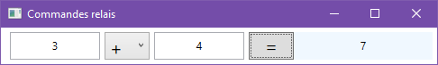

# 8 Les commandes

## 8.1 Présentation

Les commandes font le lien entre des tâches de l’application (ex : un calcul, une recherche, un tri…) et les éléments de l’interface utilisateur qui les déclenchent.

Elles fournissent les avantages suivants par rapport à une gestion classique par évènement :

-  Une commande est indépendante. Elle peut ainsi être appelée par plusieurs sources, qu’elles soient visuelles (ex : boutons, menus) ou non (ex : raccourci clavier)

-  L’activation/désactivation de toutes les sources reliées à une commande est centralisée

-  Les commandes s’inscrivent dans la logique du modèle MVVM pour le découplage entre visuel et logique applicative

[Page de doc Microsoft](https://docs.microsoft.com/fr-fr/dotnet/framework/wpf/advanced/commanding-overview) de vue d’ensemble des commandes

Une commande est une classe qui implémente l’interface `ICommand`. Cette interface définit deux méthodes et un évènement :

```csharp
bool CanExecute(object parameter)
void Execute(object parameter)
event EventHandler CanExecuteChanged
```

-  La première méthode définit les **conditions dans lesquelles la commande est active** (retour True ou False)

-  La seconde définit la logique de la **tâche à exécuter**

-  L’évènement doit être déclenché quand des changements affectent les conditions d’exécution de la commande. Typiquement, il s’agira de clics de souris ou de frappes clavier.

En réponse à l’évènement `CanExecuteChanged`, les contrôles associés à la commande doivent être activés ou désactivés, selon le résultat renvoyé par `CanExecute`. Le déclenchement de cet évènement et la réponse associée peuvent être gérés au moyen de la classe [CommandManager](https://docs.microsoft.com/fr-fr/dotnet/api/system.windows.input.commandmanager?view=netframework-4.8) fournie par le .Net Framework.

## 8.2 Evènements vs commandes

Comparons ce qu’il faut faire pour gérer une action avec des évènements et avec des commandes :

**Avec des évènements :**

-  Définir un gestionnaire à exécuter pour l’action (qui contient la logique applicative)

-  Sur chaque élément WPF, associer l’évènement approprié (souvent Click) au gestionnaire

-  Gérer l’activation des éléments WPF et des raccourcis clavier en fonction du contexte (ex : un texte sélectionné, un élément sélectionné dans une liste, une feuille activée…). Cela conduit généralement à gérer d’autres évènements.

L’activation des éléments d’interface est souvent difficile à gérer et pas centralisée. Le code correspondant peut amener un couplage fort entre la logique de l’application et l’interface.

**Avec une commande :**

En pratique, l’interface `ICommand` sera implémentée par une classe fournie par le Framework .Net ou un autre, tel que Prism, MVVM Light Toolkit… etc. Cette classe facilitera la création des commandes, et le branchement des méthodes associées.

A l’utilisation, il suffira donc de :

-  Créer une instance de cette classe et la stocker dans une variable de type `Icommand`
-  Fournir des méthodes (éventuellement anonymes) qui seront appelées par `Execute` et `CanExecute`
-  Lier la commande par binding à la propriété `Command` de chaque élément WPF

Conséquences :

-  L’ajout d’un nouvel élément source de déclenchement de l’action consiste simplement à affecter sa propriété `Command`
-  La gestion de l’activation de toutes les sources de déclenchement est centralisée
-  La liaison de la commande avec les deux gestionnaires est également réalisée de façon centralisée

## 8.3 Commandes relais

La classe `RelayCommand` est une implémentation de l’interface `ICommand`, fournie initialement par la bibliothèque MVVM Light Toolkit, couramment utilisée dans les applications WPF. Elle est particulièrement adaptée à la séparation du visuel et de la logique métier dans le cadre d’une architecture MVVM.

Voici la version générique de cette classe, permettant de gérer des commandes avec des paramètres de n’importe quel type :

```csharp
/// <summary>
/// Classe de commande générique implémentant ICommand
/// </summary>
/// <typeparam name="T"></typeparam>
public class RelayCommand<T> : ICommand
{
   // Délégués exécutés par les méthodes Execute et CanExecute
   private readonly Action<T> _execute;
   private readonly Predicate<T> _canExecute;
 
   // Constructeur recevant la méthode à exécuter lors de l'appel à Execute
   public RelayCommand(Action<T> execute) : this(execute, null)
   {
   }
 
   // Constructeur recevant les méthodes à exécuter lors de l'appel à
   // Execute et CanExecute 
   public RelayCommand(Action<T> execute, Predicate<T> canExecute)
   {
      if (execute == null) throw new ArgumentNullException("execute");
      _execute = execute;
      _canExecute = canExecute;
   }
 
   #region Implémentation de l'interface ICommand
 
   // Evènement déclenché quand des changements affectent les conditions d’exécution
   // de la commande (clics de souris ou frappes clavier)
   // La logique associée à cet evt est gérée en interne par la classe CommandManager
   public event EventHandler CanExecuteChanged
   {
      add
      {
         if (_canExecute != null)
            CommandManager.RequerySuggested += value;
      }
      remove
      {
         if (_canExecute != null)
            CommandManager.RequerySuggested -= value;
      }
   }
 
   // Logique du traitement exécuté par la commande
   public void Execute(object parameter)
   {
      _execute((T)parameter);
   }
 
   // Définit les conditions dans lesquelles la commande peut être exécutée ou non,
   // ce qui impacte l'état d'activation des contrôles liés à la commande
   public bool CanExecute(object parameter)
   {
      if (_canExecute == null)
         return true;
 
      if (parameter == null && typeof(T).IsValueType)
         return _canExecute(default(T));
 
      return _canExecute((T)parameter);
   }
   #endregion
}
```

Cette classe permet de créer une commande, dont la logique des méthodes Execute et CanExecute est fournie au moyen de délégués passés en paramètres aux constructeurs. Le délégué appelé par CanExecute est optionnel. S’il n’est pas fourni, la commande sera toujours active.

`Action<T>` est un type délégué générique qui représente une méthode prenant un paramètre de type `T`, et ne retournant rien.

`Predicate<T>` est un type délégué qui représente une fonction prenant un paramètre de type `T`, et retournant un booléen.

Le type `T` doit être précisé au moment de l’instanciation de la commande.

L’utilisation de délégués permet de séparer la déclaration de la commande et la logique métier exécutée par cette commande.

**Remarques** :

-  On trouve différentes variantes de la classe `RelayCommand` sur le web, liées notamment aux versions de C# utilisées, et au type des paramètres des délégués (objet ou générique)
-  Prism fournit une classe nommée `DelegateCommand<T>`, proche de `RelayCommand<T>`

**Exemple de mise en œuvre : calculatrice simplifiée**

Considérons l’application suivante, qui permet de faire une opération simple entre 2 nombres :



Le calcul est exécuté par une commande déclenchée par le bouton « = »

Le type d’opération (+ - x /) est sélectionnable au moyen d’une liste déroulante. Il sera passé en paramètre à la méthode Execute de la commande.

Voici le code xaml :

```xml
<DockPanel Margin="5">
      <TextBox Text="{Binding Path=Operande1}"/>
      <ComboBox Name="cmbOperateur" Width="50" FontSize="20">
         <ComboBox.Items>
            <ComboBoxItem Content="+" IsSelected="True"/>
            <ComboBoxItem Content="-"/>
            <ComboBoxItem Content="X"/>
            <ComboBoxItem Content="/"/>
         </ComboBox.Items>
      </ComboBox>
      <TextBox Text="{Binding Path=Operande2}"/>
      <Button Content="=" Width="50" FontSize="20"
              Command="{Binding CmdCalculer}"
              CommandParameter="{Binding ElementName=cmbOperateur, Path=SelectedIndex}"/>
      <Label Content="{Binding Path=Resultat}"
             HorizontalContentAlignment="Center"
             VerticalContentAlignment="Center"
             Background="AliceBlue"/>
   </DockPanel>
```

La commande est branchée sur le bouton au moyen de sa propriété Command. On passe en paramètre à cette commande l’indice de l’item sélectionné dans la liste déroulante. On utilise pour cela la propriété `CommandParameter` du bouton.

Le seul code-behind ajouté est la ligne suivante dans le constructeur de la fenêtre :

```csharp
DataContext = new Contexte();
```

Cela permet d’affecter le contexte de la fenêtre avec une instance de la classe décrite ci-dessous :

```csharp
using System.ComponentModel;
using System.Windows.Input;

namespace Evts_Commandes
{
   public class Contexte : INotifyPropertyChanged
   {
      private double _resultat;

      // Implémentation de INotifyPropertyChanged
      public event PropertyChangedEventHandler PropertyChanged;      

      // Propriétés
      public double Operande1 { get; set; }
      public double Operande2 { get; set; }
      public ICommand CmdCalculer { get; } // Commande
      public double Resultat
      {
         get { return _resultat; }
         private set
         {
            if (value != _resultat)
            {
               _resultat = value;
               RaisePropertyChanged(); // Notification du changement de valeur
            }
         }
      }
 
      // Constructeur
      public Contexte()
      {
         CmdCalculer = new RelayCommand<int>(Calculer,
                     op => !(op == 3 && Operande2 == 0));
      }

      // Fonction appelée par la commande
      private void Calculer(int operateur)
      {
         switch (operateur)
         {
            case 0:
               Resultat = Operande1 + Operande2;
               break;
            case 1:
               Resultat = Operande1 - Operande2;
               break;
            case 2:
               Resultat = Operande1 * Operande2;
               break;
            case 3:
               Resultat = Operande1 / Operande2;
               break;
         }
      }
   }
}
```

Cette classe définit les propriétés sources pour les deux opérandes et pour le résultat de l’opération. Comme le résultat est calculé par le code, il faut pouvoir notifier son changement de valeur ; c’est pourquoi on appelle `PropertyChanged` dans l’accesseur set de la propriété `Resultat`.

La propriété `CmdCalculer` est une commande, initialisée en utilisant le second constructeur de RelayCommand, auquel on a passé en 2 méthodes :

-  `Calculer` : c’est la méthode à exécuter lorsque la commande est déclenchée. Son paramètre est du même type (int) que celui spécifié à l’instanciation de la commande.
-  Une expression lambda (pour éviter de créer une méthode comportant une seule ligne de code), qui indique les conditions dans lesquelles la commande est active (i.e. peut être exécutée).

Il faut garder à l’esprit que ces deux méthodes ne sont pas appelées lors de l’instanciation de la commande :  
- La première est appelée lorsqu’on déclenche la commande en cliquant sur le bouton « = »  
- La seconde est appelée automatiquement par WPF lorsque des évènements susceptibles d’interdire ou d’autoriser l’exécution de la commande se produisent.


!> En pratique, la seconde méthode est appelée très souvent (presque à chaque clic ou frappe clavier), c’est pourquoi il est important que son code reste simple et performant, afin de ne pas ralentir l’application.  

!> Lorsque qu’aucun paramètre de commande n’est défini dans le xaml, il faut représenter ce paramètre en C# par un type nullable, tel qu’object (`new RelayCommand<object>(…)`), car la valeur `Null` sera transmise à la méthode exécutée par la commande.
