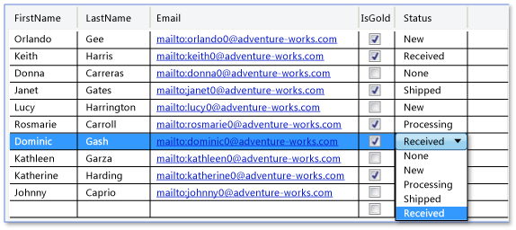

# 9 Réalisation d’une saisie

## 9.1 Le modèle MVVM

MVVM (Model View ViewModel) est un modèle d’architecture dérivé de modèles plus anciens tels que MVP (Model View Presenter), qui permet de tirer pleinement partie des possibilités de WPF pour séparer complètement le code métier et l’interface visuelle. Cela permet :

-  Une collaboration plus simple entre les designers et les développeurs

-  La production d’un code cloisonné, plus facile à faire évoluer, à réutiliser et à tester

En fait, WPF et MVVM ont été conçus conjointement par Microsoft. John Gossman, un des architectes de WPF a exposé le modèle pour la première fois en 2005 dans [cet article de blog](https://blogs.msdn.microsoft.com/johngossman/2005/10/08/introduction-to-modelviewviewmodel-pattern-for-building-wpf-apps/). MVVM a ensuite été utilisé avec d’autres technologies, telles que HTML5, Java…

La séparation du code métier de l’interface visuelle signifie qu’il n’y a aucun code métier dans les fichiers xaml.cs (qu’on appelle code-behind). Pour cela, MVVM s’appuie notamment sur 2 mécanismes centraux de WPF : les liaisons de données (binding) et les commandes.

[Page synthétique de Microsoft sur le modèle MVVM](https://docs.microsoft.com/en-us/previous-versions/msp-n-p/hh848246(v=pandp.10))

Examinons les 3 composantes du modèle MVVM et les relations entre elles :


**Le modèle** représente la couche de données, et la logique métier associée (règles de gestion). Il manipule généralement les données au travers d’objets (entités) en mémoire, et utilise une base de données ou des fichiers pour leur stockage. Il n’a aucune connaissance de l’interface graphique, et n’a pas besoin de WPF.

**La vue** représente le visuel, l’interface utilisateur. Elle est décrite en xaml pur, avec un code-behind très limité, qui ne contient pas de logique métier.

Une vue peut être décomposée en plusieurs sous-vues au moyen de UserControl.

Une vue peut avoir sa propre vue-modèle ou hériter de celle de sa vue parente. Elle obtient les données à afficher de sa vue-modèle par binding, ou en appelant des commandes.

**La vue-modèle** (ou modèle de vue) est une abstraction de la vue, qui décrit son état et son comportement. Elle constitue le **contexte de données** (DataContext) de la vue. A ce titre, elle réalise plusieurs choses :

-  Elle interagit avec le modèle en appelant des méthodes sur les classes du modèle
-  Elle expose les données du modèle via des propriétés exploitables par la vue
-  Elle fournit les commandes que l’utilisateur peut déclencher via la vue
-  Elle mémorise l’état de la vue (éléments sélectionnés dans les contrôles, état d’édition…etc.) et décrit ses comportements dans les différents états (indiquer un état d’édition ou de consultation, une opération en cours…etc)

Dans le modèle MVVM :

-  La vue ne connaît que la vue-modèle
-  La vue-modèle ne connaît que le modèle
-  Le modèle ne connaît que lui-même

Les liens entre la vue et la vue-modèle sont basés sur le databinding, les commandes, et les comportements (behaviors, que nous n’aborderons pas dans ce cours). Ces concepts techniques permettent en particulier la mise à jour de la vue à partir de la vue-modèle, sans que la seconde connaisse la première.

## 9.2 Mise en place de l’architecture MVVM

La capture ci-dessous montre l’organisation d’un projet Visual Studio respectant l’architecture MVVM :

<div style="display:flex; flex-wrap:wrap; justify-content: center; align-items:flex-start;">


Les éléments du projet sont rangés dans des dossiers par couche technique.  
**Le dossier Entites** contient les classes (POCO ou non) utilisées par les couches Model  
et ViewModel.  
**Le dossier Model** contient les classes qui stockent et fournissent les données  
(typiquement, en exploitant une base de données)  
**Le dossier View** contient la partie visuelle (fenêtres, UserControls)  
**Le dossier ViewModel** contient les vues-modèles, la classe RelayCommand, et   
éventuellement une classe ancêtre ViewModelBase qui implémente INotifyPropertyChanged,  
et qui simplifie la syntaxe de notification des changements.  

</div>

## 9.3 Liaison vue / vue-modèle

La fenêtre principale d’une application contient généralement un menu et une zone centrale dans laquelle les différentes vues (typiquement des UserControl) sont affichées :

<div style="display:flex; flex-wrap:wrap; justify-content:space-evenly; align-items:center;">


```xml
<DockPanel>
   <Menu DockPanel.Dock="Top" Padding="5">
      <MenuItem Name="menu1" Header="Menu 1"/>
      <MenuItem Name="menu2" Header="Menu 2"/>
      <MenuItem Name="menu3" Header="Menu 3"/>
   </Menu>

   <ContentControl Name="zoneCentrale"/>
</DockPanel>
```

</div>

Pour afficher la vue correspondant au menu cliqué et la lier à une vue-modèle, 2 approches sont possibles :

### 9.3.1 En partant de la vue

Au clic sur un menu (gestionnaire d’évènement placé dans le code-behind de la fenêtre), on instancie la vue souhaitée et on l’affecte comme contenu de la zone centrale.  
Cf. chapitre sur les contrôles utilisateur pour un exemple de code.

Puis dans le constructeur de chaque vue, on affecte une instance de vue-modèle à la propriété `DataContext` de la vue, comme nous l’avons fait jusqu’à maintenant.

### 9.3.2 En partant de la vue-modèle

Cette fois, dans les gestionnaires de clics sur les menus, on affecte à la zone centrale non pas une instance de vue, mais une instance de vue-modèle :

```csharp
public partial class MainWindow : Window
{
   private VMProduits _vmProduits;
   private VMClients _vmClients;
 
   public MainWindow()
   {
      InitializeComponent();
 
      menu1.Click += MenuProduits_Click;
      menu2.Click += MenuClients_Click;
   }
 
   private void MenuProduits_Click(object sender, RoutedEventArgs e)
   {
      if (_vmProduits == null) _vmProduits = new VMProduits();
      zoneCentrale.Content = _vmProduits;
   }
 
   private void MenuClients_Click(object sender, RoutedEventArgs e)
   {
      if (_vmClients == null) _vmClients = new VMClients();
      zoneCentrale.Content = _vmClients;
   }
}
```

... puis on utilise des DataTemplate pour associer automatiquement une vue à chaque type de vue-modèle :

```xml
<Application x:Class="Divers.App"
             xmlns="http://schemas.microsoft.com/winfx/2006/xaml/presentation"
             xmlns:x="http://schemas.microsoft.com/winfx/2006/xaml"
             xmlns:local="clr-namespace:Divers"
             xmlns:vw="clr-namespace:Divers.View"
             xmlns:vm="clr-namespace:Divers.ViewModel"
             StartupUri="View/MainWindow.xaml">
    <Application.Resources>
      <!-- DataTemplates qui associent les vues aux vues-modèles -->
      <DataTemplate DataType="{x:Type vm:VMPersonnes}">
         <vw:UCPersonnes/>
      </DataTemplate>
 
      <DataTemplate DataType="{x:Type vm:VMRegions}">
         <vw:UCRegions/>
      </DataTemplate>
   </Application.Resources>
</Application>
```

Grâce à ces templates, lorsqu’on affecte une instance de vue-modèle au contenu d’un composant visuel :

-  La vue associée est automatiquement instanciée et affichée dans le composant

-  L’instance de vue-modèle est automatiquement définie comme contexte de données de la vue. Il n’est donc plus nécessaire de renseigner la propriété DataContext dans le constructeur de la vue.

### 9.3.3 Instanciation de la vue-modèle

Au lieu d’instancier la vue-modèle souhaitée dans les gestionnaires d’évènements Click des menus, on peut le faire à l’aide de commandes associées à ces menus. La technique est la suivante :

-  Créer une propriété `VMCourante` dans la vue-modèle associée à la fenêtre

-  Relier cette propriété au conteneur de la zone centrale de la fenêtre par binding

-  Associer des commandes au menus pour affecter une instance de la vue-modèle souhaitée à la propriété `VMCourante`.

Voici le code correspondant pour la fenêtre principale :

```xml
   <Window.DataContext>
      <vm:VMPrincipale/>
   </Window.DataContext>
 
   <DockPanel>
      <Menu DockPanel.Dock="Top" Padding="5">
         <MenuItem Name="menu1" Header="Menu 1" Command="{Binding CmdProduits}"/>
         <MenuItem Name="menu2" Header="Menu 2" Command="{Binding CmdClients}"/>
      </Menu>
 
      <ContentControl Name="zoneCentrale" Content="{Binding VMCourante}"/>
   </DockPanel>
```

 … et pour la vue-modèle principale :

```csharp
public class VMPrincipale : INotifyPropertyChanged
{
   private object _VMCourante;
 
   public event PropertyChangedEventHandler PropertyChanged;
   
   // Commandes liées aux menus
   public ICommand CmdProduits { get; }
   public ICommand CmdClients { get; }
 
   // Vue-modèle courante, à laquelle est liée le ContentControl de la zone principale
   public object VMCourante
   {
      get { return _VMCourante; }
      private set
      {
         if (value != _VMCourante)
         {
            _VMCourante = value;
            RaisePropertyChanged();
         }
      }
   }
 
   public VMPrincipale()
   {
      // Chaque commande affecte une instance de VM comme VM courante
      CmdProduits = new RelayCommand<object>(o => VMCourante = new VMProduits());
      CmdClients = new RelayCommand<object>(o => VMCourante = new VMClients());
   }
 
   private void RaisePropertyChanged([System.Runtime.CompilerServices.CallerMemberName] string prop = null)
   {
      if (PropertyChanged != null)
         PropertyChanged(this, new PropertyChangedEventArgs(prop));
   }
}
```

La classe doit implémenter `INotifyPropertyChanged` pour pouvoir notifier le changement de valeur de la propriété `VMCourante` et ainsi mettre à jour le visuel.

## 9.4 Le DataGrid

Le composant DataGrid se présente sous une forme similaire à la ListView, mais il permet en plus de saisir des données directement dans le tableau.

Dans sa forme la plus simple, son code est le suivant :

```xml
<DataGrid ItemsSource="{Binding}" AutoGenerateColumns="True"/>
```

Les colonnes de la grille sont dans ce cas générées automatiquement par WPF et leur-en-têtes reprennent les noms des propriétés de la classe des items.



Si on souhaite modifier les en-têtes, les styles ou les formats des données, il faut définir soi-même les colonnes.  
Voici un exemple de code :

```xml
<DataGrid ItemsSource="{Binding}" AutoGenerateColumns="False" >
   <DataGrid.Columns>
      <DataGridTextColumn Header="Prénom" Binding="{Binding FirstName}"/>
      <DataGridTextColumn Header="Nom" Binding="{Binding LastName}"/>
      <DataGridHyperlinkColumn Header="Email" Binding="{Binding Email}"
                      ContentBinding="{Binding Email,
                            Converter={StaticResource EmailConverter}}"/>
      <DataGridCheckBoxColumn Header="Client or?" Binding="{Binding IsGold}" />
      <DataGridComboBoxColumn Header="Etat commande"
                      SelectedItemBinding="{Binding Etat}"
                      ItemsSource="{Binding Source={StaticResource EtatsComm}}"/>
   </DataGrid.Columns>
</DataGrid>
```

Les colonnes peuvent être de quatre types, comme illustré par le code ci-dessus : texte, case à cocher, liste déroulante ou lien hypertexte.

Mais si on veut personnaliser encore davantage une colonne, on peut utiliser une colonne de type Template et lui appliquer un DataTemplate, comme dans l’exemple suivant :

```xml
<DataGridTemplateColumn Header="Date de naissance" SortMemberPath="DateNais">
   <DataGridTemplateColumn.CellTemplate>
      <DataTemplate>
        <DatePicker SelectedDate="{Binding DateNais}" BorderThickness="0" />
      </DataTemplate>
   </DataGridTemplateColumn.CellTemplate>
</DataGridTemplateColumn>
```

Ici, la colonne affichera un composant de sélection de date : 

Par défaut, les colonnes de type `DataGridTemplateColumn` n’ont aucun critère de tri associé. Pour ajouter un critère de tri, on utilise la propriété `SortMemberPath`, qui prend comme valeur le nom de la propriété selon laquelle on veut trier.

La documentation complète de ce composant est disponible sur [cette page](https://docs.microsoft.com/en-us/dotnet/framework/wpf/controls/datagrid) d’aide Microsoft.

## 9.5 La validation

Une application doit s’assurer que les données saisies par l’utilisateur sont valides avant de faire certains traitements dessus ou de les enregistrer

### 9.5.1 Déclenchement de la validation

La validation d'un champ d’une saisie peut être déclenchée :

-  A chaque saisie d'un caractère dans la zone de saisie
-  Lorsque la zone de saisie perd le focus
-  Lors de la validation d'un autre champ, si les deux champs sont liés
-  Lorsqu'on clique sur un bouton de validation / enregistrement

Pour certains types de validation, on peut choisir librement le mode de déclenchement en fonction de l'expérience utilisateur souhaitée. Mais pour d'autres, certains choix ne sont pas pertinents voire impossibles. Voici quelques exemples :

**Ex1** : vérifier le format d'un champ (ex : longueur min ou max, ou un format bien précis)

Ce type de validation peut techniquement être déclenché de n'importe quelle façon

**Ex2** : rendre un champ obligatoire

A moins de placer initialement le focus dans la zone de saisie, ce type de validation ne peut pas être réalisé lors de la saisie d'un caractère ou lors de la perte du focus par la zone de saisie, car si l'utilisateur ne met jamais le focus dans la zone, la validation ne sera pas déclenchée.

Si plusieurs champs sont obligatoires dans un formulaire, le plus simple est de déclencher la validation par clic sur un bouton

**Ex3** : vérifier la cohérence entre plusieurs valeurs saisies

Il est dans ce cas généralement préférable d'attendre que l'utilisateur ait saisi toutes les valeurs avant de déclencher la validation et de notifier visuellement l'erreur.

**Ex4** : vérifier que la valeur saisie est cohérente par rapport aux données déjà enregistrées (ex : vérifier qu'un nom d'utilisateur n'est pas déjà pris lors de la création d'un compte).

Ce type de vérification peut nécessiter des traitements relativement lourds (ex : exécution de requêtes sql sur une base de données). Dans ce cas, déclencher la validation à chaque saisie d'un caractère ne sera pas pertinent, car l'interface visuelle sera très peu réactive et il y aura beaucoup de traitements inutiles. Il faudra au minimum faire ce contrôle de façon asynchrone pour que l'interface reste réactive, ou bien déclencher la validation lorsque la zone de saisie perd le focus ou lorsqu’on clique sur un bouton.

Le déclenchement par clic sur un bouton a l'avantage d'être applicable à toutes les situations

### 9.5.2 Notification visuelle des erreurs

Les erreurs peuvent être notifiées visuellement de différentes façons :

-  Elément visuel sur chaque zone de saisie en erreur (ex : cadre de couleur, astérisque, info-bulle… )
-  Message d'erreur affiché dans une zone spécifique de l'écran (au-dessus ou au-dessous d'un formulaire par exemple)
-  Message d'erreur affiché dans une popup
-  …

Les captures ci-dessous montrent quelques exemples :

<div style="display:flex; flex-wrap:wrap; justify-content:space-evenly; align-items:center;">


</div>

### 9.5.3 Les techniques de validation

Différentes techniques de validation ont été développées au fur et à mesure de l’évolution du .Net Framework.

**Validation basée sur le type**

WPF implémente par défaut un mécanisme basique de validation automatique basé sur le type de donnée. Lorsque l’utilisateur saisit une valeur qui ne peut pas être convertie dans le type de la propriété associée, la zone de saisie est encadrée en rouge pour signaler l’erreur, et le focus reste dans la zone.

**Classe ValidationRule**

Le .net framework 3.0 fournit un mécanisme de validation basé sur la classe `ValidationRule`, qui modélise une règle de validation. Cette classe étant abstraite, il faut soit utiliser les classes dérivées concrètes `ExceptionValidationRule` et `DataErrorValidationRule` fournies par le framework, soit créer nos propres classes dérivées.

Le mécanisme de validation basé sur ces classes est peu compatible avec le modèle d’architecture MVVM, car la validation est obligatoirement déclenchée par la vue. On ne peut pas la déclencher par la vue-modèle.

**Attributs de validation et Interface INotifyDataErrorInfo**

Avec la version 4.5 du .net framework est apparu un mécanisme de validation plus évolué, et surtout vraiment compatible avec le modèle MVVM. Il permet notamment de :

-  Valider les données dans la vue-modèle et notifier les erreurs à la vue

-  Associer plusieurs erreurs à une même propriété

-  Valider des champs liés

-  Créer des attributs de validation personnalisés

Ce mécanisme repose sur l’interface `INotifyDataErrorInfo` et sur les attributs `DataAnnotations` définis dans l’espace de noms `System.ComponentModel.DataAnnotations` et l’assembly de même nom. Nous allons l’étudier plus en détail dans le paragraphe suivant.

!> Penser à ajouter une référence vers cet assembly dans le projet !

### 9.5.4 Scénarios de validation avec attributs

Les scénarios suivants illustrent différentes techniques de gestion des erreurs utilisant les attributs de validation et une implémentation de `INotifyDataErrorInfo`. Cette implémentation est réalisée dans une classe abstraite `ValidatableBase` qui fournit en plus des méthodes pour la validation d’une propriété ou d’une entité complète. Cette classe dérive également d’une classe `BindableBase` qui fournit une implémentation de `INotifyPropertyChanged` pour faciliter la notification des changements.

Le code de ces 2 classes est fourni dans les fichiers ci-joints et pourra être intégré facilement dans un projet respectant l’architecture MVVM.

[Code de la classe BindableBase](wpf/fichiers/BindableBase.cs ':ignore')

[Code de la classe ValidatableBase](wpf/fichiers/ValidatableBase.cs ':ignore')


**Scénario 1 : Validation d’un champ à chaque saisie d’un caractère pour détecter les caractères incorrects, et affichage du message d’erreur dans une info-bulle au survol de la zone de saisie.**


Dans la vue :

```xml
<Label Content="Nom"/>
<TextBox Text="{Binding Path=Nom, UpdateSourceTrigger=PropertyChanged}"/>
<!-- La validation du format sera déclenchée à chaque saisie d'un caractère-->
```

Dans le dictionnaire de ressources de l’application :

```xml
<Application.Resources>
  <!-- Style utilisant un trigger pour afficher une info bulle lorsque qu’une erreur de validation est notifiée par le code de validation -->
  <Style TargetType="TextBox">
      <Style.Triggers>
          <Trigger Property="Validation.HasError" Value="True">
              <Setter Property="ToolTip">
                  <Setter.Value>
                      <Binding Path="(Validation.Errors).CurrentItem.ErrorContent"
                               RelativeSource="{x:Static RelativeSource.Self}" />
                  </Setter.Value>
              </Setter>
          </Trigger>
      </Style.Triggers>
  </Style>
</Application.Resources>
```

Dans la vue-modèle :

```csharp
   private string _nom;
   [ExcludeChar("/.,!@#$%", ErrorMessage = @"Les caractères /.,!@#$% sont interdits")]
   public string Nom
   {
      get { return _nom; }
      set
      {
          ValidateProperty(value); // Validation de la valeur saisie
          _nom = value;
      }
   }
```

La méthode `ValidateProperty` est issue de la classe `ValidatableBase`. Elle se charge de la validation et de la notification des erreurs.

L’attribut `[ExcludeChar]` qui décore la propriété est un attribut de validation personnalisé défini de la façon suivante :

```csharp
public class ExcludeChar : ValidationAttribute
{
   string _characters;
   public ExcludeChar(string characters)
   {
       _characters = characters;
   }
   protected override ValidationResult IsValid(object value, ValidationContext context)
   {
      if (value != null)
      {
         for (int i = 0; i < _characters.Length; i++)
         {
            var valueAsString = value.ToString();
            if (valueAsString.Contains(_characters[i]))
            {
                var errorMessage = FormatErrorMessage(context.DisplayName);
                return new ValidationResult(errorMessage, 
                                       new string[] { context.MemberName });
            }
         }
      }
      return ValidationResult.Success;
   }
}
```

On peut créer un attribut de validation en dérivant la classe `ValidationAtribute` et en redéfinissant sa méthode `IsValid`. Celle-ci prend en paramètre la valeur à valider et un contexte de validation dont la propriété DisplayName représente le nom de la propriété à valider.

La méthode `ValidateProperty` utilisée dans la vue-modèle utilise les attributs de validation qui décorent la propriété pour la valider.

**Scénario 2 : validation du format et de la confirmation d’une adresse email lorsque la zone de saisie perd le focus, et affichage de l’erreur en info-bulle :**


Dans la vue :

```xml
<DockPanel>
   <Label Content="Email"/>
   <TextBox Text="{Binding Path=Email}"/>
</DockPanel>
<DockPanel>
   <Label Content="Confirmation"/>
   <TextBox Text="{Binding Path=ConfirmEmail}"/>
</DockPanel>
```

Dans la vue-modèle :

```csharp
[Required]
[EmailAddress(ErrorMessage = "L'adresse email n'est pas valide")]
public string Email { get; set; }
 
private string _confirmEmail;
[Required]
[Compare("Email", ErrorMessage = "La confirmation de l'email est incorrecte")]
public string ConfirmEmail
{
    get { return _confirmEmail; }
    set
    {
        ValidateProperty(value);
        _confirmEmail = value;
    }
}
```

On utilise cette fois les attributs `[EmailAddress]` et `[Compare]` fournis par le .net framework pour valider respectivement le format de l’adresse mail et fait que l’adresse saisie dans la seconde zone soit identique à la première.

Le code montre également qu’on peut utiliser la propriété ErrorMessage d’un l’attribut pour personnaliser le message d’erreur qui sera affiché à l’écran. Dans notre cas, le message s’affiche en info-bulle grâce au style défini dans les ressources de l’application.

Une propriété peut être décorée de plusieurs attributs de validation, comme c’est le cas ici. L’attribut `[Required]` rend la saisie du champ obligatoire.

**Scénario 3 : champ obligatoire et affichage du message d’erreur dans une popup**


Dans la vue :

```xml
<DockPanel>
   <Label Content="Date de naissance"/>
   <DatePicker SelectedDate="{Binding Path=DateNais, NotifyOnValidationError=True}"/>
   <!-- NotifyOnValidationError permet d'émettre un évènement Error auquel
       on peut réagir dans le code-behind pour afficher une popup par exemple -->
</DockPanel>
```

Dans le code-behind de la vue :

```csharp
public partial class MainWindow : Window
{
    public MainWindow()
    {
        InitializeComponent();
        DataContext = new ViewModel.VM();
 
        // Définit la méthode à exécuter lorsqu'un evt d'erreur est déclenché
        // par un des éléments visuels de la fenêtre
        Validation.AddErrorHandler(this, AfficherErreurs);
    }
 
    private void AfficherErreurs(object sender, ValidationErrorEventArgs args)
    {
        string message = args.Error.ErrorContent.ToString();
        MessageBox.Show(message, "Erreur", MessageBoxButton.OK, MessageBoxImage.Error);
    }
}
```

Le message d’erreur est récupéré sur la propriété ErrorContent de l’erreur transmise en paramètre.

Dans la vue-modèle :

```csharp
[Required(ErrorMessage = "La date de naissance est obligatoire")]
public DateTime? DateNais { get; set; }
```

**Scénario 4 : validation globale de l’ensemble des champs au clic sur un bouton Valider et affichage des erreurs sous le formulaire**


Dans la vue :

```xml
<Button Content="Valider" Width="100" Margin="5" Command="{Binding CmdValider}"/>
<TextBlock Text="{Binding MessageErreur}" Foreground="Red" TextWrapping="Wrap"/>
```

Dans la vue-modèle :

```csharp
private string _messageErreur;
public string MessageErreur
{
    get { return _messageErreur; }
    set { SetProperty(ref _messageErreur, value); }
}

public ICommand CmdValider { get; }
 
public VM()
{
    CmdValider = new RelayCommand<object>(ValiderSaisie);
}
 
private void ValiderSaisie(object param)
{
    ValidateAll();
    MessageErreur = GetErrorMessage();
}
```

A ce code, il faut ajouter tous les attributs de validation qui décorent les propriétés.

La méthode `ValidateAll` est définie dans la classe `ValidatableBase` dont dérive notre vue-modèle. Elle lance la validation de toutes les propriétés de la vue-modèle en s’appuyant sur les attributs qui les décorent.

La propriété MessageErreur rassemble les messages d’erreurs issus de cette validation globale. Comme sa valeur est modifiée par le code, il faut notifier cette modification pour que la liaison avec la propriété Text du bloc de texte soit rafraîchie. Ceci est réalisé au moyen de la méthode SetProperty appelée dans l’accesseur set de la propriété. Cette méthode est définie dans la classe BindableBase.

**Remarque** : si on utilise une DataGrid, on peut utiliser le template suivant pour afficher les erreurs :

```xml
<DataGrid.RowValidationErrorTemplate>
   <ControlTemplate>
      <Grid Margin="0,-2,0,-2">
         <Grid.ToolTip>
            <Binding RelativeSource="{RelativeSource AncestorType=DataGridRow}"
                     Path="(Validation.Errors)"
                     Converter="{StaticResource ErrorToStringConv />
         </Grid.ToolTip>
         <Ellipse StrokeThickness="0" Fill="Red" 
                  Width="{TemplateBinding FontSize}"
                  Height="{TemplateBinding FontSize}" />
         <TextBlock Text="!" FontSize="{TemplateBinding FontSize}"
                    FontWeight="Bold" Foreground="White"
                    HorizontalAlignment="Center" />
      </Grid>
   </ControlTemplate>
</DataGrid.RowValidationErrorTemplate>
```

Les erreurs s’affichent en info-bulle en marge de chaque ligne.

La liste d’erreurs est fournie par la propriété attachée Validation.Errors. Pour l’afficher sous forme de chaîne avec retours à la ligne après chaque erreur, on utilise le convertisseur `ErrorToStringConv`, dont voici le code :

```csharp
public object Convert(object value, Type targetType, object parameter, CultureInfo culture)
{
    if (value == null) return null;
 
    var res = (value as string);
    if (res != null) return res;
 
    var validationErrors = (value as IEnumerable).Cast<ValidationError>();
    if (validationErrors != null)
    {
        StringBuilder sb = new StringBuilder();
        foreach (var err in validationErrors)
        {
            sb.AppendLine(err.ErrorContent.ToString());
        }
        return sb.ToString();
    }
 
    return null;
}
```

### 9.5.5 Attributs de validation prédéfinis

[Cette page de doc](https://docs.microsoft.com/fr-fr/dotnet/api/system.componentmodel.dataannotations?view=netframework-4.8) fournit la liste complète des attributs prédéfinis pour la validation, et aussi pour l’affichage.  
Voici les attributs de validation les plus communs :

| Attribut | Fonction |
|----------|----------|
| Required          | Rend la saisie du champ obligatoire|
| MinimumLength     | Définit une longueur minimale|
| StringLength      | Définit la longueur maximale (et éventuellement minimale) d’un champ texte|
| RegularExpression | Expression régulière qui définit le format de la valeur saisie|
| Range             | Définit une plage de valeurs pour la saisie|
| EmailAddress      | La valeur saisie doit respecter le format d’une adresse e-mail|
| Phone             | La valeur saisie doit respecter le format d’un N° de téléphone|
| Compare           | Compare la valeur du champ avec un autre champ (ex : pour confirmer une adresse mail) |

NB/ Les attributs EmailAddress et Phone sont en fait des expressions régulières prédéfinies.
