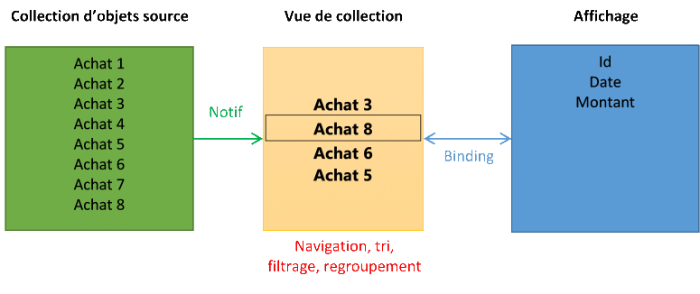
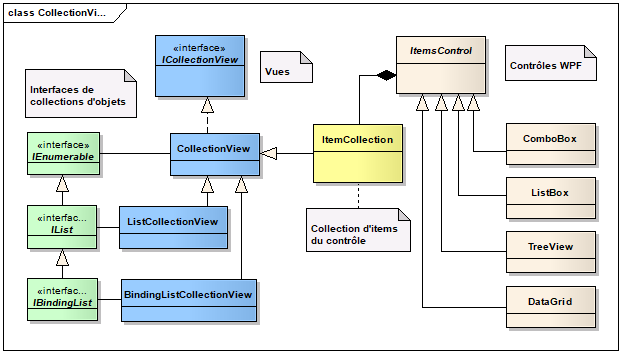
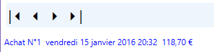
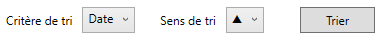
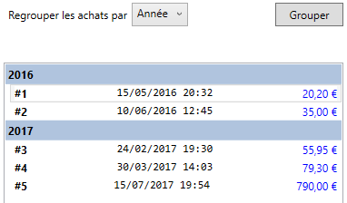
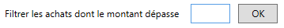

# 10 Navigation, tri, regroupement et filtrage

## 10.1 Vue de collection

Lorsqu’on travaille avec des collections de données, on a généralement besoin de les manipuler visuellement : naviguer entre les enregistrements, les trier selon différents critères, les filtrer selon certaines conditions, ou bien faire des regroupements. Toutes ces opérations sont réalisées sur une vue placée entre la collection d’objets qui constitue la source de données, et le contrôle visuel qui affiche les données



Cette **vue de collection** constitue une couche d’abstraction. Le contrôle d’affichage (ListBox, ListView…) est donc en réalité relié par binding, non pas directement à la collection d’objets source, mais à la vue de collection. Cette vue implémente la notion d’élément courant, et son contenu reste à jour par rapport à celui de la collection d’objets source si celle-ci notifie ses ajouts et suppressions d’éléments.

Une vue de collection est une classe qui implémente l’interface [**ICollectionView**](https://msdn.microsoft.com/fr-fr/library/system.componentmodel.icollectionview(v=vs.110).aspx), qui définit des propriétés et méthodes pour naviguer, trier, filtrer et regrouper les items de la vue.

Il est possible de créer plusieurs vues de collection. WPF en fournit une par défaut, à laquelle on accède grâce à la méthode statique `CollectionViewSource.GetDefaultView` qui prend en paramètre la collection d’objets source.

Le diagramme de classes ci-dessous est une représentation technique du schéma précédent :



La collection d’objets source de données implémente une des interfaces représentées en vert.

La vue de collection est une des classes en bleu, qui implémentent `ICollectionView`.

Les items du contrôle WPF sont stockés dans une collection de type `ItemCollection`, qui dérive elle-même de `CollectionView`.

Le diagramme montre quel type de vue est utilisé selon l’interface implémentée par la collection d’objets avec laquelle on fait la liaison. Par exemple, si on fait une liaison avec une collection qui implémente `Ilist`, mais pas `IBindingList`, c’est une vue de type `ListCollectionView` qui est utilisée.

NB/ Ne pas confondre la vue de collection (ICollectionView), qui est indépendante de tout contrôle WPF, et la vue associée à une ListView (comme la GridView).

Nous allons voir maintenant comment utiliser la vue de collection pour implémenter concrètement les opérations de navigation, tri, filtrage et regroupement.

## 10.2 Navigation

La navigation consiste à afficher les éléments d’une collection un par un au moyen d’une barre de navigation. Le visuel ci-dessous est un exemple d’interface minimaliste pour naviguer dans une collection :



La barre d’outils contient des boutons pour naviguer parmi les éléments de la collection, c’est-à-dire aller au premier, au précédent, au suivant ou au dernier élément. L’item courant est affiché en dessous.

Nous allons implémenter cela en reprenant l’exemple de la liste d’achats.  
Commençons par créer le visuel en xaml :

```xml
<ToolBar Grid.Row="0" VerticalAlignment="Top">
    <Button Content="|&#x23F4;"
            Command="{Binding CmdNaviguer}" CommandParameter="First"/>
    <Button Content="&#x23F4;"
            Command="{Binding CmdNaviguer}" CommandParameter="Previous"/>
    <Button Content="&#x23F5;"
            Command="{Binding CmdNaviguer}" CommandParameter="Next"/>
    <Button Content="&#x23F5;|"
            Command="{Binding CmdNaviguer}" CommandParameter="Last"/>
</ToolBar>
<TextBlock Grid.Row="1" Margin="0,30,0,0" Foreground="Blue">
   <TextBlock Text="{Binding Path=Achats/Id, StringFormat='Achat N°{0}'}"/>
   <TextBlock Text="{Binding Path=Achats/Date, StringFormat=' ({0:g}) : '}"/>
   <TextBlock Text="{Binding Path=Achats/Montant, StringFormat=C}"/>
</TextBlock>
```

Tous les boutons sont associés à la même commande, à laquelle on passe en paramètre la direction de navigation. Les détails de l’achat courant sont affichés au moyen de bindings sur des TextBlock. Dans la syntaxe de ces bindings, le « / » permet d’accéder à chaque propriété particulière de l’élément courant de la collection d’achats.

Voyons maintenant le code de la vue-modèle :

```csharp
public class VMAchats
{
   public ICommand CmdNaviguer { get; }
   public List<Achat> Achats { get; }
 
   public VMAchats()
   {
      CmdNaviguer = new RelayCommand<string>(Naviguer);
   }
 
   // Méthode associée à la commande CmdNaviguer
   private void Naviguer(string dir)
   {
       // Récupère la vue associée à la collection des achats
       ICollectionView view = CollectionViewSource.GetDefaultView(Achats);
 
       // Navigue dans la collection selon la direction souhaitée
       if (dir == "First")
       {
           view.MoveCurrentToFirst(); // premier élément
       }
       else if (dir == "Previous" && view.CurrentPosition > 0)
       {
           view.MoveCurrentToPrevious(); // élément précédent
       }
       else if (dir == "Next" && view.CurrentPosition < Achats.Count - 1)
       {
           view.MoveCurrentToNext(); // élément suivant
       }
       else if (dir == "Last")
       {
           view.MoveCurrentToLast(); // dernier élément
       }
   }
```

Les méthodes définies par l’interface [ICollectionView](https://msdn.microsoft.com/fr-fr/library/system.componentmodel.icollectionview(v=vs.110).aspx) pour la navigation sont :

-  `MoveCurrentTo(object)` : Définit l'élément spécifié comme devant être l’item courant de la vue.

-  `MoveCurrentToFirst()` : Définit le premier élément de la vue comme item courant.

-  `MoveCurrentToLast()` : Définit le dernier élément de la vue comme item courant.

-  `MoveCurrentToNext()` : Définit l'élément suivant dans la vue comme item courant.

-  `MoveCurrentToPosition(Int32)` : Définit l'élément situé à l'index spécifié comme item courant

-  `MoveCurrentToPrevious()` : Définit l'élément précédent dans la vue comme item courant.

Il existe 2 positions vides avant le premier item de la liste (`IsCurrentBeforeFirst`), et après le dernier item (`IsCurrentAfterLast`). Si on veut empêcher la navigation vers ces positions, il faut ajouter des conditions comme indiqué dans l’exemple.  

NB/ Attention, si la vue de collection est filtrée, le nombre d’éléments doit être obtenu depuis cette vue et non depuis la collection source (cf. code correspondant dans le paragraphe sur le filtrage).

Nous avons ici utilisé la vue de collection par défaut, obtenue par la méthode statique `GetDefaultView`. Mais nous aurions pu créer une nouvelle vue de collection de la façon suivante :

```csharp
ICollectionView view = new ListCollectionView(Achats);
```

Créer plusieurs vues de collection permet d’avoir plusieurs affichages indépendants de la même collection de données.

## 10.3 Tri

Le tri d’une liste consiste à comparer ses éléments entre eux selon un ou plusieurs critères, et à définir un sens de tri (ascendant ou descendant) pour chaque critère.

Le visuel ci-dessous permet de définir un critère et un sens du tri pour notre liste d’achats :



Il est implémenté par le code XAML suivant :

```xml
    <Label Content="Critère de tri" Margin="0,0,5,0"/>
    <ComboBox SelectedValuePath="Tag" SelectedValue="{Binding ChampTri}">
        <ComboBoxItem Tag="Date" Content="Date" IsSelected="True"/>
        <ComboBoxItem Tag="Montant" Content="Montant"/>
    </ComboBox>

    <Label Content="Sens de tri" Margin="20,0,0,0"/>
    <ComboBox Name="cbSensTri" SelectedValuePath="Tag" Margin="5,0">
        <ComboBoxItem Tag="A" Content="&#x25b2;" IsSelected="True"/>
        <ComboBoxItem Tag="D" Content="&#x25bc;"/>
    </ComboBox>
    <Button Content="Trier" Width="75" HorizontalAlignment="Right"
    Command="{Binding CmdTrier}"
    CommandParameter="{Binding ElementName=cbSensTri, Path=SelectedValue}"/>
```

Dans la vue-modèle, nous définissons des propriétés pour la commande, le champ de tri et le sens de tri :

```csharp
public string ChampTri { get; set; }
public string SensTri { get; set; }
public ICommand CmdTrier { get; }

public VMAchats()
{
    CmdTrier = new RelayCommand<string>(Trier);
    ChampTri = "Date";
    SensTri = "A";
}
```

… ainsi que le code associé à la commande de tri :

```csharp
private void Trier(string sens)
{
    ICollectionView view = CollectionViewSource.GetDefaultView(Achats);
    view.SortDescriptions.Clear();
    var dir = sens == "A" ? ListSortDirection.Ascending : ListSortDirection.Descending;                                   
    var tri = new SortDescription(ChampTri, dir);
    view.SortDescriptions.Add(tri);
}
```

Les tris sont définis par des objets de type `SortDescription`, qu’on ajoute à la collection `SortDescriptions` de la vue de collection. Si on définit plusieurs descriptions de tris, chaque tri est appliqué dans l’ordre d’ajout dans la collection SortDescriptions. Il faut penser à vider cette collection au moyen de la méthode `Clear` avant d’appliquer de nouveaux tris.

Le constructeur de `SortDescription` prend en paramètres le nom de la propriété sur laquelle porte le tri, et le sens de tri.

En interne, le tri est effectué en comparant les éléments entre eux. On peut personnaliser le tri en utilisant la propriété `CustomSort` de la vue de collection. Cette propriété est de type `IComparer`, qui est une interface définissant une méthode `Compare`, qu’on peut donc implémenter selon nos besoins.

## 10.4 Regroupement

Le regroupement consiste à afficher les éléments de la collection regroupés selon un ou plusieurs critères. Chaque groupe possède un en-tête et un détail des éléments.

Exemple : liste d’achats regroupée par année :



Voici le code xaml correspondant à ce visuel :

```xml
<DockPanel Grid.Row="3" Margin="0,10">
    <Label Content="Regrouper les achats par"/>
    <ComboBox Name="cbChampGroupe">
        <ComboBoxItem Content="Année" IsSelected="True"/>
        <ComboBoxItem Content="Nombre d'articles"/>
    </ComboBox>
    <Button Content="Grouper" Width="75" HorizontalAlignment="Right"
            Command="{Binding CmdGrouper}"
            CommandParameter="{Binding ElementName=cbChampGroupe, Path=SelectedIndex}"/>
</DockPanel>

<ListBox Grid.Row="4" Margin="0,30,0,0" HorizontalContentAlignment="Stretch"
        ItemsSource="{Binding Achats}" IsSynchronizedWithCurrentItem="True">
    <ListBox.GroupStyle>
        <GroupStyle>
            <!-- Apparence des en-têtes de groupes -->
            <GroupStyle.HeaderTemplate>
                <DataTemplate>
                    <TextBlock Background="LightSteelBlue" FontWeight="Bold" Padding="3"
                                Text="{Binding Path=Name}"/>
                </DataTemplate>
            </GroupStyle.HeaderTemplate>
        </GroupStyle>
    </ListBox.GroupStyle>
    <ListBox.ItemTemplate>
        <DataTemplate>
         ...
        </DataTemplate>
     </ListBox.ItemTemplate>
</ListBox>
```

Le champ sur lequel les enregistrements sont groupés est sélectionné dans une liste déroulante, et son indice est passé en paramètre de la commande qui est branchée sur le bouton OK.

On définit l’apparence des en-têtes de groupes au moyen de la propriété `GroupStyle.HeaderTemplate` de la liste. Chaque en-tête affiche la valeur de la propriété selon laquelle les items sont groupés.  

!> Pour récupérer cette valeur, il faut faire un binding sur la propriété `Name`. Il s’agit en fait d’une propriété de l’objet `PropertyGroupDescription`, qui décrit le critère de regroupement.

Le code de la vue-modèle associée est le suivant :

```csharp
public class VMAchats
{
   public ICommand CmdGrouper { get; }
   public List<Achat> Achats { get; }
 
   public VMAchats()
   {
      InitializeComponent();

      CmdGrouper = new RelayCommand<int>(Grouper);
      ... 
   }

   private void Grouper(int critère)
   {
       ICollectionView view = CollectionViewSource.GetDefaultView(Achats);
 
       // Suppression des tris et regroupements éventuels
       view.SortDescriptions.Clear();
       view.GroupDescriptions.Clear();
 
       if (critère == 0) // Regroupement selon l'année
       {
           var tri = new SortDescription("Date", ListSortDirection.Ascending);
           view.SortDescriptions.Add(tri);
           var grp = new PropertyGroupDescription("Date.Year");
           view.GroupDescriptions.Add(grp);
       }
       else if (critère == 1) // Regroupement selon le nombre d'articles
       {
           var tri = new SortDescription("NbArticles", ListSortDirection.Ascending);
           view.SortDescriptions.Add(tri);
           var grp = new PropertyGroupDescription("NbArticles");
           view.GroupDescriptions.Add(grp);
       }
   }
}
```

On trie tout d’abord la vue selon la propriété de regroupement, puis on applique un regroupement en ajoutant un objet `PropertyGroupDescrption` à la liste `GroupDescriptions` de la vue de collection.

## 10.5 Filtrage

Le filtrage consiste à afficher uniquement les éléments qui correspondent à ensemble de critères.

Ex : le visuel suivant définit un filtre, afin de ne garder que les achats dont le montant dépasse un seuil défini par l’utilisateur :



Voici le code xaml correspondant à ce visuel :

```xml
<Label Content="Filtrer les achats dont le montant dépasse"/>
<TextBox Width="50" Margin="5,0,0,0" Text="{Binding Seuil}"/>
<Button Content="OK" Width="75" Command="{Binding CmdFiltrer}"/>
```

Le montant seuil saisi par l’utilisateur est transmis par liaison de donnée à une propriété `Seuil` de la vue-modèle. Dans cette dernière, nous définissons également la commande et la méthode de filtrage de la façon suivante :

```csharp
public ICommand CmdFiltrer { get; }

public VMAchats()
{
    CmdFiltrer = new RelayCommand<object>(Filtrer);
}

// Filtrage des achats dont le montant est supérieur à un seuil 
private void Filtrer(object o)
{
    ICollectionView view = CollectionViewSource.GetDefaultView(Achats);
    view.Filter = (a => (a as Achat).Montant >= Seuil);            
    // Filter est une propriété de type Predicate<object>.
}
```

La vue de collection possède une propriété `Filter`, de type `Predicate<object>`, qui représente la méthode de filtre. Cette méthode sera appelée automatiquement sur **chaque** élément de la collection (et non pas une fois sur l’ensemble des éléments).

Filter impose que la méthode de filtre prenne en entrée un paramètre de type object représentant l’élément de la collection à évaluer, et renvoie en sortie un booléen indiquant si l’élément doit être retenu ou non. Le paramètre de type object est ici transtypé en Achat.

**Remarque** : pour récupérer la liste des éléments restants après filtrage, on peut utiliser la syntaxe suivante :

```csharp
var elts = view.Cast<Achat>().ToList();
```
