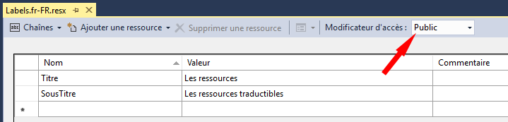
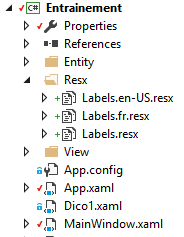
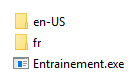
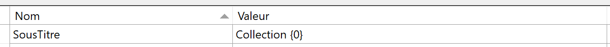

# 11 Internationalisation

L’internationalisation d’une application consiste à rendre cette dernière adaptable à plusieurs cultures différentes. Un des moyens possibles pour cela est d’utiliser des fichiers de ressources rex, dans lesquels nous placeront toutes les ressources traductibles. Nous allons voir ci comment créer et exploiter ce type de fichiers.

## 11.1 Créer un fichier resx

Un fichier resx peut être ajouté au projet en cliquant sur le menu « Projet \\ Ajouter un nouvel élément », et en sélectionnant « Fichier de ressource ».

Ceci ajoute en fait deux fichiers :

-  Un fichier à l’extension « .Designer.cs », qui contient les classes permettant de stocker et d’accéder aux valeurs de ressources.

-  Un fichier à l’extension « .resx » au format xml, qui contient les types et valeurs de ressources

Ces fichiers ne sont jamais édités directement, mais plutôt au travers d’une interface graphique qui présente les ressources sous forme de tableau, pour faciliter la saisie et la consultation. Cette interface s’ouvre automatiquement lorsqu’on double-clique sur le fichier resx :



!> Penser à rendre l’accès public (flèche rouge) pour que les ressources soient accessibles depuis le xaml.

Bonnes pratiques :

-  Il est important de partager les ressources traductibles qui peuvent l’être pour réduire le nombre de ressources, et ainsi diminuer le travail de traduction.

-  Séparer les ressources traductibles des autres ressources pour faciliter leur extraction. On peut utiliser pour cela plusieurs fichiers resx.

**Gestion des cultures**

Les fichiers resx sont particulièrement adaptés au stockage de valeurs localisables, c’est-à-dire dépendant d’une culture. Une culture désigne un couple langue + pays.

On peut déployer plusieurs dll de ressources correspondant aux cultures visées par l’application. Le framework fournit un mécanisme permettant à l’application d’utiliser automatiquement la dll adaptée à la culture du système d’exploitation sur lequel l’application s’exécute.

Si une ressource n’est pas trouvée pour la culture du système d’exploitation, la ressource de la culture neutre est utilisée par défaut.

Pour profiter de ce mécanisme, on procédera de la façon suivante :

-  Créer un premier fichier de ressources pour la culture neutre (ex : Labels.resx)

-  Créer ensuite un fichier pour chaque culture qu’on souhaite prendre en charge. Le fichier doit avoir le même nom que le précédent, et être suffixé par la culture. Exemple : `Labels.fr-FR.resx`, `Labels.en-US.resx`…etc.


-  Si on crée un fichier qui ne spécifie que la langue (ex : Labels.en.resx), il sera utilisé pour tous les pays utilisant la langue spécifiée.

Les propriétés de ces fichiers sont par défaut :

-  *Action de génération* : ressource incorporée

-  *Copier dans le répertoire de sortie* : ne pas copier

Il faut laisser ces valeurs par défaut.

L’image ci-dessous montre l’exemple d’un projet nommé Entrainement, contenant des fichiers resx placés dans un sous-répertoire Resx du projet :



La compilation de ce projet, produit :
- Un fichier Entrainement.exe correspondant à l’application
- Un répertoire pour chaque culture trouvée parmi les resx :



Chaque répertoire contient lui-même une dll nommée Entrainement.resources.dll  
NB/ Le nom est constitué du nom du projet, suivi de « resources.dll »


**Remarques** 

Un fichier Resources.resx est présent par défaut dans le répertoire Properties du projet. Il est destiné à contenir des ressources partagées par plusieurs formulaires/classes du projet. On peut également créer à côté d’autres fichiers resx propres aux cultures ciblées.

Pour tester le changement de langue, on peut ajouter le code suivant dans la méthode `Main`, avant l’affichage de la fenêtre principale :

```csharp
Thread.CurrentThread.CurrentUICulture = new CultureInfo("en");
```

NB/ Ce code change la langue de l’application en espagnol. Il nécessite l’ajout des using suivants :

```csharp
using System.Globalization;
using System.Threading;
```

## 11.2 Utiliser des ressources resx

### Dans le xaml

**Déclaration de l’espace de noms**

Pour accéder aux ressources d’un fichier resx, il faut tout d’abord déclarer l’espace de noms dans lequel elle se trouvent :

```xml
<Window x:Class="Ressources.MainWindow"
        ...
        xmlns:resx="clr-namespace:Ressources.FichiersResx"
        Title="Ressources" Height="350" Width="525">
```

Ici on déclare un préfixe « resx » pour accéder aux ressources présentes dans les fichiers du répertoire *FichiersResx* du projet *Ressources*.

**Accès à une ressource**

On accède ensuite à une ressource particulière avec la syntaxe classique d’accès à une ressource statique :

```xml
<TextBlock Text="{x:Static resx:Labels.Titre}"/>
```

Dans cet exemple, on accède à une ressource nommée « Titre », contenue dans un fichier *Labels.resx*, ou l’une de ses déclinaisons pour une culture particulière (ex : *Labels.fr.resx*)

**Utilisation comme chaîne de format**

On peut utiliser une ressource comme chaîne de format dans une expression de binding, comme le montre l’exemple suivant :

```xml
<TextBlock Text="{Binding Nom, StringFormat='{x:Static resx:Labels.SousTitre}'}"/>
```

Dans cet exemple, on affiche la valeur d’une propriété `Nom` d’un objet en utilisant une chaîne de format définie par la ressource SousTitre. Cette ressource doit comporter un joker pour désigner la valeur bindée. Exemple :



Le TextBlock affichera par exemple : « Collection Astérix ».

Autre exemple avec un binding multiple :

```xml
<TextBlock>
    <TextBlock.Text>
        <MultiBinding StringFormat="{x:Static resx:Labels.AnneePublication}">
            <Binding Path="Bornes[0]"/>
            <Binding Path="Bornes[1]"/>
        </MultiBinding>
    </TextBlock.Text>
</TextBlock>
```

Dans ce cas, la ressource doit comporter autant de jokers que de valeurs bindées.

Exemple : « L'année de publication doit être comprise entre {0} et {1} »

### Dans le code C#

L’exemple ci-dessous montre comment accéder à la ressource SousTitre située dans l’espace de noms `FichiersResx.Labels`. La ressource est utilisée comme chaîne de format pour afficher la valeur d’une propriété `Nom.`

```csharp
string s = string.Format(FichiersResx.Labels.SousTitre, Nom);
```

**Utilisation dans un attribut de validation ou d’affichage**

On peut utiliser une ressource dans un attribut de validation ou d’affichage qui décore une propriété :

```csharp
[Required(ErrorMessageResourceName="ChampObligatoire",
          ErrorMessageResourceType=typeof(Properties.Resources))]
```

Le premier paramètre spécifie le nom de la ressource tel que défini dans le fichier resx.

Le second spécifie la classe qui contient cette ressource. Ici, on fait référence à la classe de ressources définie dans le dossier Properties du projet.
