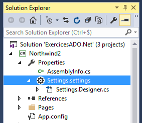
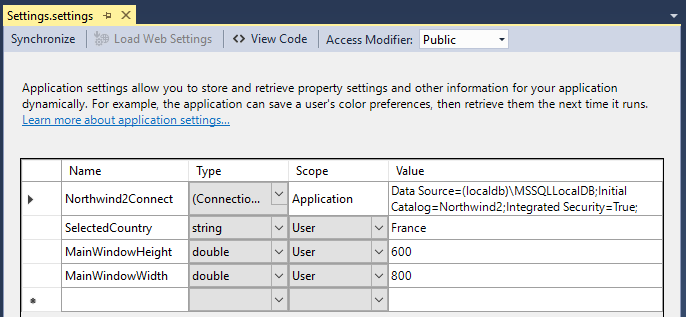

# 12 Les paramètres d’application

Cf. [cette page de doc](https://docs.microsoft.com/fr-fr/visualstudio/ide/managing-application-settings-dotnet?view=vs-2022).

Les paramètres d’application répondent à plusieurs besoins :

-  Faciliter l’accès par le code à des informations utilisées partout dans l’application, et qu’on souhaite pouvoir modifier sans recompiler l’application. Ex : une chaîne de connexion à une base de données, des valeurs qui dépendent de différentes typologies de clients…etc.

-  Permettre aux utilisateurs de mémoriser leurs préférences (ex : choix d’un thème visuel, positions des fenêtres à l’écran, chemin du dernier fichier ouvert…etc.)

Une application .net gère 2 types de paramètres :

-  **Des paramètres de portée application**, non spécifiques aux utilisateurs (les valeurs sont communes à tout le monde), et non modifiables par les utilisateurs durant l’exécution de l’appli.

-  **Des paramètres de portée utilisateur**, modifiables par les utilisateurs durant l’exécution de l’appli. Chaque utilisateur a ses propres valeurs de paramètres.

## 12.1 Créer des paramètres

Visual Studio offre une interface visuelle spécifique pour éditer les paramètres de l’application, accessible de deux façons :

-  Depuis la rubrique *Paramètres* des propriétés du projet
-  En double-cliquant sur l’entrée *Settings.settings* dans l’explorateur de solution (figure ci-dessous)



Cette interface visuelle est la suivante :



Chaque paramètre est caractérisé par un nom, un type, une portée (scope) et une valeur par défaut.

Les chaînes de connexions sont représentées par un type spécifique `ConnectionString` qui permet de les stocker de façon cryptée pour ne pas révéler les mots de passe éventuels.

La saisie de paramètre dans cette interface génère automatiquement du code dans la classe `Settings` décrite par le fichier `Settings.Designer.cs`. Cette classe permet d’accéder aux paramètres depuis le code.

## 12.2 Modification par l’utilisateur

L’application peut permettre à l’utilisateur de modifier des valeurs de paramètres, comme par exemple le thème visuel de l’application, des chemins de répertoires par défaut pour la recherche ou l’enregistrement de fichiers…etc.

Ces paramètres sont de portée utilisateur. Leurs valeurs par défaut sont définies dans la classe `Settings`, mais chaque utilisateur peut définir son propre jeu de valeurs dans l’application. Ces valeurs sont stockées dans un fichier user.config au format xml, placé dans un dossier caché propre à chaque utilisateur.

Voici un exemple de chemin de fichier de config généré par une application nommée Northwind2WPF :

"C:\\Users\\formateur_dev\\AppData\\Local\\**Northwind2WPF**\\Northwind2WPF.vshost.exe_Url_qce4ow5od1elewaei2byxy1aalfu13xs\\1.0.0.0\\user.config"

-  La première partie représente le répertoire de stockage des préférences de l’utilisateur pour les applications qu’il utilise.

-  La partie du milieu (en gras) correspond au nom de l’application

Le contenu du fichier est le suivant :

```xml
<?xml version="1.0" encoding="utf-8"?>
<configuration>
   <userSettings>
      <Northwind2WPF.Properties.Settings>
         <setting name="SelectedCountry" serializeAs="String">
            <value>Japan</value>
         </setting>
         <setting name="MainWindowHeight" serializeAs="String">
            <value>641</value>
         </setting>
         <setting name="MainWindowWidth" serializeAs="String">
            <value>778</value>
         </setting>
      </Northwind2WPF.Properties.Settings>
   </userSettings>
</configuration>
```

Les valeurs des paramètres sont ici différentes des valeurs par défaut, car elles ont été modifiées par l’utilisateur.

## 12.3 Utiliser des paramètres dans le code

Les paramètres sont représentés par des propriétés statiques de la classe `Settings.` Celle-ci est un singleton dont la propriété `Default` représente l’instance.

Dans l’exemple qui suit, nous allons mémoriser les dimensions de la fenêtre principale dans des paramètres `MainWindowHeight` et `MainWindowWidth` du fichier *Settings.Settings* :

```xml
<Window x:Class="BD.View.MainWindow"
        xmlns="http://schemas.microsoft.com/winfx/2006/xaml/presentation"
        xmlns:x="http://schemas.microsoft.com/winfx/2006/xaml"
        xmlns:d="http://schemas.microsoft.com/expression/blend/2008"
        xmlns:mc="http://schemas.openxmlformats.org/markup-compatibility/2006"
        xmlns:local="clr-namespace:BD.View"
        xmlns:prop="clr-namespace:BD.Properties"
        mc:Ignorable="d"
        Title="Bandes dessinées"
        Height="{Binding Source={x:Static prop:Settings.Default},
                         Path=MainWindowHeight, Mode=TwoWay}"
        Width="{Binding Source={x:Static prop:Settings.Default},
                        Path=MainWindowWidth, Mode=TwoWay}">
```

Nous utilisons des bindings des propriétés `Height` et `Width` de la fenêtre sur les paramètres. Ces derniers sont accessibles grâce au préfixe prop représentant l’espace de noms `Properties.`

Noter que par défaut le binding de ces propriétés est en OneWay. Il faut donc spécifier TwoWay pour que les valeurs de hauteur et largeur soient affectées aux paramètres lorsque l'utilisateur redimensionne la fenêtre.

Pour que les valeurs soient enregistrées lorsqu’on quitte l’application, il faut ajouter le code-behind suivant :

```csharp
public MainWindow()
{
   InitializeComponent();

   Closing += MainWindow_Closing;
}

private void MainWindow_Closing(object sender, System.ComponentModel.CancelEventArgs e)
{
   Settings.Default.Save();
}
```

Au premier lancement de l’application, comme l’utilisateur n’a pas encore enregistré ses propres valeurs de paramètres, ce sont les valeurs par défaut définies par le développeur qui s’appliquent.

NB/ Les paramètres sont bien entendu également accessibles dans le code-behind avec la syntaxe suivante, si besoin :

```csharp
Properties.Settings.Default.MainWindowdHeight = ...
```
